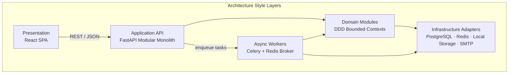
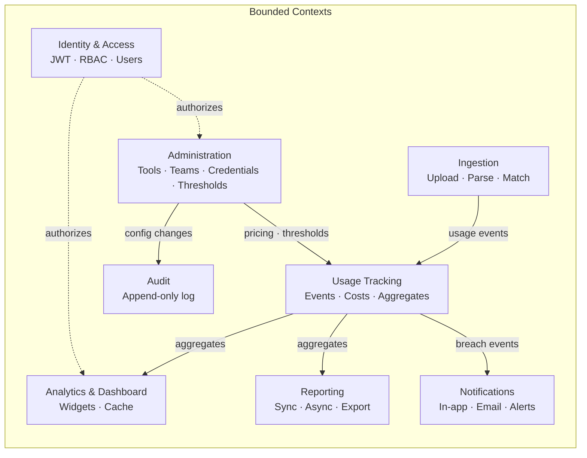
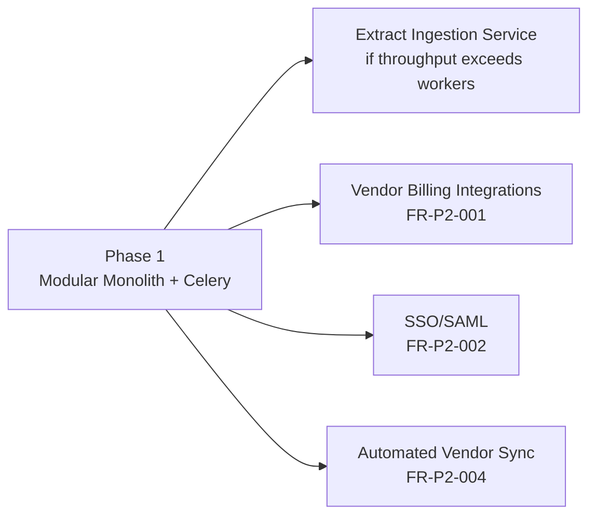

# Architecture Overview

Principal Solution Architect view of the AI Tool Usage Tracker platform.

**Sources:** [project.md](../project.md) · [NFR.md](../requirements/NFR.md) · [ADR-013](../decisions/ADR-013-docker-compose-local-storage.md)

---

## Recommended Architecture Style

### Primary: Modular Monolith with Event-Driven Async Processing

The Phase 1 (MVP) platform SHALL be delivered as **Docker Compose services**: a **single backend image** (FastAPI) with **strict internal module boundaries**, plus **Celery workers**, **PostgreSQL**, **Redis**, and **local volume file storage**.

### Secondary: Hexagonal (Ports & Adapters) within Each Module

Domain logic SHALL be isolated from infrastructure through ports (interfaces) and adapters (PostgreSQL, **local storage**, SMTP, vendor parsers). This supports testability and future extraction of high-load modules without rewriting core rules.

### Supporting: API-First, CQRS-Lite Read Models

- **Write path:** Usage ingestion and administration mutate normalized transactional tables.
- **Read path:** Dashboards and standard reports query pre-aggregated tables and Redis cache (CQRS-lite, not full event sourcing).

---

## Justification

### Why Modular Monolith (Not Microservices) for Phase 1

| Factor | Assessment |
|--------|------------|
| **Scale targets** | 50 tools, 200 teams, 5,000 users — well within a well-indexed monolith (NFR-SCL-001) |
| **Team topology** | Single product team for MVP; microservices add operational overhead without proportional benefit |
| **Time to market** | Administration, dashboards, ingestion, reporting, and alerts share user/team/tool entities — a monolith avoids distributed transaction complexity |
| **Operational cost** | 99.5% uptime achievable with HA Kubernetes deployment (NFR-AVL-001) without service mesh complexity |
| **Future path** | Clear module boundaries enable extraction of **Ingestion Worker** or **Report Generator** to separate services in Phase 2 if load demands |

### Why Event-Driven Async (Celery) for Background Work

| Workload | Sync vs Async | Reason |
|----------|---------------|--------|
| Dashboard reads | Sync + cache | Sub-3s p95 target (NFR-PER-001) |
| File upload parsing | Async | CPU/IO bound; up to 50 MB files (FR-ING-001) |
| Report generation (large) | Async | >10s queries offloaded (FR-RPT-007) |
| Threshold evaluation | Async + scheduled | Periodic and post-ingestion evaluation (FR-NTF-003) |
| Email notifications | Async | Resilience and retry (NFR-PER-005) |

Decoupling via task queues prevents ingestion spikes from degrading interactive API latency (NFR-AVL-003 graceful degradation).

### Why PostgreSQL as System of Record

Usage attribution, cost calculation, RBAC, and audit trails require **ACID transactions**, relational joins, and 24-month retention with configurable policies (FR-PLT-004, NFR-CMP-001). PostgreSQL supports reporting queries, indexing strategies (NFR-SCL-003), and managed HA (NFR-AVL-002).

### Why FastAPI + React

Aligns with project technical direction: Python/FastAPI backend, React/TypeScript/MUI frontend, OpenAPI-first contracts (OpenSpec principles). FastAPI provides native async, Pydantic validation (NFR-SEC-006), and automatic OpenAPI generation.

### Why Not Full Microservices or Event Sourcing (Phase 1)

- **Microservices:** Premature for MVP scale; increases deployment, tracing, and contract versioning burden.
- **Event sourcing:** Usage tracking does not require complete event replay for MVP; normalized facts + aggregates suffice.
- **SSO/SAML:** Explicitly out of Phase 1 scope; JWT satisfies FR-PLT-001.

---

## Bounded Contexts (Domain Modules)

| Module | Responsibility | Key FRs |
|--------|----------------|---------|
| Identity & Access | Authentication, JWT issuance, RBAC enforcement | FR-PLT-001 |
| Administration | Tool/team/credential/threshold CRUD | FR-ADM-001 – 004 |
| Ingestion | File upload, vendor parsing, user matching | FR-ING-001 – 002 |
| Usage Tracking | Token/cost facts, package utilization, aggregation | FR-USG-001 – 002 |
| Analytics & Dashboard | Read-optimized queries, widget data, cache | FR-DSH-001 – 009 |
| Reporting | Report queries, CSV/PDF, scheduling | FR-RPT-001 – 007 |
| Notifications | Notification center, email, threshold alerts | FR-NTF-001 – 003 |
| Audit | Immutable audit log | FR-PLT-002, NFR-AUD-001 |

### Module Boundary Rules

1. Modules MUST NOT query another module's tables directly; cross-module access goes through **application services** or **shared read views**.
2. Each module owns its PostgreSQL schema namespace (e.g., `admin`, `usage`, `ingestion`).
3. Shared kernel entities: `Organization`, `User`, `Team` — owned by Identity/Administration, referenced by ID elsewhere.
4. Async tasks MUST carry `organization_id`, `correlation_id`, and actor context for audit and traceability (NFR-AUD-004).

---

## Patterns Considered

| Pattern | Decision | Rationale |
|---------|----------|-----------|
| **Modular monolith** | ✅ Chosen | MVP speed, shared entities, single deployment unit |
| **Microservices** | ❌ Rejected (Phase 1) | Operational cost exceeds benefit at reference scale |
| **Layered architecture** | ✅ Chosen | API → application services → domain → repositories |
| **Hexagonal / ports & adapters** | ✅ Chosen | Vendor parsers, storage, email are swappable adapters |
| **DDD bounded contexts** | ✅ Chosen | Aligns with OpenSpec domain-driven specs |
| **Event-driven (async tasks)** | ✅ Chosen | Ingestion, reports, alerts via Celery |
| **Event sourcing** | ❌ Rejected | Unnecessary complexity for MVP reporting |
| **CQRS-lite** | ✅ Chosen | Write to facts; read from aggregates + cache |
| **Repository pattern** | ✅ Chosen | Test seams; tenant-scoped queries |
| **Adapter pattern** | ✅ Chosen | OpenAI, Anthropic, Azure, Cursor export parsers |
| **Strategy pattern** | ✅ Chosen | Pricing models, threshold evaluators |
| **BFF (Backend for Frontend)** | ❌ Rejected | Single SPA; FastAPI serves all clients in Phase 1 |
| **API Gateway (dedicated)** | ⚠️ Deferred | ALB + FastAPI sufficient for Phase 1; Kong/APIGW in Phase 2 if multi-client |
| **Saga / distributed transactions** | ❌ Rejected | Single database transaction boundaries in monolith |
| **Outbox pattern** | ⚠️ Optional P1 | Recommended if at-least-once task delivery becomes critical |

---

## Cross-Cutting Concerns

| Concern | Approach |
|---------|----------|
| **Security** | JWT middleware; RBAC policy layer; AES-256 credential encryption (NFR-SEC-001) |
| **Observability** | OpenTelemetry traces; Prometheus metrics; structured JSON logs (NFR-MON-001 – 003) |
| **Multi-tenancy** | `organization_id` on all tenant data; query filters enforced in repository layer (NFR-SCL-005) |
| **Caching** | Redis TTL cache for dashboard aggregates; invalidation on pricing/usage writes (NFR-PER-006) |
| **Idempotency** | Ingestion events keyed by vendor event ID or content hash (FR-USG-002) |
| **Time** | UTC storage; organization timezone for display (NFR-LOC-002) |

---

## Phase 2 Evolution Path

Extraction triggers: ingestion queue sustained >1,000 tasks (NFR-MON-004), or independent scaling requirements for vendor API sync jobs.

---

## Technology Stack Mapping

| Layer | Technology | Purpose |
|-------|------------|---------|
| Frontend | React, TypeScript, MUI, TanStack Query, Recharts | SPA dashboards and admin UI |
| API | FastAPI, Pydantic, SQLAlchemy 2 | REST API, validation, ORM |
| Workers | Celery | Async ingestion, reports, alerts |
| Database | PostgreSQL 15+ in Docker | Transactional store, aggregates; persistent volume |
| Cache / Broker | Redis 7 | Cache, Celery broker, rate limiting |
| Storage | AWS S3 | Uploads, report artifacts |
| Auth | JWT (python-jose), RBAC middleware | Phase 1 authentication |
| Infra | Docker, Kubernetes (EKS), ALB | Container orchestration |
| Observability | OpenTelemetry, Prometheus, Grafana | Metrics, traces, dashboards |
| CI/CD | GitHub Actions | Build, test, deploy pipelines |
