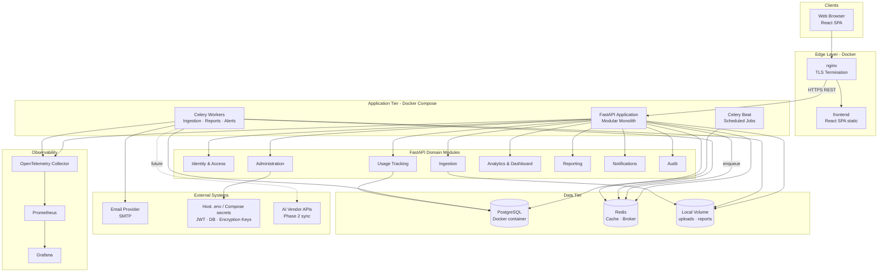
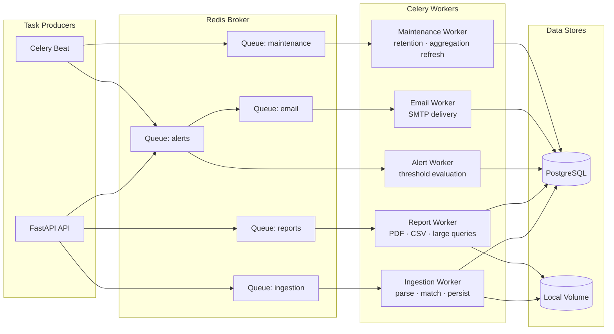
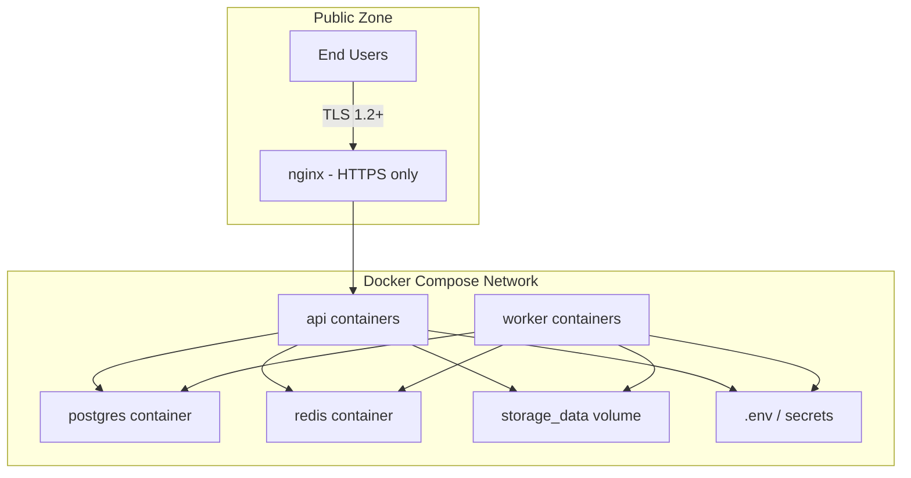

# Component Diagram

Logical and physical component views for the AI Tool Usage Tracker.

**Phase 1 runtime:** All components below deploy as **Docker Compose services** on a single host (ADR-013). Object storage is a **local volume**, not S3.

---

## Logical Component Diagram

High-level application components and their relationships.

---

## FastAPI Internal Module Structure

```mermaid
flowchart TB
    subgraph api_layer ["API Layer - Routers"]
        R_AUTH["/auth"]
        R_TOOLS["/tools"]
        R_TEAMS["/teams"]
        R_KEYS["/credentials"]
        R_THRESH["/thresholds"]
        R_UPLOAD["/uploads"]
        R_DASH["/dashboard"]
        R_REPORTS["/reports"]
        R_NOTIF["/notifications"]
        R_AUDIT["/audit-logs"]
    end

    subgraph app_layer ["Application Layer - Use Cases"]
        UC_AUTH["AuthenticateUser<br/>AuthorizeAction"]
        UC_ADMIN["ManageTool<br/>ManageTeam<br/>ManageCredential"]
        UC_INGEST["UploadFile<br/>PreviewImport<br/>ProcessImport"]
        UC_USAGE["RecordUsage<br/>AggregateUsage<br/>CalculateCost"]
        UC_DASH["GetWidgetData"]
        UC_RPT["GenerateReport<br/>ScheduleReport"]
        UC_NTF["EvaluateThresholds<br/>SendNotification"]
        UC_AUDIT["RecordAuditEvent"]
    end

    subgraph domain_layer ["Domain Layer"]
        D_TOOL["Tool · PricingModel"]
        D_TEAM["Team · Membership"]
        D_USAGE["UsageEvent · Aggregate"]
        D_THRESH["Threshold · Alert"]
        D_NOTIF["Notification"]
    end

    subgraph infra_layer ["Infrastructure Adapters"]
        REPO["PostgreSQL Repositories"]
        CACHE["Redis Cache Adapter"]
        STORE["Local Storage Adapter<br/>filesystem volume"]
        PARSER["Vendor Parser Adapters<br/>OpenAI · Anthropic · Azure · Cursor"]
        MAIL["Email Adapter"]
        CRYPTO["Encryption Adapter<br/>AES-256"]
    end

    R_AUTH --> UC_AUTH
    R_TOOLS --> UC_ADMIN
    R_TEAMS --> UC_ADMIN
    R_KEYS --> UC_ADMIN
    R_THRESH --> UC_ADMIN
    R_UPLOAD --> UC_INGEST
    R_DASH --> UC_DASH
    R_REPORTS --> UC_RPT
    R_NOTIF --> UC_NTF
    R_AUDIT --> UC_AUDIT

    UC_ADMIN --> D_TOOL
    UC_ADMIN --> D_TEAM
    UC_INGEST --> PARSER
    UC_INGEST --> UC_USAGE
    UC_USAGE --> D_USAGE
    UC_NTF --> D_THRESH
    UC_NTF --> D_NOTIF

    UC_AUTH --> REPO
    UC_ADMIN --> REPO
    UC_ADMIN --> CRYPTO
    UC_USAGE --> REPO
    UC_DASH --> REPO
    UC_DASH --> CACHE
    UC_RPT --> REPO
    UC_RPT --> STORE
    UC_NTF --> REPO
    UC_NTF --> MAIL
    UC_AUDIT --> REPO
    UC_INGEST --> STORE
```

---

## Worker Component Diagram

Celery task routing and worker specialization.

---

## Component Responsibilities

| Component | Responsibility | Scaling |
|-----------|----------------|---------|
| React SPA | UI rendering, client state, TanStack Query cache | `frontend` container behind nginx |
| nginx | TLS, routing, health checks | Single container; scale via second host (P2) |
| FastAPI | Sync REST API, auth, enqueue async jobs | Scale `api` service replicas in Compose |
| Celery Workers | Background processing | Scale `worker` service replicas |
| Celery Beat | Scheduled threshold scans, retention, reports | **Single** container |
| PostgreSQL | Transactional data, aggregates, audit | Docker volume; vertical scale |
| Redis | Cache, Celery broker, rate limit counters | Docker container + AOF volume |
| Local storage | Uploads, generated reports on `storage_data` volume | Expand host disk |
| Host secrets | JWT keys, DB creds, encryption keys in `.env` | Per-environment file |
| OpenTelemetry | Trace/metric export | OTel Collector container |

---

## Security Component Boundaries

Credentials decrypted in worker/API memory only at point of use (NFR-SEC-005). No secrets in container images or Git (NFR-SEC-008).
