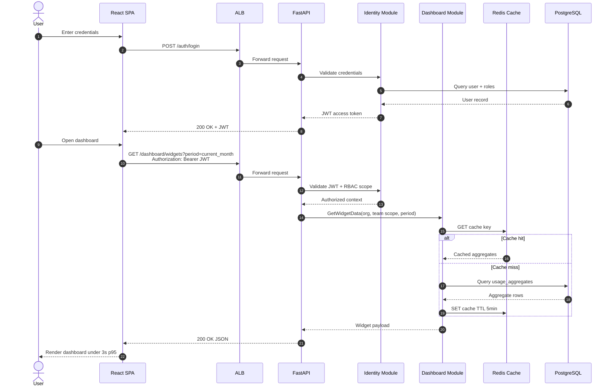
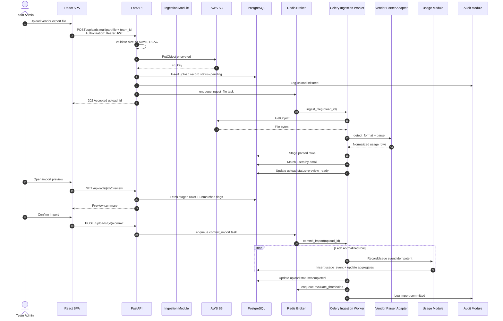
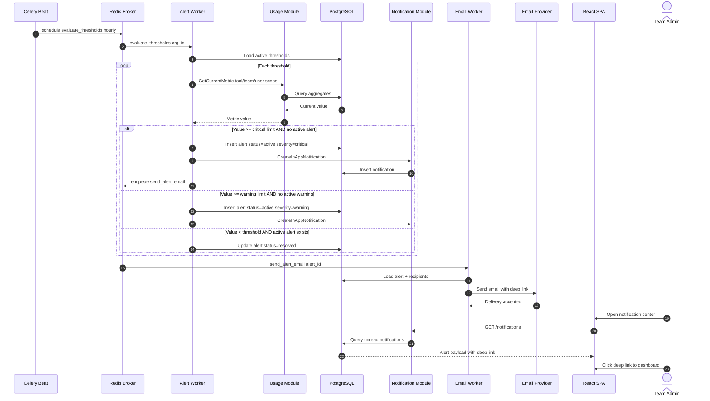
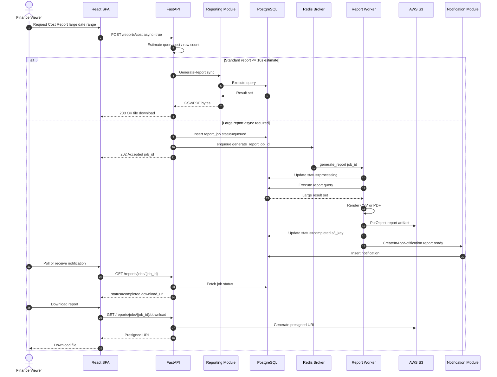
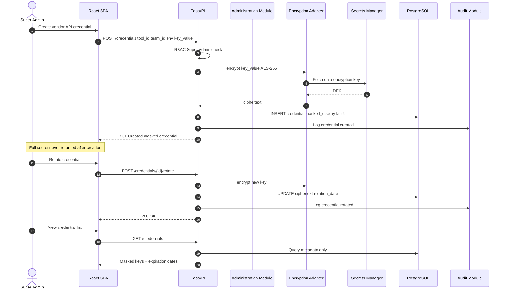
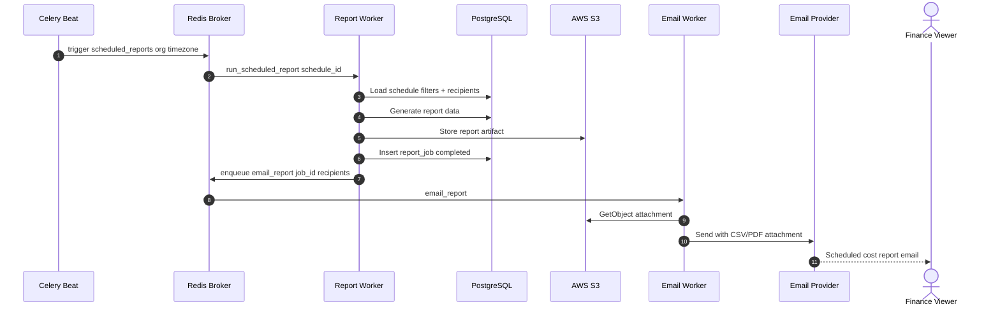

# Sequence Diagrams

Key interaction flows for the AI Tool Usage Tracker.

---

## 1. User Authentication and Dashboard Load

Authenticated dashboard access with cached aggregate reads.

**NFR traceability:** NFR-PER-001 (dashboard ≤3s), NFR-SEC-003/004 (JWT + RBAC)

---

## 2. Vendor File Upload and Ingestion

Phase 1 primary ingestion path via file upload (FR-ING-001, FR-ING-002).

**FR traceability:** FR-ING-001, FR-ING-002, FR-USG-001, FR-USG-002

---

## 3. Threshold Evaluation and Alert Notification

Post-ingestion and scheduled threshold breach flow (FR-NTF-003).

**NFR traceability:** NFR-PER-005 (email ≤5 min p95), FR-NTF-001 – 003

---

## 4. Async Report Generation

Large report offloaded to background worker (FR-RPT-007).

**NFR traceability:** NFR-PER-002 (standard ≤10s; async fallback)

---

## 5. API Credential Storage and Rotation

Secure credential lifecycle (FR-ADM-003, NFR-SEC-005).

---

## 6. Scheduled Report Email Delivery

Recurring report distribution (FR-RPT-007 P1).

---

## Sequence Diagram Index

| # | Flow | Primary FRs | Primary NFRs |
|---|------|-------------|--------------|
| 1 | Auth + dashboard load | FR-DSH-009, FR-PLT-001 | NFR-PER-001, NFR-SEC-003 |
| 2 | File upload ingestion | FR-ING-001 – 002, FR-USG-001 | NFR-SEC-006, NFR-PER-004 |
| 3 | Threshold alerts | FR-NTF-001 – 003, FR-ADM-004 | NFR-PER-005 |
| 4 | Async report generation | FR-RPT-007 | NFR-PER-002 |
| 5 | Credential storage | FR-ADM-003 | NFR-SEC-005, NFR-SEC-008 |
| 6 | Scheduled report email | FR-RPT-007 | NFR-PER-002, NFR-CMP-004 |
