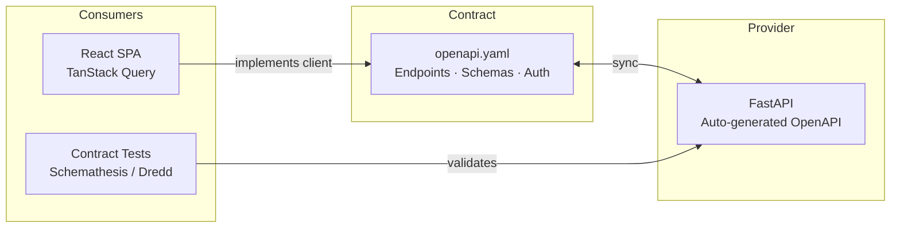
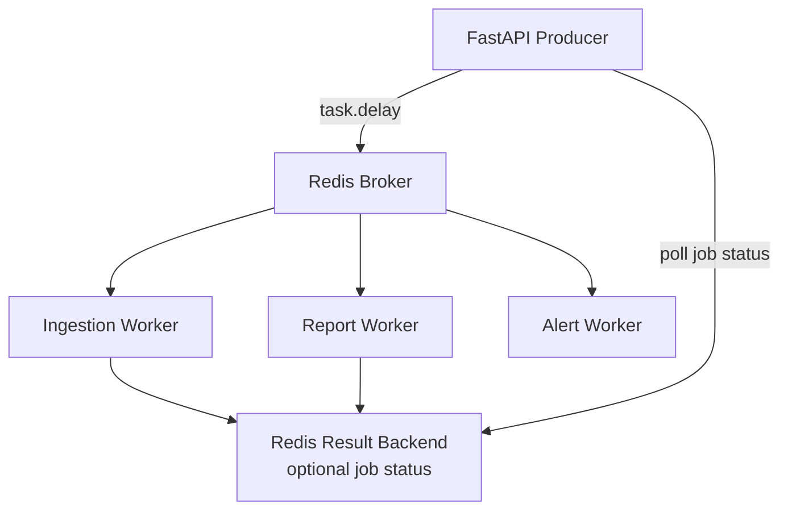
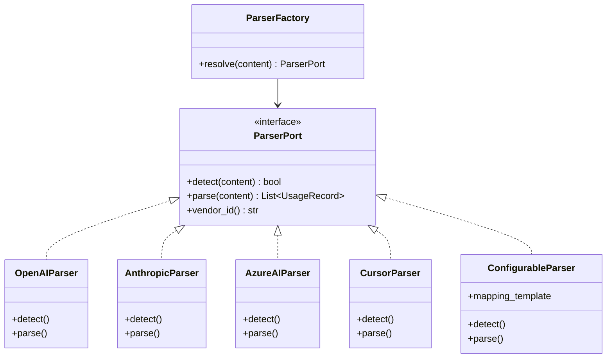
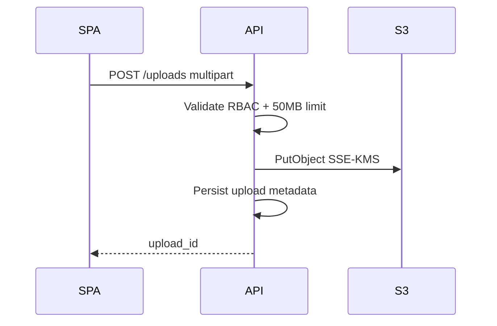
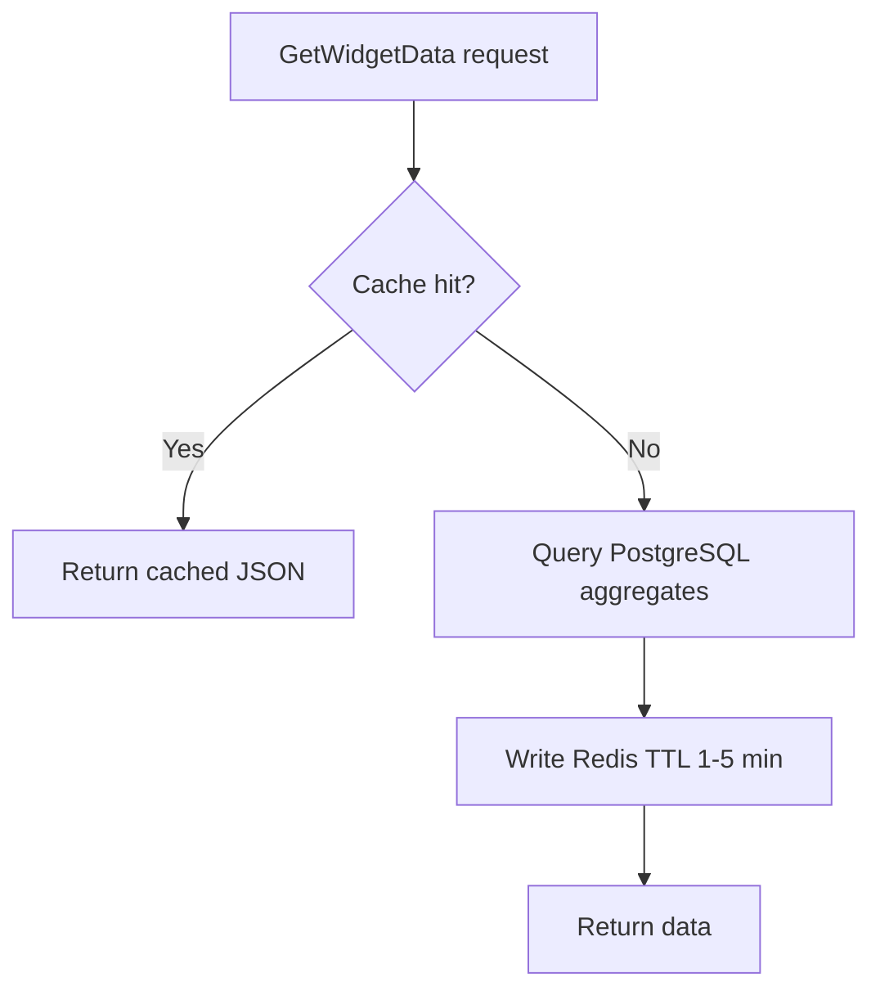
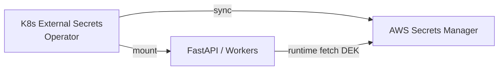
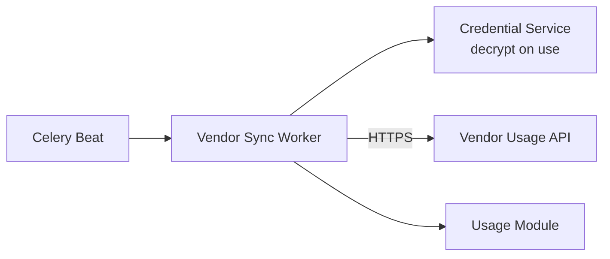

# Integration Patterns

External and internal integration patterns for the AI Tool Usage Tracker.

---

## Integration Pattern Summary

| Pattern | Usage | Phase |
|---------|-------|-------|
| REST API (OpenAPI) | SPA ↔ FastAPI; future external consumers | Phase 1 |
| Async message tasks | API ↔ Celery via Redis broker | Phase 1 |
| Object storage (S3) | File uploads, report artifacts | Phase 1 |
| Adapter | Vendor export parsers | Phase 1 |
| Presigned URL | Secure direct upload/download | Phase 1 |
| SMTP / SES | Email notifications | Phase 1 |
| Polling | Async job status, notification refresh | Phase 1 |
| Webhook (inbound) | Vendor push events | Phase 2 |
| Vendor REST sync | Automated usage pull | Phase 2 (FR-P2-004) |
| SSO/SAML | Enterprise identity | Phase 2 (FR-P2-002) |

---

## 1. API-First REST Integration (Primary)

All client-server integration SHALL follow an **OpenAPI 3.x contract** as the single source of truth.



### Conventions

| Aspect | Standard |
|--------|----------|
| Protocol | HTTPS JSON REST |
| Versioning | URL prefix `/api/v1/` |
| Auth | `Authorization: Bearer <JWT>` |
| Errors | RFC 7807 Problem Details |
| Pagination | Cursor-based for large lists; `limit` + `cursor` |
| Filtering | Query params aligned with report filters (period, team, tool) |
| Idempotency | `Idempotency-Key` header on POST for ingestion commits |
| Correlation | `X-Correlation-ID` propagated API → workers → logs |

### API Module Mapping

| API Prefix | Module | Example Operations |
|------------|--------|-------------------|
| `/api/v1/auth` | Identity | login, refresh, me |
| `/api/v1/tools` | Administration | CRUD tools |
| `/api/v1/teams` | Administration | CRUD teams, members |
| `/api/v1/credentials` | Administration | CRUD credentials, rotate |
| `/api/v1/thresholds` | Administration | CRUD thresholds |
| `/api/v1/uploads` | Ingestion | upload, preview, commit, reprocess |
| `/api/v1/dashboard` | Analytics | widget endpoints |
| `/api/v1/reports` | Reporting | generate, jobs, schedules |
| `/api/v1/notifications` | Notifications | list, mark read |
| `/api/v1/audit-logs` | Audit | query export |

---

## 2. Async Task Integration (Celery + Redis)

Decouples long-running work from the request thread using **task queue** pattern.



### Task Design Rules

- Tasks MUST be **idempotent** (safe retry on failure).
- Tasks MUST accept `correlation_id` and `organization_id`.
- Task results for user-facing jobs stored in `report_jobs` / `uploads` tables, not only Celery backend.
- Failed tasks MUST retry with exponential backoff (max 3 retries); permanent failures logged and surfaced in admin UI.
- Queue separation prevents report backlog from blocking ingestion (NFR-AVL-003).

### Task Catalog

| Task Name | Queue | Trigger | Output |
|-----------|-------|---------|--------|
| `ingest_file` | ingestion | Upload complete | Staged preview rows |
| `commit_import` | ingestion | Admin confirms | Usage events persisted |
| `generate_report` | reports | Async report request | S3 artifact + notification |
| `evaluate_thresholds` | alerts | Post-ingestion / hourly | Alerts + email tasks |
| `send_alert_email` | email | Critical alert | SMTP delivery |
| `run_scheduled_report` | reports | Celery Beat | Email with attachment |
| `enforce_retention` | maintenance | Daily Beat | Purge/archival |
| `refresh_aggregates` | maintenance | Post-batch ingest | Updated rollups |

---

## 3. Vendor Parser Adapter Pattern

Each supported vendor export format implements a common **Parser Port**.



### Normalized Usage Record

All parsers emit a canonical structure before persistence:

```json
{
  "vendor_event_id": "string | null",
  "user_email": "string",
  "tool_id": "uuid",
  "team_id": "uuid | null",
  "occurred_at": "ISO-8601 UTC",
  "input_tokens": 0,
  "output_tokens": 0,
  "metadata": {}
}
```

New vendors (Phase 1: "other configurable providers") add a **ConfigurableParser** with JSON mapping template — no core code change required (Open/Closed principle).

---

## 4. Object Storage Integration (S3)

### Upload Pattern: API-Mediated Multipart

Phase 1 uses API-mediated upload for simplicity and uniform RBAC validation.



### Download Pattern: Presigned URLs

Report and export downloads use **time-limited presigned URLs** so browsers fetch directly from S3 without streaming through API pods.

| Parameter | Value |
|-----------|-------|
| URL expiry | 15 minutes |
| Access control | API validates RBAC before issuing URL |
| Encryption | SSE-S3 or SSE-KMS (NFR-SEC-001) |

### S3 Key Convention

```
org/{org_id}/uploads/{upload_id}/{filename}
org/{org_id}/reports/{job_id}/{report_name}.pdf
```

---

## 5. Email Integration (SMTP / AWS SES)

Notification module uses **Email Adapter** behind a port interface.

| Email Type | Trigger | Opt-out |
|------------|---------|---------|
| Critical threshold alert | Alert worker | Mandatory |
| Warning threshold alert | Alert worker | Configurable (NFR-CMP-004) |
| API key expiration reminder | Scheduled job | Mandatory |
| Scheduled report delivery | Report worker | Per schedule |
| Async report ready | Report worker | N/A (in-app primary) |

Retry policy: 3 attempts, exponential backoff; failures logged to Prometheus counter `email_delivery_failures_total`.

---

## 6. Cache-Aside Integration (Redis)

Dashboard read path uses **cache-aside** pattern.



### Cache Invalidation Triggers

| Event | Invalidation Scope |
|-------|-------------------|
| Usage ingestion commit | Org + team aggregate keys |
| Tool pricing update | Org tool-related keys |
| Team membership change | Team scope keys |
| Manual admin refresh | Optional admin action |

Cache keys MUST include `organization_id` and RBAC scope hash (NFR-PER-006).

---

## 7. Secrets Management Integration



| Secret | Storage | Rotation |
|--------|---------|----------|
| Database credentials | Secrets Manager | 90-day automated |
| JWT signing key | Secrets Manager | Manual + dual-key window |
| AES data encryption key | Secrets Manager / KMS | Annual |
| SMTP credentials | Secrets Manager | Per provider policy |

---

## 8. Observability Integration

OpenTelemetry instrumentation across all integration points.

| Integration Point | Instrumentation |
|-------------------|-----------------|
| HTTP requests | Span per request; status, latency |
| Celery tasks | Span linked to parent correlation ID |
| PostgreSQL | Query span (sanitized, no secrets) |
| Redis | Cache hit/miss attributes |
| S3 operations | Operation type, bucket, key prefix (not full key with PII) |
| SMTP | Delivery attempt outcome |

Metrics exported to Prometheus; dashboards in Grafana (NFR-MON-001).

---

## 9. Phase 2 Integration Patterns (Planned)

### Vendor API Sync (FR-P2-004)



Uses **Anti-Corruption Layer** adapter per vendor API — distinct from file export parsers.

### SSO/SAML (FR-P2-002)

- **Pattern:** Federated identity via SAML 2.0 IdP
- JWT issuance remains internal after SAML assertion validation
- RBAC mapping from IdP groups to platform roles

---

## Integration Anti-Patterns (Prohibited)

| Anti-Pattern | Reason |
|--------------|--------|
| Direct database access from SPA | Security; bypasses RBAC |
| Shared mutable state on API pods | Breaks horizontal scaling |
| Synchronous large file parsing in API | Blocks request workers; violates NFR-PER-004 |
| Credentials in logs or error responses | NFR-SEC-005 violation |
| Cross-module SQL joins in routers | Breaks modular boundaries |
| Polling vendor APIs from user requests | Timeout risk; use async workers |
