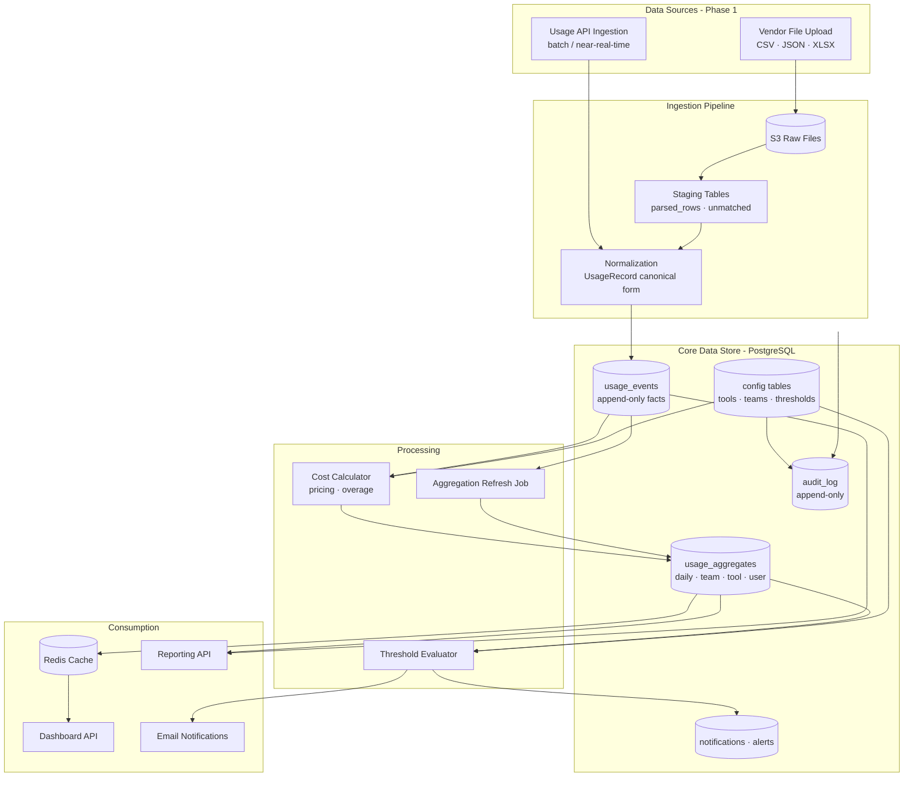
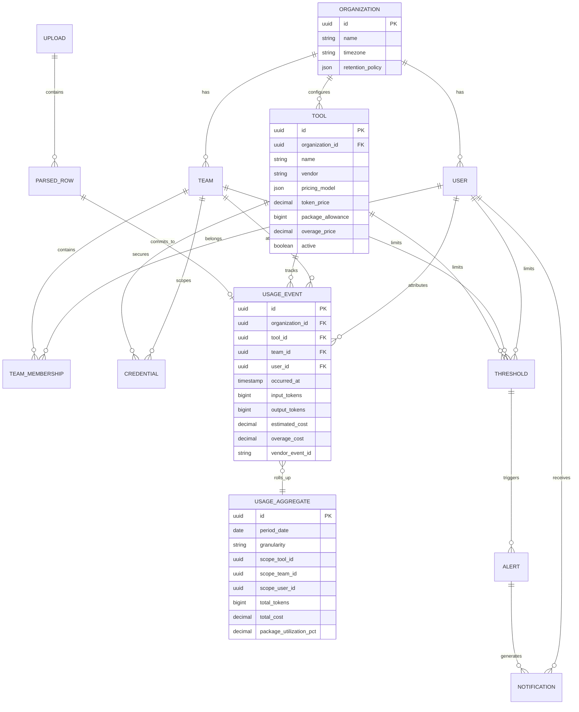
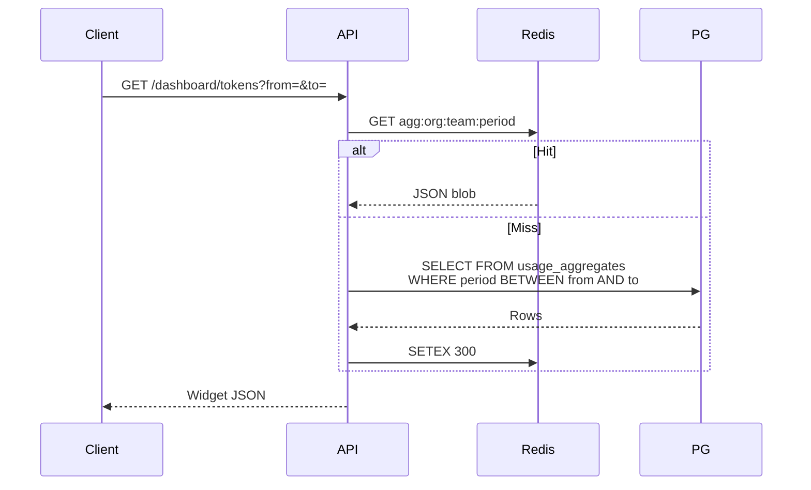
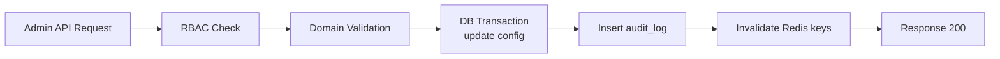
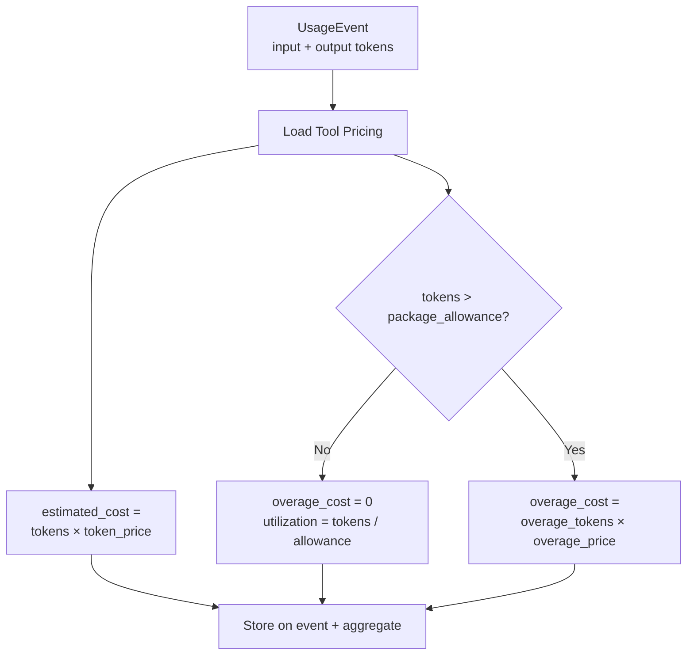
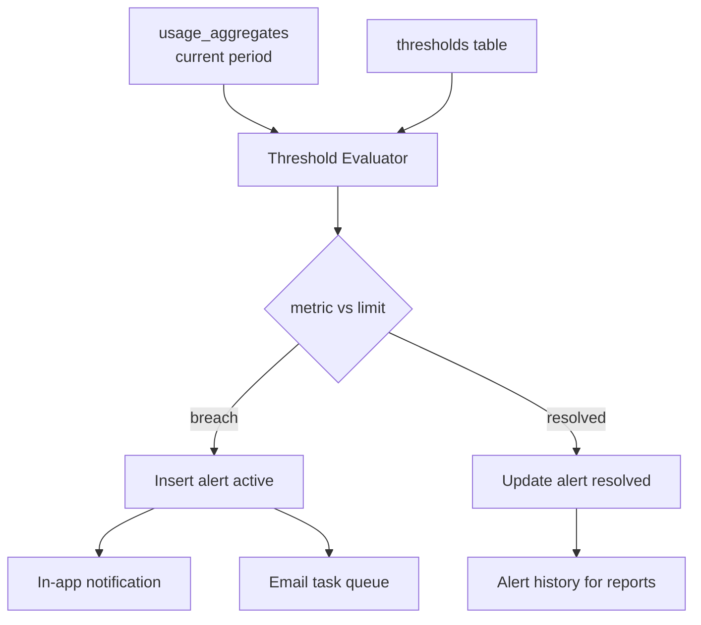
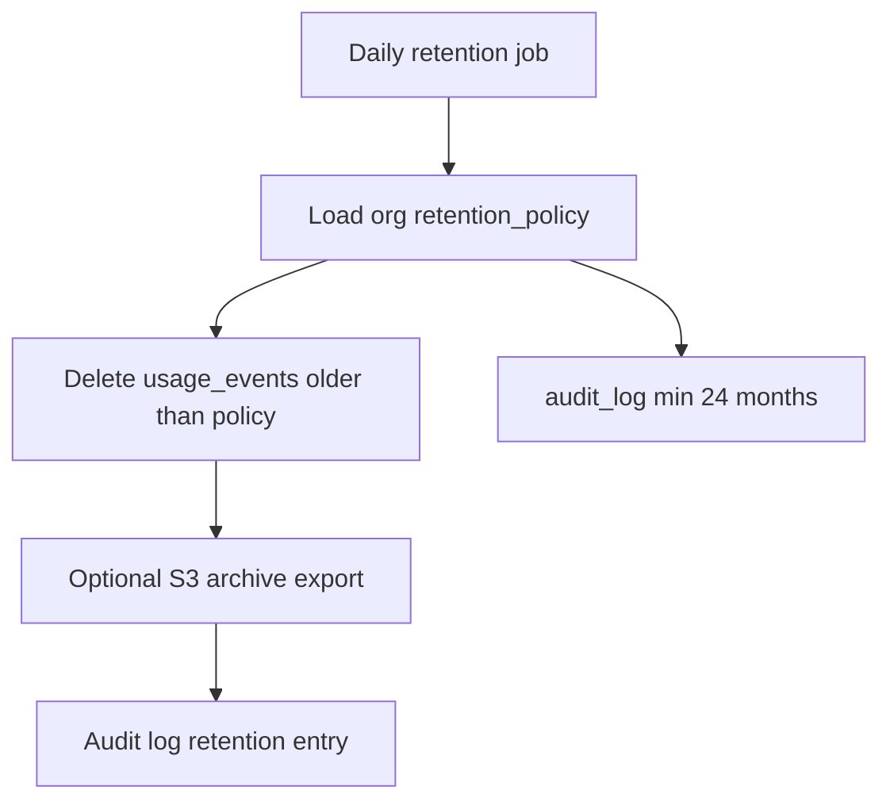

# Data Flow

End-to-end data movement from ingestion through aggregation to consumption.

---

## Data Flow Overview

---

## Entity Relationship (Conceptual)

---

## Ingestion Data Flow (Detail)

### Stage 1: Capture

| Step | Data | Storage |
|------|------|---------|
| Upload received | Raw bytes | S3 `org/{id}/uploads/` |
| Metadata recorded | filename, size, uploader, team, status | PostgreSQL `uploads` |
| Audit | upload initiated | PostgreSQL `audit_log` |

### Stage 2: Parse and Match

| Step | Data | Storage |
|------|------|---------|
| Format detection | MIME, extension, header sniff | Worker memory |
| Vendor parse | Raw rows → `UsageRecord` | PostgreSQL `parsed_rows` staging |
| User match | email → `user_id` | Update staging; flag `unmatched` |
| Preview | counts, samples | API read from staging |

### Stage 3: Commit

| Step | Data | Storage |
|------|------|---------|
| Idempotency check | `vendor_event_id` or hash | PostgreSQL unique index |
| Persist facts | `UsageEvent` rows | PostgreSQL `usage_events` |
| Cost calculation | pricing from `tools` | Computed columns on event |
| Aggregate refresh | rollups | PostgreSQL `usage_aggregates` |
| Cache invalidation | org/team keys | Redis DEL pattern |
| Threshold queue | evaluation task | Redis Celery queue |

---

## Read Path Data Flow (Dashboard)

**Consistency model:** Eventual consistency — aggregates may lag ingestion by near-real-time SLA (≤5 min, NFR-PER-004). Dashboard SHOULD display `last_updated_at` timestamp.

---

## Write Path Data Flow (Administration)

Configuration changes follow **transactional write + audit + cache invalidation**.

Pricing changes do NOT retroactively alter stored `usage_events` unless explicit **reprocess** job is triggered (FR-ADM-001 business rule).

---

## Cost Calculation Data Flow

Pricing model variants (per-tool `pricing_model` JSON) use **Strategy pattern** — e.g., flat token rate, tiered, seat-based placeholder for Phase 2.

---

## Alert Data Flow

Alert deduplication: one active alert per `(threshold_id, period_window)`.

---

## Report Data Flow

| Report Type | Primary Tables | Output |
|-------------|----------------|--------|
| Tool Usage Summary | `usage_aggregates`, `tools` | CSV/PDF |
| Team Usage | `usage_aggregates`, `teams` | CSV/PDF |
| Cost Report | `usage_aggregates`, `tools` | CSV/PDF |
| User Usage | `usage_aggregates`, `users` | CSV/PDF |
| Alert History | `alerts`, `thresholds` | CSV/PDF |
| API Key Activity | `audit_log`, `credentials` metadata | CSV/PDF |

Large reports: query → stream to temp file → S3 → presigned download URL.

---

## Data Retention Flow

Default: 24 months minimum (FR-PLT-004, NFR-CMP-001). Purge is hard delete from active tables; archive optional Phase 2.

---

## Data Classification

| Classification | Examples | Controls |
|----------------|----------|----------|
| **Restricted** | API credentials ciphertext | AES-256, Secrets Manager, no logs |
| **Confidential** | Usage per user, cost data | RBAC, encryption at rest |
| **Internal** | Team aggregates, tool config | RBAC |
| **Public** | None in Phase 1 | N/A |

---

## Data Volume Estimates (Reference Scale)

| Entity | Estimated Volume (24 mo) |
|--------|--------------------------|
| Users | 5,000 |
| Teams | 200 |
| Tools | 50 |
| Usage events | ~50M (NFR-SCL-001) |
| Aggregates (daily) | ~18M rows (50 tools × 200 teams × 365 × est. users factor reduced by rollup) |
| Uploads | ~10K files/year (assumption) |
| Audit log | ~500K events/year |

Partitioning strategy: `usage_events` partitioned by `occurred_at` monthly (PostgreSQL declarative partitioning) when row count exceeds 10M.
