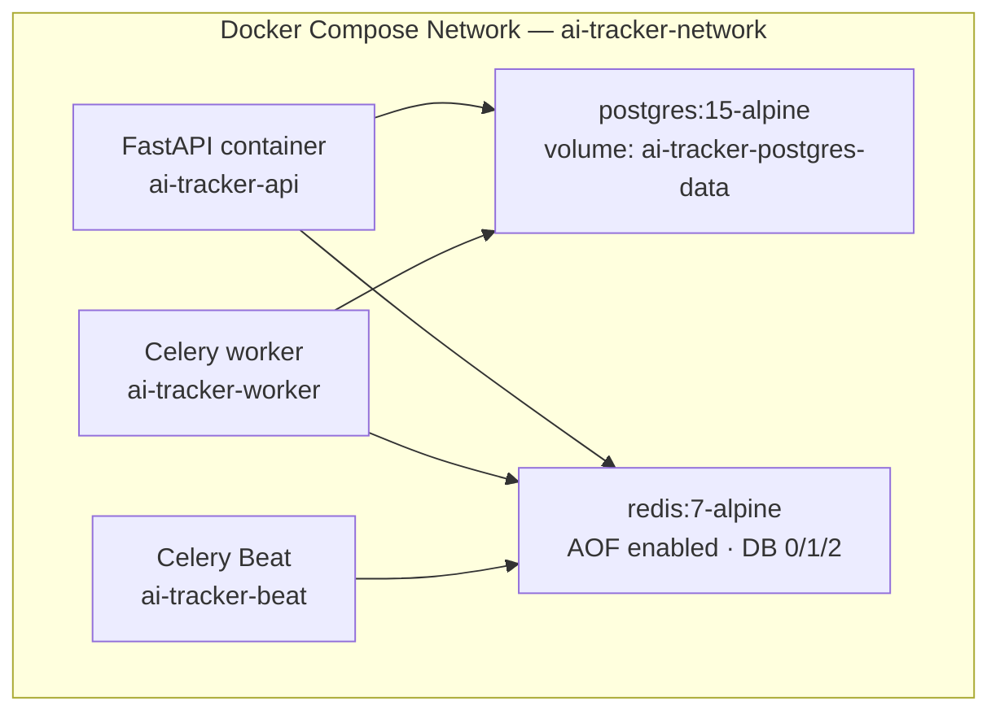
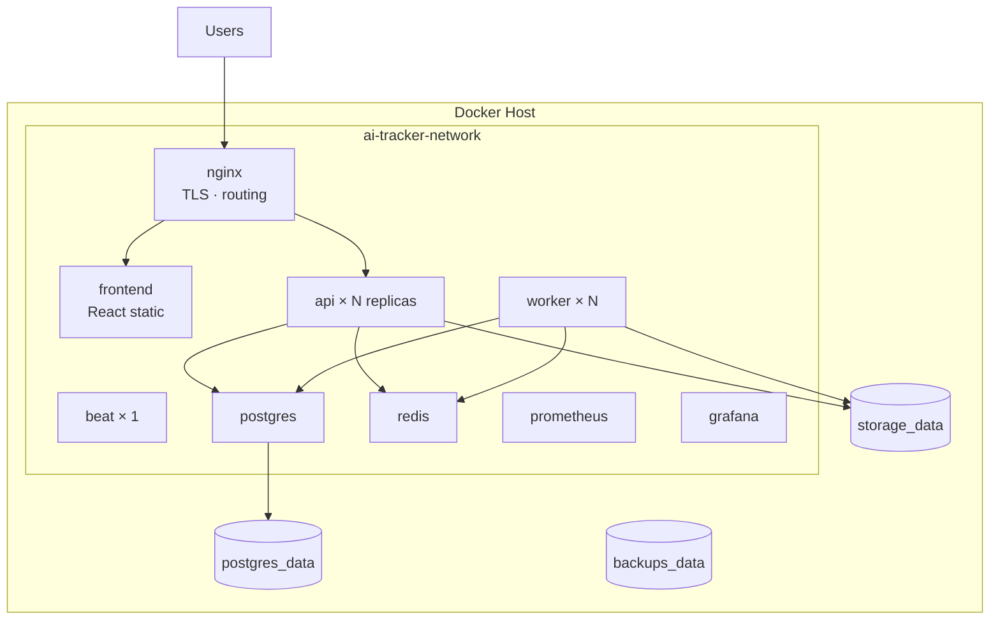
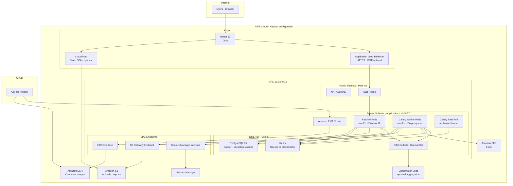
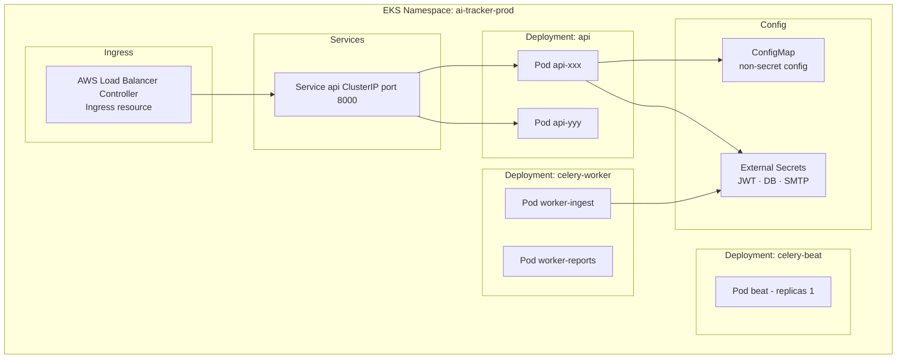
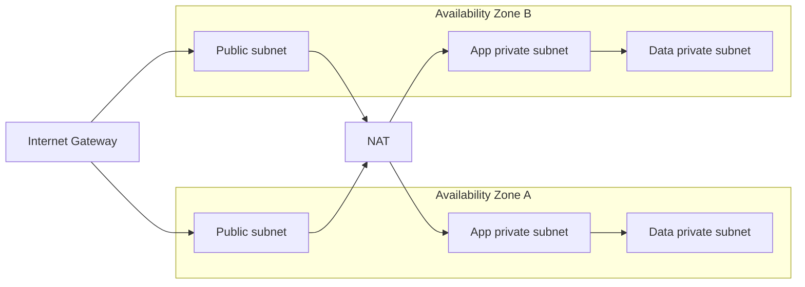
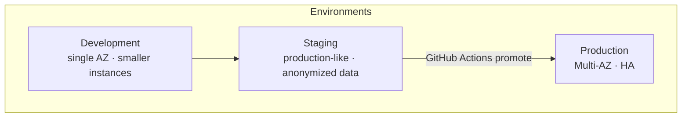
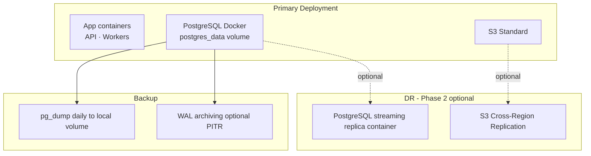
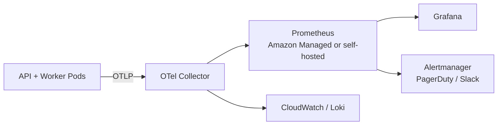

# Deployment Topology

**Phase 1 deployment:** **100% Docker Compose** on a VM or bare-metal host. All services and storage use **local Docker volumes** — no AWS EKS, S3, or ElastiCache.

Architecture diagrams below include optional AWS patterns **deferred to Phase 2**. Canonical operational spec: [deployment.md](../specifications/deployment.md).

**Stack alignment:** Docker Compose · PostgreSQL (Docker) · Redis (Docker) · Local volume storage · GitHub Actions CI/CD

---

## Docker Compose Stack (Database & Local/Staging)

PostgreSQL is **not** deployed on Amazon RDS. It runs as a Docker service with a named volume, on the same Docker network as the API and workers.

**Canonical specification:** [local-development.md](../specifications/local-development.md) (implemented in TASK-INF-001). **Full deployment spec:** [deployment.md](../specifications/deployment.md).

| Implementation detail | Value |
|-----------------------|-------|
| Compose file | `docker-compose.yml` (repository root) |
| Backend source | `backend/` |
| Interim health probe | `GET /health` (migrates to `/api/v1/health` in TASK-INF-002) |
| Env template | `.env.example` |

See [database.md](./database.md#docker-deployment) for PostgreSQL backups (`pg_dump`), sizing, and connection settings.

---

## Phase 1 Production Topology (Docker Compose)

All staging and production workloads run on a **Docker host** using Compose (see [deployment.md](../specifications/deployment.md), ADR-013):

| Setting | Production |
|---------|------------|
| Compose files | `docker-compose.yml` + `docker-compose.prod.yml` |
| Secrets | Host `.env` or Compose `secrets:` |
| Backups | Daily `pg_dump` → `backups_data` volume + off-host rsync |
| Frontend | `frontend` + `nginx` containers — not S3/CloudFront |

---

## Phase 2 — AWS Cloud Topology (Deferred)

> The diagrams below describe an **optional Phase 2** migration path. **Do not implement for Phase 1 MVP.** Superseded for Phase 1 by [ADR-013](../decisions/ADR-013-docker-compose-local-storage.md).

## Production Deployment Topology (Phase 2 reference)

---

## Kubernetes Workload Layout

### Pod Resource Baselines (Starting Point)

| Workload | CPU Request | Memory Request | Replicas |
|----------|-------------|----------------|----------|
| FastAPI | 500m | 512Mi | 2–10 (HPA) |
| Celery ingestion | 1000m | 1Gi | 2–6 (HPA) |
| Celery reports | 1000m | 2Gi | 1–4 (HPA) |
| Celery beat | 100m | 256Mi | 1 |

HPA triggers: CPU >70%, or custom metric `celery_queue_depth` >500.

---

## Network Topology

### Security Groups (Summary)

| Source | Target | Port | Purpose |
|--------|--------|------|---------|
| ALB SG | API pods SG | 8000 | HTTP to FastAPI |
| API pods SG | PostgreSQL host / Docker network | 5432 | PostgreSQL container |
| API/Worker SG | Redis SG | 6379 | Cache + broker |
| API/Worker SG | S3 endpoint | 443 | Object storage |
| EKS nodes | ECR endpoint | 443 | Image pull |

No direct internet ingress to application or data subnets (NFR-SEC-002).

---

## Environment Topology

| Environment | App runtime | PostgreSQL | Redis | Storage | Purpose |
|-------------|-------------|------------|-------|---------|---------|
| Development | Docker Compose | `postgres:15-alpine` + volume | `redis:7-alpine` + volume | Local volume | Local feature development |
| Staging | Docker Compose | PostgreSQL Docker + volume | Redis Docker + volume | Local volume | Integration / load test |
| Production | Docker Compose | PostgreSQL Docker + volume (not RDS) | Redis Docker + volume | Local volume | Live workloads |

Credential environments (sandbox vs production) are **logical** separation within Administration (FR-ADM-003), distinct from deployment environments.

---

## CI/CD Pipeline Topology

```mermaid
flowchart LR
    subgraph gh ["GitHub"]
        CODE["Source Code"]
        PR["Pull Request"]
    end

    subgraph gha ["GitHub Actions"]
        LINT["Lint · Type Check"]
        TEST["Unit · Integration Tests"]
        SAST["Dependency Scan · Bandit"]
        BUILD["Docker Build"]
        PUSH["Push to ECR"]
        DEPLOY_STG["Deploy Staging"]
        DEPLOY_PROD["Deploy Production<br/>manual approval"]
    end

    subgraph k8s ["EKS"]
        ROLL["Rolling Update<br/>maxUnavailable 0"]
        HEALTH["Readiness Probe Gate"]
    end

    CODE --> PR
    PR --> LINT --> TEST --> SAST
    SAST --> BUILD --> PUSH
    PUSH --> DEPLOY_STG --> DEPLOY_PROD
    DEPLOY_PROD --> ROLL --> HEALTH
```

### Deployment Strategy

- **Rolling update** with readiness probes (NFR-AVL-004)
- **Database migrations** via init job or Alembic job before traffic shift
- **Feature flags** for risky features (optional P1)
- **Rollback:** Kubernetes rollout undo; DB migrations require backward-compatible changes (OpenSpec principle)

---

## High Availability and DR

| Objective | Target | Mechanism |
|-----------|--------|-----------|
| RPO | ≤ 24h (daily dump) | Local `backups_data` volume + off-host rsync |
| RTO | ≤ 4 hours | Restore dump + storage tarball on new Docker host |
| API container failure | ≤ 5 min | Docker restart + healthcheck |
| Monthly uptime | ≥ 99.5% | Multi-replica API/worker containers + volume backups |

---

## Observability Deployment

Key dashboards: API latency p95, error rate, Celery queue depth, PostgreSQL connections, Redis memory, ingestion throughput.

---

## Static Frontend Delivery (Phase 1)

| Pattern | Description | Phase 1 |
|---------|-------------|---------|
| **A: frontend + nginx containers** | React build in `frontend` image; `nginx` reverse proxy | **Used** |
| **B: Embedded in API** | FastAPI serves static build | Dev only |
| ~~C: S3 + CloudFront~~ | ~~CDN static hosting~~ | **Deferred Phase 2** |

---

## Cost Optimization (Phase 1 Docker host)

| Resource | Optimization |
|----------|--------------|
| Docker host | Right-size CPU/RAM/disk for Postgres + storage volumes |
| PostgreSQL | Tune container resources; daily pg_dump to local backup volume |
| Local storage | Monitor disk usage; retention jobs purge old uploads/reports |
| Redis | Single container with AOF volume; scale vertically if needed |

---

## Deployment Checklist (MVP Go-Live)

See [deployment-checklist.md](../specifications/deployment-checklist.md). Summary:

- [ ] Docker host with dedicated disk for volumes
- [ ] `docker compose -f docker-compose.yml -f docker-compose.prod.yml up` healthy
- [ ] PostgreSQL + Redis + storage + backup volumes provisioned
- [ ] Host `.env` secured (`chmod 600`); no secrets in Git
- [ ] Daily backup job to `backups_data` volume
- [ ] nginx TLS + frontend container routing
- [ ] OpenTelemetry + Prometheus + Grafana Compose profile
- [ ] GitHub Actions deploy pipeline to Compose host
- [ ] DR restore drill documented (NFR-BKP-005)

<!--
## Phase 2 AWS Checklist (Deferred)

- [ ] EKS cluster with node groups and ALB ingress controller
- [ ] ElastiCache Redis cluster
- [ ] S3 buckets with encryption, versioning, lifecycle rules
- [ ] Secrets Manager entries + External Secrets Operator
-->
