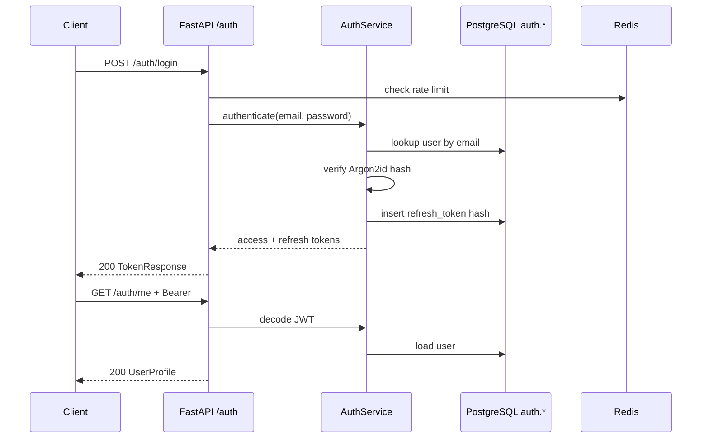

# Design: Authentication Backend

## Context

The repository has a Docker Compose dev stack (TASK-INF-001) with a minimal FastAPI app exposing interim `GET /health` and Celery scaffold. No Alembic migrations, SQLAlchemy session, or bounded-context packages exist yet.

Functional requirements FR-PLT-001 and NFR-SEC-003 define JWT authentication with five RBAC roles. OpenAPI specifies `/auth/login`, `/auth/refresh`, and `/auth/me` with Problem Details error responses. Database schema for `auth.*` tables is fully specified in [database.md](../../specifications/database.md).

**In-force ADRs** (from `openspec/decisions/`, not superseded):

| ADR | Constraint |
|-----|------------|
| ADR-001 | Modular monolith with bounded contexts |
| ADR-002 | FastAPI + Python backend |
| ADR-003 | PostgreSQL as system of record |
| ADR-005 | JWT auth + server-side RBAC (Phase 1, no SSO) |
| ADR-012 | API-first; implement to OpenAPI contract |
| ADR-013 | Phase 1 secrets via host `.env` / Compose secrets (not AWS Secrets Manager) |

This change implements the auth slice and minimal prerequisites (Alembic, `/api/v1` router) required to deliver it.

## Goals / Non-Goals

### Goals

- Deliver `auth` schema migration, models, repositories, and dev seed.
- Implement OpenAPI-aligned auth endpoints under `/api/v1/auth/*`.
- Issue and validate JWT access tokens; rotate refresh tokens with hashed DB storage.
- Rate-limit failed logins via Redis.
- Provide integration tests covering login, refresh, expired token, and rate limit.
- Establish reusable `get_current_user` FastAPI dependency for downstream routes.

### Non-Goals

- Full RBAC permission matrix and route-level policy enforcement (TASK-PLT-002).
- SSO/SAML, MFA, or OAuth2 external IdP (Phase 2).
- Audit log writes on login failure (optional; TASK-PLT-003).
- Frontend login UI (TASK-UI-001).
- Team membership population beyond empty `team_ids` until TASK-DB-002 (admin schema).

## Decisions

### 1. Package layout and API prefix

**Decision:** Add `backend/app/auth/` bounded context with `router.py`, `service.py`, `schemas.py`, `dependencies.py`, and `backend/app/api/v1/router.py` mounting auth routes at `/api/v1/auth`. Move health to `/api/v1/health`.

**Rationale:** Aligns with ADR-001 bounded contexts and TASK-INF-002 structure. OpenAPI server URL assumes `/api/v1` prefix.

**Alternatives considered:**
- Keep `/health` at root — rejected; breaks OpenAPI contract consistency.
- Separate microservice for auth — rejected per ADR-001 modular monolith.

### 2. Password hashing: Argon2id

**Decision:** Use `argon2-cffi` with Argon2id (time_cost=3, memory_cost=65536 KiB, parallelism=4).

**Rationale:** OWASP recommendation; resistant to GPU attacks. OpenAPI/database.md allow bcrypt or argon2.

**Alternatives considered:**
- bcrypt — simpler but weaker against modern hardware; acceptable fallback only.

### 3. JWT library and claims

**Decision:** Use `PyJWT` with HS256 signing. Access token claims: `sub` (user UUID), `org` (organization UUID), `role`, `exp`, `iat`, `jti`. TTL from `JWT_ACCESS_TOKEN_EXPIRE_MINUTES` (default 30).

**Rationale:** ADR-005 JWT auth; HS256 sufficient for monolith Phase 1. RS256 deferred until multi-service split.

**Alternatives considered:**
- `python-jose` — less actively maintained.
- RS256 asymmetric keys — unnecessary complexity for Phase 1.

### 4. Refresh token rotation

**Decision:** Issue opaque refresh tokens (256-bit random, URL-safe base64). Store SHA-256 hash in `auth.refresh_tokens`. On refresh: revoke old row, insert new row, return new pair. TTL from `JWT_REFRESH_TOKEN_EXPIRE_DAYS` (default 7).

**Rationale:** ADR-005 recommends rotation; database.md defines `refresh_tokens` table. Hash-at-rest prevents DB leak from exposing usable tokens.

**Alternatives considered:**
- Stateless refresh JWT — harder to revoke; rejected.
- No refresh tokens — poor UX for SPA; rejected.

### 5. Rate limiting

**Decision:** Redis sliding window counter keyed by `login_attempts:{ip}:{email_hash}`. Threshold: 5 failures in 15 minutes → 429 for 15 minutes. Increment on 401 login response only.

**Rationale:** NFR-SEC-003 AC-NFR-SEC-003-02. Redis already in stack (ADR-004).

**Alternatives considered:**
- In-memory rate limit — fails with multiple API replicas; not future-proof.
- Account lockout in DB — heavier; defer unless compliance requires.

### 6. Database access

**Decision:** SQLAlchemy 2.0 async with `asyncpg` driver. Alembic migration `002_auth` creates schema. Repository pattern: `UserRepository`, `RefreshTokenRepository`, `OrganizationRepository` in `backend/app/auth/repositories/`.

**Rationale:** ADR-003; matches TASK-DB-001 and future TASK-DB-007 direction.

### 7. Configuration

**Decision:** Extend Pydantic `Settings` with:

| Variable | Purpose |
|----------|---------|
| `JWT_SECRET_KEY` | HS256 signing secret (required) |
| `JWT_ACCESS_TOKEN_EXPIRE_MINUTES` | Access TTL (default 30) |
| `JWT_REFRESH_TOKEN_EXPIRE_DAYS` | Refresh TTL (default 7) |
| `DEV_SUPER_ADMIN_PASSWORD` | Dev seed only |
| `LOGIN_RATE_LIMIT_MAX_ATTEMPTS` | Default 5 |
| `LOGIN_RATE_LIMIT_WINDOW_SECONDS` | Default 900 |

**Rationale:** ADR-013 inject secrets via `.env`; aligns with NFR-SEC-008 Phase 1.

### 8. Error responses

**Decision:** Use RFC 9457 Problem Details (`application/problem+json`) for 401/429 auth errors via shared exception handler (minimal TASK-PLT-005 alignment).

**Rationale:** OpenAPI references ProblemDetails; consistent error contract.

## Architecture



## Module structure

```
backend/
  alembic/
    versions/002_auth.py
  app/
    api/v1/router.py          # mounts auth + health
    auth/
      router.py               # /login, /refresh, /me
      service.py              # AuthService
      dependencies.py         # get_current_user, get_db
      schemas.py              # Pydantic DTOs mirroring OpenAPI
      repositories/
        user.py
        refresh_token.py
        organization.py
    db/
      session.py              # async engine + session factory
      base.py
    models/
      auth.py                 # SQLAlchemy models
    core/
      security.py             # hash, JWT encode/decode
      rate_limit.py           # Redis login throttle
      exceptions.py           # Problem Details
    scripts/
      seed_dev_admin.py
```

## Migration Plan

1. Merge Alembic framework (INF-004 minimal) and `002_auth` migration.
2. Deploy migration via one-shot container or API startup hook in dev.
3. Run dev seed in development Compose profile only.
4. Deploy API with new auth routes; existing `/health` clients update to `/api/v1/health`.
5. Rollback: revert API image; migration backward-compatible (drop auth schema only if no dependent data — safe on fresh dev).

## Risks / Trade-offs

| Risk | Mitigation |
|------|------------|
| Bundling INF-002/INF-004 scope expands change size | Limit skeleton to auth-only packages; document remaining INF-002 work |
| JWT revocation before expiry | Short access TTL + refresh rotation; Redis blocklist hook reserved for PLT-002 |
| Rate limit bypass via IP rotation | Accept for Phase 1; add account-level lockout in Phase 2 if needed |
| Windows dev: asyncpg build failures | Primary dev path is Docker Compose Linux containers |
| ADR-005 mentions AWS Secrets Manager | ADR-013 Phase 1 `.env` takes precedence; record ADR-014 for refresh token storage detail |

## Open Questions

- **Team IDs in `/auth/me`:** Return empty array until TASK-DB-002 creates `admin.team_memberships`; document in API response.
- **Correlation ID header:** Propagate if TASK-PLT-005 lands concurrently; optional header passthrough in auth routes.
