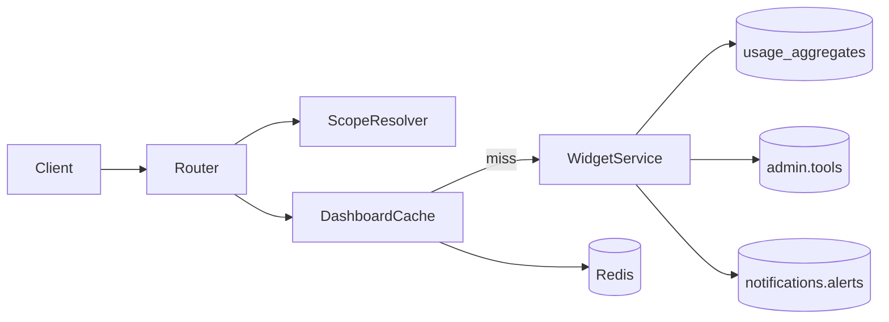

# Design: Dashboard Backend

## Context

OpenAPI defines eight dashboard GET endpoints with performance target p95 ≤ 3s (NFR-PER-001). ADR-008 mandates CQRS-lite: writes to `usage_events`, reads from `usage_aggregates` with Redis cache-aside. No dashboard code exists today.

**Depends on:**
- `authentication-backend` — JWT, `get_current_user`
- `user-management-backend` — teams, Team Admin scope (ADR-015)
- **[usage-collector-backend](../usage-collector-backend/proposal.md)** or file ingest — `usage.usage_aggregates` populated (TASK-USG-002)
- Alerts — `notifications.alerts` populated by notifications-backend (read-only here)

**In-force ADRs:**

| ADR | Constraint |
|-----|------------|
| ADR-001 | `dashboard` bounded context in modular monolith |
| ADR-005 | Server-side RBAC on every request |
| ADR-008 | Read aggregates + Redis cache-aside; `last_updated_at` |
| ADR-012 | Implement to OpenAPI schemas |
| ADR-015 | Team Admin scope via active team membership |

## Goals / Non-Goals

### Goals

- Redis cache-aside with safe keying and invalidation hooks.
- RBAC scope resolver mapping roles → SQL filter predicates.
- All eight `/api/v1/dashboard/*` endpoints.
- Query layer over `usage.usage_aggregates` with joins to `admin.tools`, `admin.teams`.
- Alerts widget reads active rows from `notifications.alerts`.
- Integration tests + reference-data perf smoke.
- Cache hit/miss Prometheus counters.

### Non-Goals

- Usage ingestion or aggregation job implementation (TASK-USG-001/002).
- Threshold evaluation engine (TASK-NTF-001).
- Dashboard CSV/PDF export (TASK-DSH-006).
- Frontend dashboard page (TASK-UI-004).
- Org timezone date bucketing (TASK-PLT-006) — UTC dates in Phase 1.

## Decisions

### 1. Package layout

```
backend/app/dashboard/
  router.py           # mounts /dashboard/*
  scope.py            # DashboardScopeResolver
  cache.py            # DashboardCache (Redis)
  queries/
    aggregates.py     # SQL against usage_aggregates
    alerts.py         # active alerts query
  services/
    tokens.py
    cost.py
    usage_by_tool.py
    usage_by_team.py
    top_consumers.py
    alerts.py
    trends.py
    my_usage.py
  schemas.py          # response DTOs mirroring OpenAPI
```

### 2. Read model

**Decision:** All standard widgets query `usage.usage_aggregates` with `granularity = 'daily'` rolled up in SQL for arbitrary date ranges. Trends endpoint uses matching granularity buckets from aggregates table.

**Rationale:** ADR-008; index `ix_agg_org_period` supports range scans.

**Fallback:** If aggregates empty for range, return zeros with `last_updated_at = now()` — not an error.

### 3. RBAC scope resolver

**Decision:** `DashboardScopeResolver.resolve(user, team_id_param) → ScopeFilter` with fields: `organization_id`, `allowed_team_ids`, `allowed_user_id`, `deny`.

| Role | Default scope | team_id param |
|------|---------------|---------------|
| `team_member` | `user_id = self` | N/A (403 if team filter conflicts) |
| `team_admin` | teams with active membership | must be in membership set |
| `super_admin` | entire org | optional filter |
| `finance_viewer` | entire org read-only | optional filter |
| `auditor` | entire org read-only | optional filter |

**Rationale:** FR-DSH-001/004; ADR-015 for Team Admin.

### 4. Cache key format

**Decision:** `dash:{org_id}:{endpoint}:{scope_hash}:{filter_hash}` where:
- `scope_hash` = SHA-256 of role + allowed team/user ids
- `filter_hash` = SHA-256 of normalized from/to/team_id/tool_id/granularity/limit/entity

TTL from `DASHBOARD_CACHE_TTL_SECONDS` (default 120).

**Rationale:** Prevents cross-tenant and cross-role cache leakage (NFR-PER-006). Documented in ADR-016.

### 5. Invalidation

**Decision:** Publish invalidation events on:
- Celery task `usage.refresh_aggregates` completion → `invalidate_org(org_id)`
- Admin tool pricing PATCH → `invalidate_org(org_id)`
- Team membership change → `invalidate_org(org_id)`

Implementation: Redis `SCAN` + `DEL` by prefix `dash:{org_id}:*` (acceptable at MVP scale).

### 6. Alerts widget

**Decision:** Query `notifications.alerts` JOIN `admin.thresholds` WHERE `status = 'active'` filtered by scope team ids. Empty list = valid 200.

**Rationale:** FR-DSH-006; decoupled from evaluation engine.

### 7. Performance

**Decision:** Integration perf smoke asserts p95 ≤ 3s on seeded reference dataset (50 tools, 200 teams per NFR scale-down fixture ~10% for CI). Log slow queries > 1s.

### 8. API prefix

**Decision:** Mount at `/api/v1/dashboard/*` matching OpenAPI paths with v1 prefix convention.

## Architecture



## Migration Plan

1. Deploy dashboard package behind existing auth middleware.
2. Ensure USG-002 aggregation job running in environment.
3. Enable cache with TTL; monitor hit rate metrics.
4. Rollback: disable cache via env `DASHBOARD_CACHE_ENABLED=false`; revert router.

## Risks / Trade-offs

| Risk | Mitigation |
|------|------------|
| Stale dashboard after ingestion | Invalidation hook + `last_updated_at` in response |
| Aggregates not populated | Document dependency; test fixtures seed aggregates |
| Cache stampede on invalidation | Single-flight lock optional; defer if not needed MVP |
| Alerts widget empty without NTF | Seed test data; document operational dependency |

## Open Questions

- Materialized views vs app aggregates? **Use app aggregates per ADR-008.**
