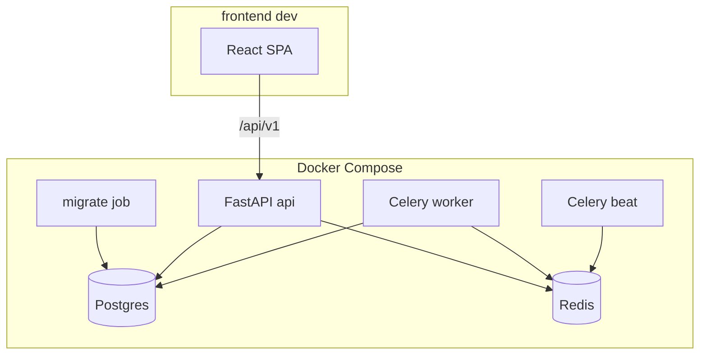

# Design: Foundation

## Context

TASK-INF-001 is **partially complete**: `docker-compose.yml`, flat `backend/app/` (main, config, connectivity, celery_app), `.env.example`, README, and `tests/infra/` exist. INF-002 through INF-006 are **not started**. No `frontend/`, Alembic, `/api/v1` router, bounded contexts, CI workflow, or Celery queue routing.

All downstream OpenSpec changes assume this foundation is applied first.

**Current scaffold (INF-001):**

| Artifact | Path | Notes |
|----------|------|-------|
| Compose stack | `docker-compose.yml` | postgres, redis, api, worker, beat |
| Backend entry | `backend/app/main.py` | interim `GET /health` at root |
| Celery | `backend/app/celery_app.py` | default queue only |
| Infra tests | `tests/infra/` | compose/env validation (12 passing) |

**In-force ADRs:**

| ADR | Constraint |
|-----|------------|
| ADR-001 | Modular monolith with bounded contexts |
| ADR-002 | FastAPI + Python backend |
| ADR-003 | PostgreSQL system of record |
| ADR-004 | Celery queue routing by domain |
| ADR-006 | React + TypeScript + MUI frontend |
| ADR-012 | API-first; OpenAPI contract |
| ADR-013 | Phase 1 Docker Compose + local volumes |

## Goals / Non-Goals

### Goals

- Complete INF-001 live verification and harden compose (migrate service, health path update).
- Deliver INF-002 bounded-context skeleton with `/api/v1` prefix and shared `core`/`db` layers.
- Deliver INF-003 Celery queues, task base, Beat placeholder, sample routed task.
- Deliver INF-004 Alembic async + initial schema creation revision.
- Deliver INF-005 GitHub Actions CI (lint, test, OpenAPI, security scan).
- Deliver INF-006 React SPA scaffold with API client and i18n.

### Non-Goals

- Auth endpoints, user models, or JWT issuance (`authentication-backend` change).
- Product routes (admin, ingestion, dashboard, etc.) — empty routers/`__init__.py` only.
- Production Kubernetes, resource limits, backup sidecar (TASK-OPS-003).
- Full Problem Details taxonomy (TASK-PLT-005 stub only).
- E2E Playwright tests (TASK-UI-008).

## Decisions

### 1. Monorepo layout

**Decision:**

```text
/
├── backend/app/
│   ├── main.py
│   ├── config.py
│   ├── celery_app.py
│   ├── api/v1/router.py
│   ├── core/           # exceptions, middleware, logging
│   ├── db/             # session, base model
│   ├── auth/           # empty package (auth change fills)
│   ├── admin/
│   ├── ingestion/
│   ├── usage/
│   ├── dashboard/
│   ├── reporting/
│   ├── notifications/
│   └── audit/
├── frontend/           # Vite React SPA
├── docker-compose.yml
├── .github/workflows/
└── tests/
    ├── infra/
    └── integration/
```

**Rationale:** ADR-001; matches OpenAPI `/api/v1` convention and downstream change package paths.

### 2. Health endpoint migration

**Decision:** Move health from `GET /health` to `GET /api/v1/health`. Update Docker healthcheck URL. Return JSON matching OpenAPI `HealthResponse` shape (`status`, `database`, `redis`).

**Rationale:** OpenAPI contract; authentication-backend already documents this breaking change.

**Migration:** Single commit in foundation apply; no dual-mount period.

### 3. Settings model

**Decision:** Extend Pydantic `Settings` in `config.py`:

| Setting | Purpose |
|---------|---------|
| `DATABASE_URL` | Async SQLAlchemy |
| `REDIS_URL` | Cache + rate limit |
| `CELERY_BROKER_URL`, `CELERY_RESULT_BACKEND` | Celery |
| `JWT_SECRET_KEY`, `JWT_ACCESS_TOKEN_EXPIRE_MINUTES` | Placeholders for auth change |
| `STORAGE_BACKEND`, `LOCAL_STORAGE_ROOT` | Report/ingest storage |
| `ENVIRONMENT` | dev/staging/prod |

Load from `.env` / Compose environment per ADR-013.

### 4. Alembic and migrate job

**Decision:** Add `migrate` one-shot Compose service:

```yaml
migrate:
  build: ./backend
  command: ["alembic", "upgrade", "head"]
  depends_on:
    postgres: { condition: service_healthy }
```

Initial revision `001_initial_schemas` creates empty PostgreSQL schemas: `auth`, `admin`, `ingestion`, `usage`, `notifications`, `reporting`, `audit` per [database.md](../../specifications/database.md).

**Rationale:** Separates migration from API startup; CI runs same command against service container Postgres.

**Alternatives considered:**
- Auto-migrate in API lifespan — rejected; race conditions with multiple replicas.

### 5. Celery queue routing (ADR-004)

**Decision:** Configure task routes:

| Queue | Consumers | Example tasks |
|-------|-----------|---------------|
| `ingestion` | worker `-Q ingestion` | file parse, collector (future) |
| `reports` | worker | report generation |
| `alerts` | worker | threshold evaluation |
| `email` | worker | SMTP send |
| `maintenance` | worker | ping, cleanup |

Worker command: `celery worker -Q ingestion,reports,alerts,email,maintenance`.

**Task base:** `BaseTask` with `bind=True`, reads `correlation_id` and `organization_id` from headers; logs on failure.

**Beat:** Placeholder schedule entry (e.g. hourly no-op or documented stub) to prove Beat starts.

**Sample task:** `core.tasks.ping_queue(queue_name)` dispatched from dev-only `POST /api/v1/internal/ping-task` or integration test helper.

### 6. Shared DB session factory

**Decision:** `db/session.py` provides async `get_session()` dependency and sync session factory for Celery tasks (run async code via `asyncio.run` or sync engine for workers — prefer sync engine in worker for simplicity in foundation).

**Rationale:** INF-003 DoD requires worker shares session factory with API.

### 7. CI pipeline (INF-005)

**Decision:** Single workflow `.github/workflows/ci.yml` on `pull_request` and `push` to `main`:

| Job | Steps |
|-----|-------|
| `backend-lint` | ruff check, ruff format --check, mypy |
| `backend-test` | pytest with Postgres + Redis service containers |
| `openapi-lint` | `@redocly/cli lint openspec/specifications/apis/openapi.yaml` |
| `security` | bandit, pip-audit on `backend/requirements*.txt` |
| `frontend` | npm ci, npm run build, npm test (if tests exist) |

Python 3.12 on `ubuntu-latest` to match Dockerfile.

### 8. React SPA scaffold (INF-006)

**Decision:** `frontend/` with Vite + React 18 + TypeScript + MUI v6:

```
frontend/src/
  api/client.ts       # axios/fetch wrapper, /api/v1 base, headers
  auth/AuthContext.tsx
  i18n/en-US.json
  routes/
    LoginPage.tsx
    DashboardPage.tsx
    AdminPage.tsx
  App.tsx
  main.tsx
```

Optional Compose profile `dev` adds `frontend` service with Vite on port 5173, proxy to API.

TanStack Query provider at app root. Auth context stores JWT in memory (localStorage optional, documented as dev-only).

### 9. Problem Details stub

**Decision:** Register FastAPI exception handler returning RFC 7807 JSON for unhandled `HTTPException` and generic 500 — full error catalog deferred to TASK-PLT-005.

## Architecture



## Migration Plan

1. Apply foundation change (restructure backend, add Alembic, CI, frontend).
2. Run `docker compose run migrate` then `docker compose up --build`.
3. Update README with new health URL and frontend dev commands.
4. Downstream changes apply in order: `authentication-backend` first.

**Rollback:** Revert foundation commit; restore flat scaffold. Downstream changes cannot apply on rollback.

## Risks / Trade-offs

| Risk | Mitigation |
|------|------------|
| Breaking `/health` → `/api/v1/health` | Update compose healthcheck + README in same PR |
| Windows dev: asyncpg build failures | Document Docker-first dev; CI on Linux |
| Empty bounded contexts feel heavy | `__init__.py` + README in each package explaining owner change |
| ADR artifact satisfied by unrelated ADRs | Foundation design references ADR-001/004/006 only; no new ADR required |
| authentication-backend duplicates INF-002 | Proposal states foundation first; auth change skips skeleton work |

## Open Questions

- Sync vs async Celery DB sessions? **Use sync SQLAlchemy session in worker for foundation; async in API.**
- Frontend in default compose or profile only? **Profile `dev` only to keep default stack minimal.**
