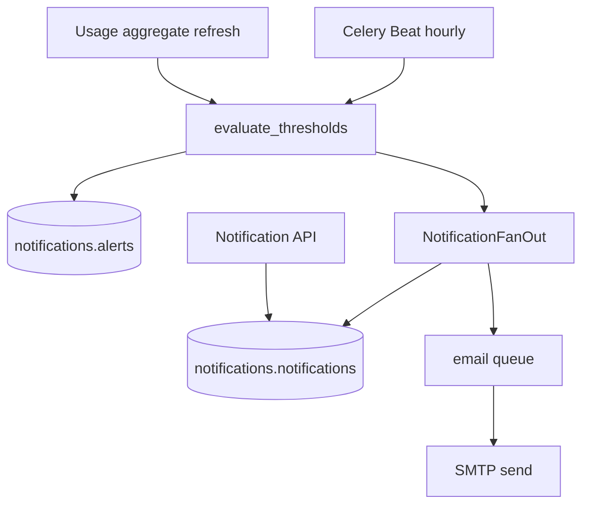

# Design: Notifications Backend

## Context

Module 5 requires threshold configuration (FR-ADM-004), automatic evaluation (FR-NTF-003), in-app notification center (FR-NTF-001), and email delivery (FR-NTF-002). Dashboard `/dashboard/alerts` and E2E-004 depend on `notifications.alerts`. No notification code exists today.

**Depends on:**
- `authentication-backend` — JWT, RBAC
- `user-management-backend` — teams, Team Admin scope (ADR-015)
- Admin tools schema — for tool-scoped thresholds
- USG-002 — usage aggregates for evaluation comparisons
- ADM-003 credentials — expiry reminder job (read expiry dates)

**In-force ADRs:**

| ADR | Constraint |
|-----|------------|
| ADR-004 | Celery `alerts` and `email` queues |
| ADR-005 | Server-side RBAC |
| ADR-013 | SMTP via `.env`, not AWS SES Phase 1 |
| ADR-015 | Team Admin threshold scope via team membership |
| ADR-008 | Evaluation reads usage aggregates |

## Goals / Non-Goals

### Goals

- `notifications` schema migration + repositories.
- Threshold CRUD under `admin/thresholds/` or `notifications/thresholds/`.
- Evaluation engine with dedupe and resolve lifecycle.
- Notification fan-out service with deep links.
- Notification center REST API.
- SMTP email worker with retry.

### Non-Goals

- Frontend notification center UI (TASK-UI-006).
- Push/mobile notifications.
- User notification preference center beyond threshold flags (Phase 2).
- Alert acknowledge API (not in OpenAPI; DB column exists for future).

## Decisions

### 1. Package layout

```
backend/app/notifications/
  router.py              # /notifications/*
  schemas.py
  alerts/
    repository.py
    service.py           # create alert, resolve, fan-out
  notifications/
    repository.py
    service.py           # list, mark read, unread count
  evaluation/
    engine.py            # compare aggregates to thresholds
    tasks.py             # alerts.evaluate_thresholds
  email/
    templates/           # Jinja2 HTML + text
    tasks.py             # notifications.send_email
    smtp.py
backend/app/admin/thresholds/
  router.py              # /thresholds/*
  service.py
  repository.py
```

### 2. Evaluation schedule

**Decision:**
- Celery Beat: `alerts.evaluate_thresholds` hourly (`0 * * * *`).
- Post-hook: call `evaluation.trigger_for_org(org_id)` after usage aggregate refresh (when USG-002 available).

**Period window:** Calendar month UTC for Phase 1 (align with billing period default in project.md).

### 3. Dedupe strategy

**Decision:** Rely on DB constraint `uq_active_alert_period` on `(threshold_id, period_start, period_end) WHERE status = 'active'`. Engine checks before insert; on conflict, update `current_value` only.

**Rationale:** FR-NTF-003 AC-NTF-003-03.

### 4. Notification fan-out

**Decision:** On new alert, determine recipients:
- Super Admins: org-wide
- Team Admins: active members of alert's team scope
- Finance Viewers: org-wide read notifications for cost/token breaches
- Team Members: only user-scoped alerts affecting them

Create one `notifications.notifications` row per recipient with denormalized OpenAPI fields in `payload` JSONB.

**Deep link:** `/dashboard/alerts/{alert_id}` (frontend route; API stores path string).

### 5. Email delivery

**Decision:** SMTP via `aiosmtplib` or standard `smtplib` in Celery worker. Config: `SMTP_HOST`, `SMTP_PORT`, `SMTP_USER`, `SMTP_PASSWORD`, `SMTP_FROM`. Critical alerts always email when `notify_email=true`; warning optional per threshold flag.

**Rationale:** ADR-013 Phase 1; ADR-018 documents SMTP choice.

### 6. Threshold scope validation

**Decision:** API validates scope FK columns match `scope` enum before DB insert; mirror CHECK constraints from database.md.

### 7. RBAC on notifications

**Decision:** All notification queries filter `user_id = current_user.id`. No cross-user listing except Super Admin audit use cases deferred.

## Architecture



## Migration Plan

1. Ensure `admin.thresholds` exists (bundle migration if needed).
2. Apply `006_notifications`.
3. Deploy API + worker with `alerts` and `email` queue consumers.
4. Enable Beat schedule.
5. Rollback: disable Beat task; API routes return 503 or hidden behind flag.

## Risks / Trade-offs

| Risk | Mitigation |
|------|------------|
| Evaluation without aggregates | Integration tests seed aggregates; engine no-ops gracefully |
| Email spam on flapping usage | Dedupe + resolve cycle; hysteresis optional Phase 2 |
| Missing tools/teams for scope | Validate FK on threshold create |
| SMTP unavailable in dev | Log-only email backend for development env |

## Open Questions

- Hysteresis band for resolve? **Use strict below-limit for Phase 1.**
