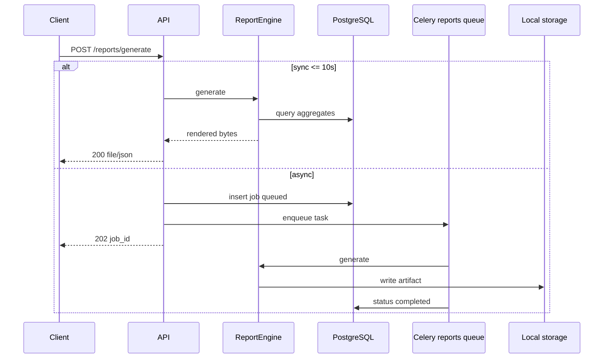

# Design: Reporting Backend

## Context

Reporting module (FR-RPT-001 – FR-RPT-007) requires exportable operational/financial reports with sync (≤10s) and async delivery. OpenAPI defines three endpoints and six `ReportType` values. ADR-008 read model applies. ADR-013 mandates **local volume storage** for report artifacts — not S3 presigned URLs (OpenAPI text is legacy).

**Depends on:**
- `authentication-backend` — JWT, RBAC
- `user-management-backend` — team scope
- `dashboard-backend` — shared aggregate query patterns (optional reuse)
- USG-002 — `usage.usage_aggregates`
- Admin schema — tools, teams, credentials (for cost and API key activity)
- Audit log — API key activity report (read-only)

**In-force ADRs:**

| ADR | Constraint |
|-----|------------|
| ADR-001 | `reporting` bounded context |
| ADR-004 | Celery async on `reports` queue |
| ADR-005 | RBAC on every request |
| ADR-008 | Read aggregates for standard reports |
| ADR-012 | OpenAPI contract |
| ADR-013 | Local storage for artifacts |
| ADR-015 | Team Admin scope via membership |

## Goals / Non-Goals

### Goals

- `reporting.report_jobs` migration and repository.
- Shared `ReportEngine`: scope → query → render (json/csv/pdf).
- Six report type handlers.
- Sync/async API with Celery worker.
- Local artifact storage and download.
- Integration + perf tests.

### Non-Goals

- Scheduled reports / `report_schedules` (TASK-RPT-004).
- Email delivery of reports (TASK-NTF-004).
- Dashboard export reuse (TASK-DSH-006) — may share renderers later.
- Raw event scans for large ad-hoc reports (async may use bounded queries only in Phase 1).

## Decisions

### 1. Package layout

```
backend/app/reporting/
  router.py              # /reports/*
  schemas.py             # ReportGenerateRequest, ReportJob DTOs
  jobs/
    repository.py        # report_jobs CRUD
    service.py           # job lifecycle
  engine/
    scope.py             # reuse/adapt DashboardScopeResolver
    queries/             # per report type SQL
    renderers/
      json_renderer.py
      csv_renderer.py
      pdf_renderer.py
    types/
      tool_usage_summary.py
      team_usage.py
      cost.py
      user_usage.py
      alert_history.py
      api_key_activity.py
  storage/
    local.py             # write/read under LOCAL_STORAGE_ROOT/reports/
  tasks.py               # Celery generate_async
```

### 2. Sync vs async threshold

**Decision:**
- `async: false` (default): run inline in API request; must complete ≤10s or return 202 and queue job automatically.
- `async: true`: always queue.
- Row-count threshold: >10,000 aggregate rows → force async.

**Rationale:** FR-RPT-007 AC-RPT-007-01/03.

### 3. Local artifact storage

**Decision:** Write files to `{LOCAL_STORAGE_ROOT}/reports/{org_id}/{job_id}/report.{ext}`. Persist relative path in `report_jobs.storage_key`. Download endpoint streams file with auth check (job owner or authorized admin roles).

**Rationale:** ADR-013; replaces OpenAPI S3 presigned URL for Phase 1.

**OpenAPI alignment:** `download_url` returns API path `/api/v1/reports/jobs/{id}/download` with short-lived token query param optional.

### 4. PDF generation

**Decision:** Use **WeasyPrint** HTML→PDF templates per report type for maintainable layouts. Fallback: CSV-only if WeasyPrint unavailable in dev (document in Dockerfile).

### 5. Report type data sources

| Report Type | Primary sources |
|-------------|-----------------|
| `tool_usage_summary` | `usage_aggregates` + `admin.tools` |
| `team_usage` | `usage_aggregates` + `admin.teams` |
| `cost` | `usage_aggregates` (cost columns) |
| `user_usage` | `usage_aggregates` (user_id dimension) |
| `alert_history` | `notifications.alerts` + `admin.thresholds` |
| `api_key_activity` | `audit.audit_log` filtered credential actions + `admin.credentials` (masked) |

### 6. RBAC

**Decision:** Reuse `DashboardScopeResolver` pattern (shared `backend/app/core/scope.py` or import from dashboard). Same role matrix as dashboard widgets.

### 7. Celery task

**Decision:** `@celery_app.task(name="reports.generate_async", queue="reports")` — update INF-003 queue routing to include `reports` queue.

Task updates job status, writes artifact, calls notification stub.

### 8. Security

- API key activity: never query `secret_ciphertext`; use audit actions + masked credential labels.
- Download: verify `requested_by` matches caller unless Super Admin/Auditor org read policy.

## Architecture



## Migration Plan

1. Add `007_reporting` migration; add `storage_key` column if aligning with uploads pattern (nullable until complete).
2. Deploy worker with `reports` queue consumer.
3. Ensure storage volume mounted on api + worker.
4. Rollback: disable report router; jobs table retained.

## Risks / Trade-offs

| Risk | Mitigation |
|------|------------|
| OpenAPI says S3 presigned URL | ADR-017; update OpenAPI description in task 1.4 |
| PDF deps increase image size | Multi-stage Dockerfile; WeasyPrint in worker only |
| 10s budget missed on sync | Auto-fallback to async 202 |
| Audit log absent for API key report | Seed fixtures; stub empty report with note |

## Open Questions

- Shared scope module with dashboard? **Extract to `core/scope.py` if both land.**
