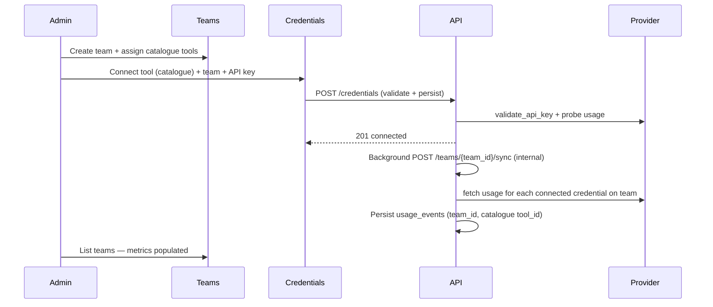

# Design: Team credentials data sync

## Intended admin workflow

### Step 1 — Create team with tools

On **Teams**, the admin selects one or more **catalogue tools** and optional per-tool pricing. This creates:

- `admin.teams.tool_ids` — catalogue tool UUIDs
- `admin.team_tools` rows — assignments with pricing overrides

No API keys are stored on the team record.

### Step 2 — Connect credentials

On **Credentials**, the admin selects:

| Field | Required | Notes |
|-------|----------|-------|
| Catalogue tool | Yes | Must be assigned to the chosen team (or will be added on connect) |
| Team | Yes | Scopes usage events and sync |
| API key | Yes | Validated before persist |

On success the system creates a **connected tool** row (`catalogue_only = false`), links it to the catalogue tool via `pricing_config.catalogue_tool_id`, sets `pricing_config.team_id`, ensures the catalogue tool is on `team.tool_ids`, and creates an active collector.

### Step 3 — Automatic data collection

After `POST /credentials` (and after secret rotation on `PATCH`):

1. Run **team sync** for the selected team (same logic as `POST /teams/{team_id}/sync`).
2. For each connected credential on that team with an API key, pull usage (30-day lookback) and members.
3. Persist `usage_events` with:
   - `organization_id`
   - `team_id` — from connected tool `pricing_config.team_id`
   - `tool_id` — **catalogue tool id** (not the connected credential id)
   - `collector_id`, provider fields, tokens, cost

Scheduled polling continues via the collector scheduler per credential interval.

### Step 4 — Team metrics display

`GET /teams` aggregates current calendar month (UTC) from `usage_events` where `team_id` matches. Per-tool pricing uses catalogue tool ids from team assignments. **Last synced** uses the latest `last_sync_at` among connected credentials for assigned catalogue tools.

## Data attribution rules

| Field | Source |
|-------|--------|
| `usage_events.team_id` | `pricing_config.team_id` on connected tool; fallback: first team with catalogue tool in `tool_ids` |
| `usage_events.tool_id` | Catalogue tool id (`pricing_config.catalogue_tool_id`) |
| Dashboard tool filter | Expands catalogue id to include connected credential ids for backwards compatibility |

## API behaviour

| Endpoint | Change |
|----------|--------|
| `POST /credentials` | After persist → background team sync for `body.team_id` |
| `PATCH /credentials/{id}` | After secret change → background team sync for credential's team |
| `POST /teams/{team_id}/sync` | Unchanged; shares internal sync implementation |

## Frontend

After successful credential connect or update with new secret:

- Invalidate `teams`, `team-tool-usage`, dashboard usage queries.

## Errors

- Provider validation failures → 422 on connect; no credential persisted.
- Sync failures after connect → credential saved; `last_sync_error` on connected tool; team sync result logged; manual refresh available on Teams page.
