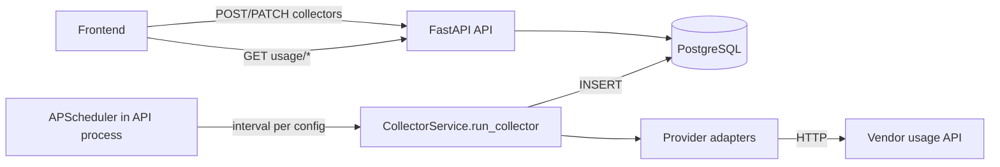

# Design: Token Collector MVP (Minimal Stack)

## Context

The full [usage-collector-backend](../usage-collector-backend/design.md) change targets Celery Beat + Redis with org-scoped credentials. For the first deliverable on `develop`, we run a **single API container** that owns both HTTP and scheduled pulls.

## Architecture



## Decisions

### 1. Two-container runtime

**Decision:** `docker-compose.yml` provides only `postgres` and `api` (+ one-shot `migrate`). No Redis, worker, or beat.

**Rationale:** User requirement — minimal footprint; collector is co-located with API.

### 2. In-process scheduling

**Decision:** [APScheduler](https://apscheduler.readthedocs.io/) `AsyncIOScheduler` starts in FastAPI `lifespan`. Each active `collector_configs` row gets an `IntervalTrigger(minutes=pull_interval_minutes)`.

**Reload:** After create/update/delete collector, router calls `scheduler.reload()` to sync jobs.

**Env:** `COLLECTOR_SCHEDULER_ENABLED=false` disables scheduler (tests/local debugging).

### 3. Pull window

For each run, fetch usage for `[now - pull_interval_minutes, now]` (UTC).

### 4. Schema (MVP subset)

Simplified tables without FK to `auth` / `admin` (single-tenant bootstrap):

- `ingestion.collector_configs` — name, provider, encrypted token, interval, status fields
- `ingestion.collector_runs` — execution history
- `usage.usage_events` — token facts with idempotent `(provider, vendor_event_id)` unique index

Full multi-tenant schema in [database.md](../../specifications/database.md) remains the Phase 1 target.

### 5. Token storage

MVP uses `COLLECTOR_ENCRYPTION_KEY` + XOR obfuscation in `app/core/token_crypto.py`. **Replace with Fernet/KMS before production.**

API never returns plaintext tokens — only `api_token_masked`.

### 6. Adapters

| Provider | MVP behaviour |
|----------|----------------|
| `openai` | Calls OpenAI org usage endpoint; falls back to deterministic stub |
| `anthropic` | Stub records |
| `azure_openai`, `cursor`, `custom` | Routed to OpenAI adapter until dedicated impl |

## Package layout

```
backend/app/collector/
  router.py       # /collectors/*
  schemas.py
  service.py      # CRUD + run_collector + persist
  scheduler.py    # APScheduler
  adapters/
    base.py
    openai.py
    anthropic.py
    registry.py
backend/app/usage/
  router.py       # /usage/events, /usage/summary
backend/app/models/collector.py
```

## Risks

| Risk | Mitigation |
|------|------------|
| API restart loses in-flight schedule timing | Acceptable for MVP; jobs re-register on startup |
| Single process handles HTTP + pulls | `max_instances=1` per job; scale out later with Celery |
| Stub data in dev | Log when vendor HTTP fails; document in README |
