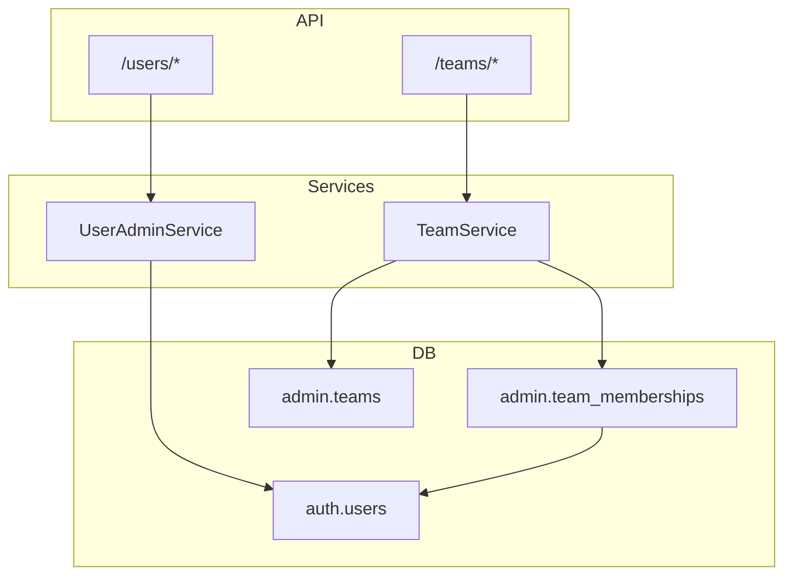

# Design: User Management Backend

## Context

Change `authentication-backend` (planned/applied) delivers `auth.users`, JWT login, and `/auth/me` with empty `team_ids`. FR-ADM-002 and TASK-ADM-002 require team CRUD and membership management. Super Admins must provision users before assigning them to teams (E2E-001).

OpenAPI defines `/teams/*` but not `/users/*`. Platform user administration is required for operational onboarding and is specified in this change's delta specs.

**In-force ADRs:**

| ADR | Constraint |
|-----|------------|
| ADR-001 | Modular monolith — `admin` bounded context |
| ADR-003 | PostgreSQL; soft-delete memberships |
| ADR-005 | JWT + server-side RBAC |
| ADR-012 | API-first; extend OpenAPI for new user endpoints |
| ADR-013 | Secrets via `.env` / Compose |
| ADR-014 | Unrelated to this change |

**Depends on:** `authentication-backend` (auth schema, JWT dependency, password hashing).

## Goals / Non-Goals

### Goals

- Migration `003_admin_teams` for `admin.teams` and `admin.team_memberships`.
- Platform user CRUD API (`/users/*`) for Super Admin.
- Team management API matching OpenAPI `/teams/*`.
- RBAC enforcement for administration routes (minimal PLT-002).
- Populate `/auth/me` `team_ids` from active memberships.
- Integration tests for FR-ADM-002 acceptance criteria.
- OpenAPI schema extension for Users tag.

### Non-Goals

- AI tool management (TASK-ADM-001).
- API credentials (TASK-ADM-003).
- Thresholds (TASK-ADM-004).
- Full audit log persistence (TASK-PLT-003) — interface hook only.
- Email invite / password reset flows (Phase 2).
- Hard delete of users or teams.

## Decisions

### 1. Package layout

**Decision:** `backend/app/admin/` with subpackages:

```
admin/
  users/       # router, service, schemas, repository extensions
  teams/       # router, service, schemas, repositories
  policies.py  # require_super_admin, require_team_admin_for(team_id)
  dependencies.py
```

Register routers at `/api/v1/users` and `/api/v1/teams`.

**Rationale:** ADR-001 bounded context; mirrors OpenAPI tags.

### 2. User administration API (OpenAPI extension)

**Decision:** Add to `openapi.yaml`:

| Method | Path | Roles |
|--------|------|-------|
| GET | `/users` | `super_admin`, `auditor` (read-only) |
| POST | `/users` | `super_admin` |
| GET | `/users/{userId}` | `super_admin`, `auditor` |
| PATCH | `/users/{userId}` | `super_admin` |

Schemas: `User`, `UserCreateRequest` (email, password, role, display_name), `UserUpdateRequest` (role, display_name, active), `UserListResponse`.

**Rationale:** No existing contract; required for user provisioning. Auditor read-only aligns with FR-PLT-001.

### 3. Team Admin authorization model

**Decision:** `team_admin` platform role may mutate memberships on team T **iff** they have an active `team_memberships` row for T. `super_admin` bypasses membership check for all org teams.

**Rationale:** database.md has no per-team admin flag; membership + role is minimal viable scope model. Document in ADR-015.

### 4. Soft membership removal

**Decision:** `DELETE .../members/{userId}` sets `removed_at = now()` on active membership. Re-add creates new row or clears `removed_at` on latest row.

**Rationale:** FR-ADM-002 AC-ADM-002-03; database.md design.

### 5. Deactivated team guard

**Decision:** `TeamService.assert_team_accepts_attribution(team_id)` returns false when `active=false`. Used by membership add and exported for ingestion module.

**Rationale:** FR-ADM-002 AC-ADM-002-04; central validation helper.

### 6. Pagination

**Decision:** Cursor pagination matching existing OpenAPI `Limit` + `Cursor` parameters for list endpoints.

**Rationale:** Consistency with `/teams` list contract.

### 7. Tenant isolation

**Decision:** All queries filter by `organization_id` from JWT `org` claim. Cross-org resource ids return 404 (not 403) to avoid enumeration.

**Rationale:** NFR-SCL-005 pattern; security best practice.

### 8. Audit hooks

**Decision:** `AuditRecorder` protocol with `NoOpAuditRecorder` default and structured log line; replace with TASK-PLT-003 implementation later. Events: `user.created`, `user.updated`, `team.created`, `team.updated`, `team.member_added`, `team.member_removed`.

**Rationale:** FR-PLT-002 dependency without blocking user management delivery.

## Architecture



## Migration Plan

1. Apply `003_admin_teams` after `002_auth`.
2. Deploy API with new routes.
3. Extend OpenAPI and run Redocly lint in CI.
4. Update `authentication-backend` `/auth/me` to query memberships (or patch in this change).
5. Rollback: revert API; admin tables remain (no data loss).

## Risks / Trade-offs

| Risk | Mitigation |
|------|------------|
| OpenAPI drift for new `/users` paths | Update `openapi.yaml` in same change; contract tests |
| Team Admin scope ambiguity | ADR-015; RBAC integration tests |
| Depends on unfinished auth change | Document dependency; stub tests skip if auth absent |
| Auditor read-only not in all OpenAPI team routes | Enforce in policy layer; list/get only for auditor on users |

## Open Questions

- Should `finance_viewer` list users? **Assumption:** no — 403 on `/users`.
- Password reset endpoint? **Deferred** to Phase 2.
