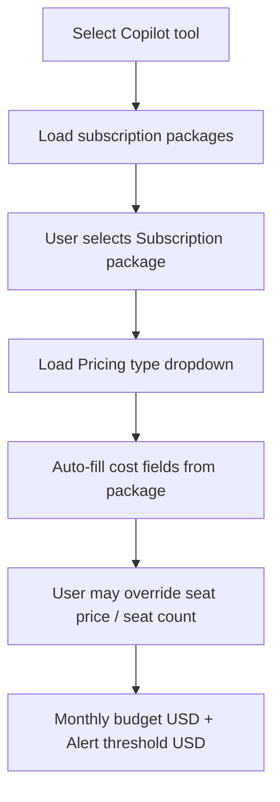

# GitHub Copilot — CSV Import & Team Configuration

**Status:** Draft for implementation  
**Priority:** P0 (Copilot delivery path)  
**Replaces (for Copilot):** Live GitHub Copilot API sync as the primary data source  
**Related:** [copilot-productivity-analytics.md](./copilot-productivity-analytics.md), [ToolNewFlow.md](./ToolNewFlow.md), [06-usage-ingestion.md](./06-usage-ingestion.md), change `team-pricing-configuration`

---

## 1. Objective

Deliver GitHub Copilot monitoring through **CSV billing import** and **team-level subscription configuration**, not through the GitHub Copilot REST/metrics APIs.

Administrators SHALL:

1. Configure Copilot subscription, pricing, budget, and cost alerts when creating or editing a team.
2. Import GitHub Copilot billing CSV exports, selecting the target tool and team.
3. View Copilot **Overview** metrics (seats, monthly cost, credit usage, additional charges) derived from imported data and team configuration.

Token-based usage events (`usage.usage_events`) MUST NOT be used for Copilot. Copilot data lives in `copilot_*` tables and/or Copilot-specific import staging, consistent with `billing_type = SEAT_BASED` / `CREDIT_BASED`.

---

## 2. Scope

### In scope

| Area | Description |
|------|-------------|
| Team create/edit | Copilot-specific fields when Copilot is among selected tools |
| Package catalogue | Copilot packages seeded and loaded from `tool_packages` |
| Pricing type cascade | Subscription package → pricing type (billing model) → editable cost fields |
| Per-tool budget | Monthly budget (USD) and alert threshold (USD) on `team_tools` |
| CSV import | Tool selector on upload; Copilot billing CSV parser |
| Cost derivation | SKU / `unit_type` rules for `copilot_for_business` and `copilot_ai_credit` |
| Overview dashboard | Copilot overview fed from import + team config |

### Out of scope

| Area | Reason |
|------|--------|
| GitHub Copilot API collector | Replaced by CSV for this delivery |
| Copilot productivity NDJSON (chat/suggestions/acceptance) | Not present in billing CSV; optional future import |
| Subscription end date | Explicitly removed from Copilot team UI |
| Token dashboards for Copilot | Copilot excluded from token aggregations (existing rule) |

---

## 3. Team creation — Copilot tool configuration

### 3.1 Trigger

When an administrator selects **GitHub Copilot** in the team **Tools** multi-select (create or edit team slide-over), the Copilot tool accordion SHALL expand with Copilot-specific configuration **inside the selected-tools section** (not at team root level).

Each selected tool retains its own package, pricing, monthly budget, and alert threshold bindings on `admin.team_tools`.

### 3.2 Field flow (cascade)



| Step | UI control | Source | Behaviour |
|------|------------|--------|-----------|
| 1 | **Subscription package** | `GET /api/v1/tools/{copilotToolId}/packages` | List active Copilot packages (see §4). Required for Copilot. |
| 2 | **Pricing type** | Derived from selected package `billing_type` | Dropdown options filtered by package (e.g. `SEAT_BASED` → Business/Enterprise seat plans; `CREDIT_BASED` → AI Credits). Read-only or single-option when package implies one type. |
| 3 | **Cost per seat** | Package `monthly_price` | Auto-filled when package selected; **editable**. Shown when pricing type is `SEAT_BASED`. |
| 4 | **Seat count** | Package `seat_limit` or team member count default | Auto-filled when package selected; **editable**. Shown when pricing type is `SEAT_BASED`. |
| 5 | **Monthly budget (USD)** | User input | Stored on `team_tools.monthly_budget`. Copilot monthly spend cap for alerts and overview. |
| 6 | **Alert threshold (USD)** | User input | Stored on `team_tools.alert_threshold_usd` (new column — see §6). Absolute USD amount, **not** percentage. |
| 7 | **Subscription start** | Optional date | Retained. |
| ~~8~~ | ~~Subscription end~~ | — | **Removed** from Copilot UI and not required for alerts. |

### 3.3 Pricing models (non-token)

When Copilot pricing type is **not** token-based (`SEAT_BASED`, `CREDIT_BASED`, or team flat model):

| Pricing model (UI) | Fields | Cost formula (configured) |
|--------------------|--------|---------------------------|
| **Per seat** | Cost per seat, Seat count | `monthly_subscription_cost = cost_per_seat × seat_count` |
| **Per team** (flat fee × members) | Cost per team (USD), Team members | `monthly_subscription_cost = cost_per_team × team_member_count` |

**Per team rules:**

- Pricing model selector includes **Per team** when tool billing type is not `TOKEN_BASED`.
- Team members MAY be added during team create/edit (existing members flow).
- `team_member_count` = count of platform users assigned to the team at calculation time.
- `cost_per_team` stored in `team_tools.pricing_config.cost_per_team` or `flat_monthly_cost` with `pricing_model = flat_fee` and multiplier applied in calculator.

### 3.4 Validation

- Copilot assignment MUST have `package_id` set unless org policy allows custom pricing (default: required).
- `monthly_budget` and `alert_threshold_usd` MUST be ≥ 0 when provided.
- `alert_threshold_usd` MUST be ≤ `monthly_budget` when both are set (warn if exceeded, do not block save).
- Seat count MUST be ≥ 1 for `SEAT_BASED` packages.

### 3.5 UI changes (frontend)

| File / area | Change |
|-------------|--------|
| `TeamToolPackageSelector.tsx` | Remove **Subscription end** for Copilot; change alert label to **Alert threshold (USD)**; hide `%` input |
| `TeamToolPackageSelector.tsx` | After package select, show **Pricing type** dropdown filtered by package `billingType` |
| `TeamsPage.tsx` | When vendor is `copilot`, show Copilot accordion fields; wire per-team pricing model |
| `ToolPricingFields.tsx` | Add **Per team** model with cost-per-team field; show member count read-only hint |

---

## 4. Copilot package catalogue (seed data)

Extend Copilot packages to match GitHub billing SKUs and pricing types.

| Package name | `billing_type` | `monthly_price` (USD) | `seat_limit` | `credit_limit` | CSV `sku` mapping |
|--------------|----------------|----------------------|--------------|----------------|-------------------|
| Copilot Business | `SEAT_BASED` | 19.00 | 1 (default per seat) | — | `copilot_for_business` |
| Copilot Enterprise | `SEAT_BASED` | 39.00 | 1 | — | `copilot_for_business` (enterprise line items — future filter) |
| Copilot AI Credits | `CREDIT_BASED` | — | — | org-defined | `copilot_ai_credit` |

**Implementation:**

- Update `backend/app/tools/package_catalog.py` and package seed migration.
- Package API unchanged: `GET /api/v1/tools/{id}/packages`.
- Add optional `pricing_config.sku` on package row for CSV auto-matching.

---

## 5. CSV import — tool selection

### 5.1 Upload dialog

The file upload flow (`UploadsPage`) SHALL add a **Tool** selector alongside the existing **Team** selector.

| Field | Required | Notes |
|-------|----------|-------|
| Team | Yes (unchanged) | Usage attributed to team |
| Tool | Yes for Copilot CSV | Catalogue tool id (Copilot). Drives parser selection. |
| File | Yes | CSV (Copilot billing export) |

**API change:** `POST /api/v1/uploads` accepts optional `tool_id` (UUID). Stored on `ingestion.uploads.tool_id` (new column).

When `tool.vendor = copilot`, the upload MUST use the Copilot billing parser (§7), not the generic token mapper.

### 5.2 Column mapping

Copilot billing CSVs use vendor-specific headers. Provide default mapping suggestions:

| App field | Typical CSV headers |
|-----------|---------------------|
| `sku` | `sku`, `SKU`, `product_sku` |
| `unit_type` | `unit_type`, `unitType`, `Unit Type` |
| `monthly_amount` | `monthly_amount`, `monthlyAmount`, `amount` |
| `net_amount` | `net_amount`, `netAmount`, `Net Amount` |
| `quantity` | `quantity`, `qty` |
| `billing_period_start` | `billing_period_start`, `period_start`, `start_date` |
| `billing_period_end` | `billing_period_end`, `period_end`, `end_date` |
| `user_login` | `user_login`, `login`, `username` (optional, seat attribution) |

Generic token fields (`input_tokens`, `output_tokens`) are **not** required for Copilot imports.

---

## 6. Data model changes

### 6.1 `ingestion.uploads`

```sql
ALTER TABLE ingestion.uploads
  ADD COLUMN tool_id UUID REFERENCES admin.tools(id);
```

### 6.2 `admin.team_tools`

```sql
-- Replace percentage alert with USD for cost alerts (Copilot and all tools going forward)
ALTER TABLE admin.team_tools
  ADD COLUMN alert_threshold_usd NUMERIC(18, 6);

-- Migrate existing alert_threshold (%) → USD where monthly_budget present:
-- alert_threshold_usd = monthly_budget * (alert_threshold / 100)
-- Deprecate alert_threshold (%) in UI; keep column for backward compatibility until migration complete.
```

Remove `subscription_end` from Copilot UI only; DB column may remain nullable for other vendors.

### 6.3 `copilot` schema — billing import snapshot

New table for monthly billing aggregates from CSV (per team, per import period):

```sql
CREATE TABLE copilot.billing_imports (
    id                  UUID PRIMARY KEY DEFAULT gen_random_uuid(),
    organization_id     UUID NOT NULL,
    team_id             UUID NOT NULL,
    tool_id             UUID NOT NULL,
    upload_id           UUID REFERENCES ingestion.uploads(id),
    billing_period_start DATE,
    billing_period_end   DATE,
    sku                 VARCHAR(64) NOT NULL,
    package_id          UUID REFERENCES admin.tool_packages(id),
    monthly_cost_limit  NUMERIC(18, 6) NOT NULL DEFAULT 0,  -- from ai_credits rows
    additional_cost     NUMERIC(18, 6) NOT NULL DEFAULT 0,  -- sum net_amount (user-months)
    total_cost          NUMERIC(18, 6) GENERATED ALWAYS AS (monthly_cost_limit + additional_cost) STORED,
    seat_count          INTEGER,
    raw_summary         JSONB DEFAULT '{}',
    imported_at         TIMESTAMPTZ NOT NULL DEFAULT now(),
    UNIQUE (team_id, tool_id, billing_period_start, billing_period_end, sku)
);
```

Optional detail rows (`copilot.billing_import_lines`) for audit if line-level retention is required.

### 6.4 Update `copilot_organizations`

Link latest billing import snapshot to org overview:

- `monthly_cost` ← `billing_imports.total_cost` when import exists for current period.
- Fall back to configured `cost_per_seat × seat_count` when no import.

---

## 7. Copilot CSV parsing & cost calculation

Parser runs **only** when upload `tool_id` resolves to `vendor = copilot`.

### 7.1 SKU values

| CSV `sku` | Package | Pricing type |
|-----------|---------|--------------|
| `copilot_for_business` | Copilot Business (or Enterprise by line item) | `SEAT_BASED` |
| `copilot_ai_credit` | Copilot AI Credits | `CREDIT_BASED` |

Rows with unknown `sku` MUST be flagged in preview and skipped on commit unless mapped manually.

### 7.2 `copilot_for_business` calculation

For rows where `sku = copilot_for_business`:

| `unit_type` | Source field | Aggregation rule |
|-------------|--------------|------------------|
| `ai_credits` (also accept `ai-credits`, case-insensitive) | `monthly_amount` | **Monthly cost limit (USD)** = SUM(`monthly_amount`) for all `ai_credits` rows in the billing period |
| `user-months` (also accept `user_months`) | `net_amount` | **Additional cost (USD)** = SUM(`net_amount`) for all `user-months` rows in the billing period |

**Totals:**

```
monthly_cost_limit = Σ monthly_amount  WHERE sku = 'copilot_for_business' AND unit_type IN ('ai_credits', 'ai-credits')
additional_cost    = Σ net_amount      WHERE sku = 'copilot_for_business' AND unit_type IN ('user-months', 'user_months')
total_cost         = monthly_cost_limit + additional_cost
```

**Notes:**

- `monthly_amount` on `ai_credits` rows represents the **included / base monthly subscription amount in USD** (monthly cost limit for alerts and overview).
- `net_amount` on `user-months` rows represents **additional seat-month charges** beyond the base subscription.
- Calculations apply **only** to Copilot imports; other tools keep existing token/cost mapping.

### 7.3 `copilot_ai_credit` calculation

For rows where `sku = copilot_ai_credit`:

| `unit_type` | Source field | Aggregation rule |
|-------------|--------------|------------------|
| `ai_credits` | `net_amount` or `monthly_amount` | **Credits consumed cost (USD)** = SUM(amount) for credit usage lines |
| Other unit types | `net_amount` | Include in `additional_cost` with unit type recorded in `raw_summary` |

Monthly cost limit for credit-based plans MAY be taken from team configuration (`team_tools.monthly_budget` or package `credit_limit` USD equivalent) and compared against imported spend for alert evaluation.

### 7.4 Worked example (`copilot_for_business`)

| sku | unit_type | monthly_amount | net_amount |
|-----|-----------|----------------|------------|
| copilot_for_business | ai_credits | 950.00 | — |
| copilot_for_business | user-months | — | 38.00 |
| copilot_for_business | user-months | — | 38.00 |

Result:

- `monthly_cost_limit` = **950.00 USD**
- `additional_cost` = **76.00 USD**
- `total_cost` = **1,026.00 USD**

### 7.5 Import commit behaviour

1. Parse and validate all rows; show preview with computed totals.
2. Upsert `copilot.billing_imports` for the billing period.
3. Update `copilot_organizations.monthly_cost` and seat counts where applicable.
4. Evaluate cost alerts: if `total_cost >= alert_threshold_usd` → trigger threshold notification (existing evaluator, USD-based).
5. Do **not** insert rows into `usage.usage_events`.

---

## 8. Copilot Overview (dashboard)

Overview SHALL use CSV import + team configuration.

| Card / metric | Source |
|---------------|--------|
| Subscription package | `team_tools.package_id` → package name |
| Pricing type | Package `billing_type` |
| Configured seat cost | `cost_per_seat × seat_count` or per-team formula |
| **Monthly cost limit** | Import `monthly_cost_limit` (ai_credits) or `monthly_budget` |
| **Additional cost** | Import `additional_cost` (user-months) |
| **Total cost (period)** | Import `total_cost` |
| Budget remaining | `monthly_budget - total_cost` when budget set |
| Alert status | `total_cost >= alert_threshold_usd` |

Existing Copilot dashboard route (`/insights/copilot`) remains; data source switches from API sync to import snapshot when no API credentials are connected.

---

## 9. API changes (summary)

| Method | Path | Change |
|--------|------|--------|
| `POST` | `/api/v1/uploads` | Add form field `tool_id` |
| `GET` | `/api/v1/uploads/{id}/mapping` | Return Copilot-specific mapping fields when tool is Copilot |
| `GET` | `/api/v1/uploads/{id}/preview` | Include Copilot computed totals (`monthly_cost_limit`, `additional_cost`, `total_cost`) |
| `POST` | `/api/v1/uploads/{id}/commit` | Persist to `copilot.billing_imports` for Copilot |
| `GET` | `/api/v1/copilot/overview` | Prefer billing import totals for current period |
| `POST/PATCH` | `/api/v1/teams/{id}/tools` | Accept `alert_threshold_usd`; validate Copilot package required |

OpenAPI schemas MUST be updated before implementation (`openspec/specifications/apis/components/schemas.yaml`).

---

## 10. Alert threshold migration (% → USD)

| Before | After |
|--------|-------|
| `alert_threshold` = 80 (meaning 80%) | `alert_threshold_usd` = 800 when `monthly_budget` = 1000 |
| Threshold evaluator uses % of token budget | Cost alert evaluator uses USD for Copilot and seat/credit tools |

**Business rule:** For Copilot, alerts compare **imported or calculated total cost in USD** against `alert_threshold_usd`, not against a percentage.

Migration script SHALL backfill `alert_threshold_usd` from existing `%` and `monthly_budget` where possible.

---

## 11. Functional requirements & acceptance criteria

### FR-COP-IMP-001: Copilot team configuration

**Given** an admin creates a team and selects Copilot,  
**When** the tools section renders,  
**Then** subscription packages load from the Copilot catalogue, pricing type cascades from the package, cost per seat and seat count auto-fill and remain editable, monthly budget and alert threshold are in USD, and subscription end is not shown.

- **AC-COP-IMP-001-01:** Package dropdown lists Copilot Business, Enterprise, and AI Credits packages.
- **AC-COP-IMP-001-02:** Selecting Business auto-fills pricing type `SEAT_BASED`, cost per seat `$19`, seat count editable.
- **AC-COP-IMP-001-03:** Per-team pricing model calculates cost as `cost_per_team × member_count`.
- **AC-COP-IMP-001-04:** `alert_threshold_usd` stored and returned on team tool assignment APIs.

### FR-COP-IMP-002: CSV upload with tool selection

**Given** an admin uploads a Copilot billing CSV,  
**When** they select team and Copilot tool and commit,  
**Then** costs are calculated per §7 and overview updates.

- **AC-COP-IMP-002-01:** Upload form requires tool selection for Copilot CSVs.
- **AC-COP-IMP-002-02:** Preview shows `monthly_cost_limit`, `additional_cost`, and `total_cost` for `copilot_for_business`.
- **AC-COP-IMP-002-03:** No rows written to `usage.usage_events` for Copilot import.
- **AC-COP-IMP-002-04:** Re-importing the same billing period upserts the snapshot (idempotent).

### FR-COP-IMP-003: Cost alerts (USD)

**Given** a team Copilot assignment with `monthly_budget = 1000` and `alert_threshold_usd = 800`,  
**When** imported `total_cost` reaches 800 USD,  
**Then** a cost usage alert is raised.

- **AC-COP-IMP-003-01:** Alert fires on USD threshold, not percentage.
- **AC-COP-IMP-003-02:** Alert payload includes period, total cost, threshold, and package name.

### FR-COP-IMP-004: Overview

**Given** a successful Copilot CSV import for the current month,  
**When** a user opens Copilot Overview for that team,  
**Then** cards reflect imported totals and configured budget.

- **AC-COP-IMP-004-01:** Overview shows monthly cost limit from `ai_credits` rows.
- **AC-COP-IMP-004-02:** Overview shows additional cost from `user-months` rows.
- **AC-COP-IMP-004-03:** Without import, overview falls back to configured seat/team pricing only (with “Import billing CSV” empty state).

---

## 12. Implementation tasks (ordered)

1. **DB migration** — `uploads.tool_id`, `team_tools.alert_threshold_usd`, `copilot.billing_imports`, package seed updates.
2. **Backend parser** — `CopilotBillingCsvParser` in `backend/app/copilot/billing_import.py` (or `uploads/copilot_parser.py`).
3. **Upload service** — branch on tool vendor; preview/commit paths for Copilot.
4. **Team tool APIs** — USD alert field; remove subscription end from Copilot responses/documentation.
5. **Frontend team UI** — cascade package → pricing type; USD alert; per-team pricing model.
6. **Frontend upload UI** — tool selector; Copilot preview totals.
7. **Copilot overview service** — read billing import snapshot.
8. **Threshold evaluator** — USD cost alerts for Copilot.
9. **Tests** — parser unit tests with fixture CSV; integration test for import → overview.

---

## 13. Test fixtures

Provide sample CSV headers for QA:

```csv
sku,unit_type,monthly_amount,net_amount,quantity,billing_period_start,billing_period_end,user_login
copilot_for_business,ai_credits,950.00,,1,2026-06-01,2026-06-30,
copilot_for_business,user-months,,38.00,2,2026-06-01,2026-06-30,dev-user-1
copilot_ai_credit,ai_credits,,120.50,500,2026-06-01,2026-06-30,
```

Expected `copilot_for_business` totals: limit **950.00**, additional **38.00**, total **988.00** (single user-months row).

---

## 14. Dependencies & conflicts

| Item | Action |
|------|--------|
| `copilot-productivity-analytics.md` | Mark API sync as **optional**; CSV import is primary |
| Existing Copilot collector | Disable by default when no GitHub credential; do not block CSV path |
| `alert_threshold` (%) on other tools | Migrate to USD over time; Copilot first |
| Credentials connect for Copilot | Optional / hidden in UI if org uses CSV-only mode (product decision) |

---

## 15. Open questions (defaults assumed)

| Question | Assumed default |
|----------|-----------------|
| Multiple billing periods in one CSV | Group by `(billing_period_start, billing_period_end)`; one snapshot per period |
| Enterprise vs Business same SKU | Match `package_id` from team assignment; SKU alone maps to Business unless line item distinguishes |
| Currency non-USD | Reject or convert with explicit `currency` column in v2; v1 USD only |

---

**Document owner:** Product / Engineering  
**Next step:** OpenSpec change proposal `copilot-import-mechanism` with design + tasks derived from this requirements doc.
