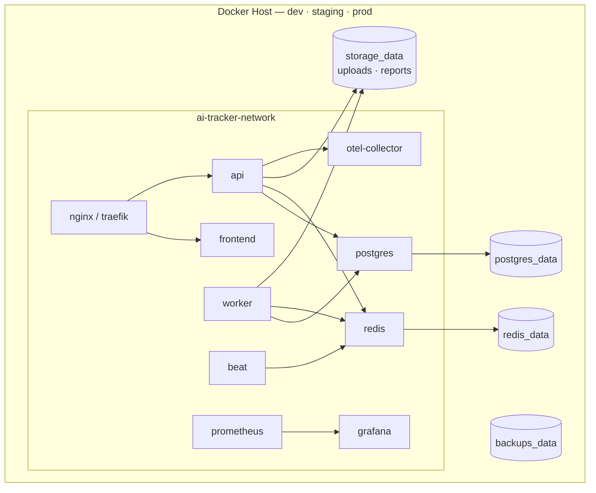
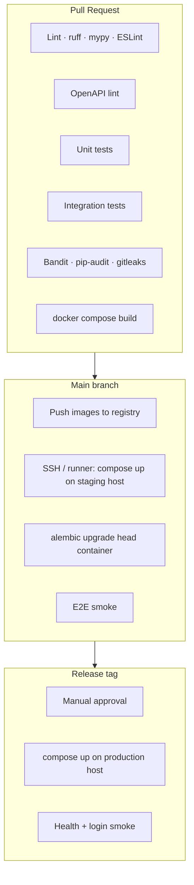

# Deployment Specification

Operational deployment requirements for the **AI Tool Usage Tracker** (Phase 1 MVP).

**Deployment model:** **100% Docker containerized** — all environments (development, staging, production) run via **Docker Compose**. **No AWS EKS, S3, ElastiCache, or CloudFront** in Phase 1.

**Storage model:** **Local persistent Docker volumes** on the host for PostgreSQL, Redis AOF, file uploads, generated reports, and backups.

**Sources:** [local-development.md](./local-development.md) · [database.md](./database.md) · [testing.md](./testing.md) · [NFR.md](../requirements/NFR.md) · [ADR-010](../decisions/ADR-010-opentelemetry-observability.md)

> **Note on ADR-007:** The original EKS/AWS topology is **deferred**. Phase 1 deploys entirely on Docker Compose with local volumes. See [§10 Platform evolution](#10-platform-evolution-deferred).

---

## Overview

| Aspect | Decision |
|--------|----------|
| **All environments** | Docker Compose (`docker-compose.yml` + overrides) |
| **Database** | `postgres:15-alpine` container + volume `ai-tracker-postgres-data` |
| **Cache / broker** | `redis:7-alpine` container + volume `ai-tracker-redis-data` |
| **Object storage** | **Local filesystem** via Docker volume `ai-tracker-storage-data` (uploads + reports) |
| **Backups** | **Local filesystem** via Docker volume `ai-tracker-backups-data` |
| **Frontend** | `frontend` container (nginx serving Vite build) or dev Vite container |
| **Reverse proxy** (prod) | `nginx` or `traefik` container — TLS termination |
| **CI/CD** | GitHub Actions → build images → `docker compose pull/up` on host |
| **Observability** | OTel Collector, Prometheus, Grafana — **all Docker containers** |
| **Secrets** | `.env` file on host (gitignored) or Docker Compose `secrets:` (NFR-SEC-008) |



---

## 1. Docker Strategy

### 1.1 Principles

| Principle | Requirement |
|-----------|-------------|
| **Everything containerized** | API, workers, Beat, Postgres, Redis, frontend, proxy, observability stack |
| **Single backend image** | One image for `api`, `worker`, `beat` (different commands) |
| **Local volumes only** | All durable data on named Docker volumes or host bind mounts — no cloud object storage |
| **No secrets in images** | Credentials injected via `.env` or Compose secrets (NFR-SEC-008) |
| **Health-gated startup** | `depends_on` + healthchecks before dependent services start |
| **Compose overrides** | Base `docker-compose.yml`; `docker-compose.prod.yml` for production hardening |
| **Immutable tags** | Deploy tagged images `{env}-{git-sha}`; avoid `:latest` in production |

### 1.2 Container inventory

| Service | Image / build | Container name | Persistent volume |
|---------|---------------|----------------|-------------------|
| `postgres` | `postgres:15-alpine` | `ai-tracker-postgres` | `postgres_data` |
| `redis` | `redis:7-alpine` | `ai-tracker-redis` | `redis_data` |
| `api` | `backend/Dockerfile` | `ai-tracker-api` | mounts `storage_data` |
| `worker` | `backend/Dockerfile` | `ai-tracker-worker` | mounts `storage_data` |
| `beat` | `backend/Dockerfile` | `ai-tracker-beat` | — |
| `frontend` | `frontend/Dockerfile` | `ai-tracker-frontend` | — (stateless) |
| `nginx` | `nginx:alpine` | `ai-tracker-proxy` | `./docker/nginx` config mount |
| `prometheus` | `prom/prometheus` | `ai-tracker-prometheus` | `prometheus_data` |
| `grafana` | `grafana/grafana` | `ai-tracker-grafana` | `grafana_data` |
| `otel-collector` | `otel/opentelemetry-collector` | `ai-tracker-otel` | — |
| `backup` | `postgres:15-alpine` (cron sidecar) | `ai-tracker-backup` | `backups_data` + read `postgres_data` |

### 1.3 Local storage layout

Volume `storage_data` is mounted at **`/var/lib/ai-tracker/storage`** in API and worker containers:

```
/var/lib/ai-tracker/storage/
  uploads/          # Vendor export files (FR-ING-001)
  reports/          # Generated PDF/CSV artifacts (FR-RPT-007)
  temp/             # Parse staging (cleaned after commit)
```

Volume `backups_data` is mounted at **`/backups`** in the backup sidecar:

```
/backups/
  postgres/         # pg_dump -Fc files (30-day retention)
  storage/          # Optional tarball of storage_data (weekly)
```

**Host bind-mount alternative (dev):** `./data/storage` and `./data/backups` instead of named volumes (documented in `.env` via `COMPOSE_FILE` override).

### 1.4 Compose files

| File | Purpose |
|------|---------|
| `docker-compose.yml` | Base stack — all services, volumes, network (TASK-INF-001) |
| `docker-compose.override.yml` | Developer overrides (optional, gitignored) |
| `docker-compose.prod.yml` | Production: no published DB/Redis ports, resource limits, proxy, TLS |
| `docker-compose.observability.yml` | Prometheus, Grafana, OTel (TASK-OPS-001/002) |

**Development:**

```bash
docker compose up --build
```

**Production:**

```bash
docker compose -f docker-compose.yml -f docker-compose.prod.yml up -d --build
```

### 1.5 Image build and registry

```bash
# Local / CI build
docker compose build

# Tag for private registry (optional — staging/prod hosts)
docker tag ai-tool-tracker-api:latest registry.example.com/ai-tool-tracker-api:${GIT_SHA}
docker push registry.example.com/ai-tool-tracker-api:${GIT_SHA}
```

| Environment | Registry | Deploy |
|-------------|----------|--------|
| Development | Local build | `docker compose up --build` |
| Staging / Production | Private Docker registry **or** build on host | `docker compose pull && docker compose up -d` |

**Scanning:** `docker scout` or Trivy in CI; block deploy on critical CVEs.

### 1.6 Frontend delivery

| Environment | Container | Access |
|-------------|-----------|--------|
| Development | Vite dev server **or** `frontend` service | `http://localhost:5173` |
| Staging / Production | `frontend` (nginx static) behind `nginx` proxy | `https://app.example.com` |

API served at `https://api.example.com` via same reverse-proxy container.

### 1.7 Production hardening (`docker-compose.prod.yml`)

| Setting | Production value |
|---------|------------------|
| Postgres / Redis ports | **Not published** to host |
| API port | Published only on internal network; exposed via proxy |
| `restart` | `unless-stopped` on all services |
| Resource limits | CPU/memory per service (see database.md sizing) |
| Log driver | `json-file` with `max-size: 10m`, `max-file: 3` |
| Redis AUTH | `--requirepass ${REDIS_PASSWORD}` |

---

## 2. CI/CD Pipeline

### 2.1 Tooling

| Component | Tool |
|-----------|------|
| Source control | GitHub |
| CI/CD | GitHub Actions |
| Container registry | Private Docker registry **or** build-on-deploy on target host |
| Deploy target | **Docker Compose on VM / bare metal** |
| OpenAPI lint | `@redocly/cli` |

### 2.2 Pipeline stages



### 2.3 Workflow definitions (target — TASK-INF-005)

| Workflow | Trigger | Purpose |
|----------|---------|---------|
| `pr.yml` | Pull request | Lint, test, `docker compose build`, security scan |
| `deploy-staging.yml` | Push to `main` | Build/push images; deploy Compose on staging host |
| `deploy-production.yml` | Tag `v*` + manual approval | Deploy Compose on production host |
| `nightly.yml` | Cron | E2E, performance, backup verification |

### 2.4 Deployment sequence

1. **Build** — `docker compose build` with `GIT_SHA` build arg.
2. **Push** — images to private registry (if used).
3. **Pull on target host** — `docker compose pull`.
4. **Migrate** — one-shot container: `docker compose run --rm api alembic upgrade head`.
5. **Rolling recreate** — `docker compose up -d --no-deps api`, then workers, then beat.
6. **Health gate** — wait for `GET /health` (or `/api/v1/health`) before cutting traffic.
7. **Proxy reload** — `nginx -s reload` if needed.
8. **Smoke test** — health + login check.

### 2.5 Promotion gates

| Gate | Staging | Production |
|------|---------|------------|
| PR checks green | Required | Required |
| Integration tests | Required | Required |
| Manual approval | No | **Yes** |
| Backup job verified | Recommended | Required |
| E2E smoke | Recommended | Required |

---

## 3. Environment Variables

### 3.1 Configuration vs secrets

| Type | Storage | Examples |
|------|---------|----------|
| **Non-secret config** | `.env` / Compose `environment` | `LOG_LEVEL`, `STORAGE_BACKEND`, `LOCAL_STORAGE_ROOT` |
| **Secrets** | `.env` on host (gitignored) or Compose `secrets:` | `POSTGRES_PASSWORD`, `JWT_SECRET_KEY`, `REDIS_PASSWORD` |
| **Never in Git** | — | Production passwords, JWT keys, encryption keys |

### 3.2 Variable catalog

#### Core (all environments)

| Variable | Required | Description | Example |
|----------|----------|-------------|---------|
| `POSTGRES_USER` | Yes | DB user | `aitracker` |
| `POSTGRES_PASSWORD` | Yes | DB password | strong secret |
| `POSTGRES_DB` | Yes | Database name | `aitracker` |
| `DATABASE_URL` | Yes | Async SQLAlchemy URL | `postgresql+asyncpg://…@postgres:5432/aitracker` |
| `REDIS_URL` | Yes | Cache (DB 0) | `redis://redis:6379/0` |
| `CELERY_BROKER_URL` | Yes | Broker (DB 1) | `redis://redis:6379/1` |
| `CELERY_RESULT_BACKEND` | Yes | Results (DB 2) | `redis://redis:6379/2` |
| `REDIS_PASSWORD` | Prod | Redis AUTH | strong secret |
| `JWT_SECRET_KEY` | Yes (INF-002+) | Access token signing | random 32+ bytes |
| `JWT_REFRESH_SECRET_KEY` | Yes (INF-002+) | Refresh token signing | random 32+ bytes |
| `CREDENTIAL_ENCRYPTION_KEY` | Yes (ADM-003+) | Vendor credential encryption | 32-byte key |

#### Local storage (replaces S3)

| Variable | Required | Description | Default |
|----------|----------|-------------|---------|
| `STORAGE_BACKEND` | Yes | Storage adapter | `local` |
| `LOCAL_STORAGE_ROOT` | Yes | Mount path inside container | `/var/lib/ai-tracker/storage` |
| `LOCAL_STORAGE_UPLOADS_DIR` | No | Subdir for uploads | `uploads` |
| `LOCAL_STORAGE_REPORTS_DIR` | No | Subdir for reports | `reports` |
| `LOCAL_BACKUP_ROOT` | Yes (backup job) | Backup volume mount | `/backups` |

#### Application

| Variable | Required | Description |
|----------|----------|-------------|
| `ENVIRONMENT` | Yes | `development` · `staging` · `production` |
| `LOG_LEVEL` | Yes | `DEBUG` / `INFO` |
| `CORS_ORIGINS` | Prod | Comma-separated frontend URLs |
| `SMTP_HOST` / `SMTP_PASSWORD` | NTF-004+ | Email delivery |

#### Observability

| Variable | Required | Description |
|----------|----------|-------------|
| `OTEL_EXPORTER_OTLP_ENDPOINT` | Staging+ | `http://otel-collector:4317` |
| `OTEL_SERVICE_NAME` | Yes | `ai-tracker-api` / `ai-tracker-worker` |

#### Port overrides (dev only)

| Variable | Default |
|----------|---------|
| `POSTGRES_PORT` | `5432` |
| `REDIS_PORT` | `6379` |
| `API_PORT` | `8000` |
| `FRONTEND_PORT` | `8080` |
| `HTTP_PORT` | `80` / `443` |

### 3.3 Environment-specific values

| Aspect | Development | Staging / Production |
|--------|-------------|---------------------|
| Compose files | `docker-compose.yml` | `+ docker-compose.prod.yml` |
| DB/Redis ports | Published to localhost | **Not published** |
| Storage | Named volume or `./data/storage` | Named volume on dedicated disk |
| Secrets | `.env` from `.env.example` | `.env` on host with strong secrets |
| Redis AUTH | Optional | **Required** |
| TLS | HTTP localhost | HTTPS via nginx + certs |

Template: [`.env.example`](../../.env.example).

---

## 4. Secrets Management

### 4.1 Policy (NFR-SEC-008)

| Rule | Requirement |
|------|-------------|
| No secrets in Git | `.env` gitignored; only `.env.example` with placeholders |
| No secrets in images | Inject at container runtime only |
| Per-environment `.env` | Separate files on each host: `/opt/ai-tracker/.env` |
| Docker Compose secrets | Optional for prod: map file-based secrets to `/run/secrets/*` |
| Rotation | Document rotation in runbook; restart affected containers after change |

### 4.2 Production `.env` on host

```bash
# On deployment host (not in Git)
/opt/ai-tracker/.env          # mode 600, owned by deploy user
/opt/ai-tracker/docker-compose.yml
/opt/ai-tracker/docker-compose.prod.yml
```

### 4.3 Docker Compose secrets (optional)

```yaml
secrets:
  postgres_password:
    file: ./secrets/postgres_password.txt
  jwt_secret:
    file: ./secrets/jwt_secret.txt

services:
  api:
    secrets:
      - postgres_password
      - jwt_secret
    environment:
      POSTGRES_PASSWORD_FILE: /run/secrets/postgres_password
```

### 4.4 CI/CD secrets (GitHub)

| Secret | Purpose |
|--------|---------|
| `STAGING_HOST` / `PRODUCTION_HOST` | SSH target or runner label |
| `DEPLOY_SSH_KEY` | Deploy user access |
| `REGISTRY_USER` / `REGISTRY_PASSWORD` | Private Docker registry (if used) |

Application secrets (JWT, DB password) live **only** on deployment hosts — not in GitHub Secrets.

---

## 5. Rollback Strategy

### 5.1 Application rollback

| Method | Command | RTO |
|--------|---------|-----|
| **Previous image tag** | Set `IMAGE_TAG={previous-sha}` in `.env`; `docker compose up -d` | ≤ 10 min |
| **Compose file revert** | `git checkout {tag} -- docker-compose*.yml`; redeploy | ≤ 15 min |
| **Frontend rollback** | Redeploy previous `frontend` image tag | ≤ 10 min |

Keep **last 5** image tags on registry or host.

### 5.2 Database migration rollback

| Scenario | Action |
|----------|--------|
| Backward-compatible migration | Roll back app image; DB unchanged |
| Destructive migration | Restore from `backups_data` — no automatic downgrade |
| Failed migration | Do not run `compose up` on new api image |

### 5.3 Rollback decision matrix

| Symptom | Roll back containers? | Restore backup? |
|---------|----------------------|-----------------|
| New API 5xx after deploy | **Yes** | No |
| Data corruption | Stop writes; roll back app | **Yes** — pg_restore |
| Storage volume corruption | Redeploy | Restore storage tarball from `/backups/storage/` |

### 5.4 Celery / Beat rollback

Recreate `worker` and `beat` containers with previous image tag after API rollback. Ensure only **one** `beat` container runs.

---

## 6. Monitoring

### 6.1 Stack — all Docker containers (ADR-010)

| Service | Image | Port |
|---------|-------|------|
| `otel-collector` | `otel/opentelemetry-collector-contrib` | 4317 |
| `prometheus` | `prom/prometheus` | 9090 |
| `grafana` | `grafana/grafana` | 3000 |
| `postgres-exporter` | `prometheuscommunity/postgres-exporter` | 9187 |
| `redis-exporter` | `oliver006/redis_exporter` | 9121 |

Enable via: `docker compose -f docker-compose.yml -f docker-compose.observability.yml up -d`

### 6.2 Required metrics (NFR-MON-001)

Same metric families as before — scraped from API, workers, postgres-exporter, redis-exporter into Prometheus.

### 6.3 Health and readiness (NFR-AVL-004)

| Service | Probe |
|---------|-------|
| `api` | `GET /health` — DB + Redis ok |
| `postgres` | `pg_isready` |
| `redis` | `redis-cli ping` |
| `nginx` | `GET /health` upstream check |

Docker Compose `healthcheck` blocks dependent services. Production proxy MUST remove unhealthy API containers from upstream pool.

### 6.4 Logging (NFR-MON-003)

JSON logs to stdout → collected by Docker log driver → optional Loki container (P1).

---

## 7. Alerting

### 7.1 Alert rules (NFR-MON-004)

| Alert ID | Condition | Severity |
|----------|-----------|----------|
| ALT-001 | API error rate > 1% / 5 min | P0 |
| ALT-002 | API p95 > 3s / 10 min | P0 |
| ALT-003 | Celery queue > 1,000 / 15 min | P0 |
| ALT-004 | Container healthcheck failing | P0 |
| ALT-005 | Postgres volume disk > 85% | P1 |
| ALT-006 | Backup missing > 24h | P0 |
| ALT-007 | Storage volume disk > 85% | P1 |
| ALT-009 | Synthetic health failure | P0 |

Prometheus Alertmanager container routes to Slack / email / PagerDuty.

---

## 8. Backup Procedures

### 8.1 PostgreSQL (NFR-BKP-001, TASK-OPS-003)

| Parameter | Target |
|-----------|--------|
| Method | `pg_dump -Fc` |
| Schedule | Daily 02:00 UTC via `backup` container cron |
| Location | **`backups_data` volume** → `/backups/postgres/` |
| Retention | **30 days** (local `find -mtime +30 -delete`) |
| Encryption | Host disk encryption (LUKS / BitLocker) recommended |

**Backup script:**

```bash
#!/bin/bash
set -euo pipefail
TIMESTAMP=$(date +%Y%m%d_%H%M%S)
OUT="/backups/postgres/aitracker_${TIMESTAMP}.dump"

docker exec ai-tracker-postgres \
  pg_dump -U "${POSTGRES_USER}" -Fc "${POSTGRES_DB}" > "${OUT}"

find /backups/postgres -name '*.dump' -mtime +30 -delete
```

### 8.2 Local storage backup (NFR-BKP-003)

| Parameter | Target |
|-----------|--------|
| Method | `tar czf` of `storage_data` volume |
| Schedule | Weekly |
| Location | `/backups/storage/storage_YYYYMMDD.tar.gz` |
| Retention | 4 weekly archives |

### 8.3 Restore procedure

```bash
# Stop application containers
docker compose stop api worker beat

# Restore Postgres
docker exec -i ai-tracker-postgres pg_restore \
  -U aitracker -d aitracker --clean --if-exists \
  < /backups/postgres/aitracker_YYYYMMDD.dump

# Restore storage (if needed)
tar xzf /backups/storage/storage_YYYYMMDD.tar.gz -C /var/lib/ai-tracker/storage

# Restart stack
docker compose up -d
```

### 8.4 Off-host backup (recommended)

Copy `/backups` volume to external NAS or second server via `rsync` cron — satisfies off-site retention without cloud storage.

---

## 9. Disaster Recovery

### 9.1 Objectives (NFR-BKP-002)

| Objective | Target | Mechanism |
|-----------|--------|-----------|
| **RPO** | ≤ 24h (daily PG dump) | Local `backups_data` + optional off-host rsync |
| **RTO** | ≤ 4 hours | New Docker host + restore volumes + `compose up` |
| **Container failure** | ≤ 5 min | `restart: unless-stopped` + healthcheck |
| **Uptime** | ≥ 99.5% | Multi-instance API/worker containers on same host (scale replicas) |

### 9.2 Failure scenarios

| Scenario | Response |
|----------|----------|
| Single container crash | Docker restart policy |
| Host disk failure | Provision new host; restore `backups_data` + `postgres_data` from off-host copy |
| Corrupt migration | Stop stack; pg_restore latest dump |
| Lost storage volume | Restore weekly storage tarball |
| Full host loss | DR runbook: new VM, install Docker, restore backups, deploy Compose |

### 9.3 DR runbook (NFR-BKP-005)

Document in `docs/runbooks/disaster-recovery.md`:

1. Provision Docker host (same OS as production)
2. Install Docker Engine + Compose v2
3. Clone deploy repo; restore `/opt/ai-tracker/.env` from secure backup
4. Restore `backups_data` and volume dumps from off-host copy
5. `docker compose -f docker-compose.yml -f docker-compose.prod.yml up -d`
6. Verify health, E2E smoke, row counts
7. Record RTO; file remediation items within 90 days

**Test frequency:** quarterly restore drill on staging host.

---

## 10. Platform Evolution (Deferred)

The following are **out of scope** for Phase 1 Docker deployment:

| Component | Status |
|-----------|--------|
| Amazon EKS | Deferred (ADR-007 not applied in Phase 1) |
| Amazon S3 | Replaced by local Docker volumes |
| ElastiCache | Replaced by Redis container |
| CloudFront / S3 SPA | Replaced by `frontend` + `nginx` containers |
| AWS Secrets Manager | Replaced by host `.env` / Compose secrets |

Cloud migration MAY be proposed in Phase 2 via a new ADR superseding this deployment model.

---

## Environment Summary

| Environment | Deploy method | Storage | Secrets |
|-------------|---------------|---------|---------|
| **Development** | `docker compose up --build` | Local named volumes | `.env` |
| **Staging** | `compose + prod override` on staging VM | Local volumes + off-host rsync | Host `.env` |
| **Production** | `compose + prod override` on production VM | Local volumes on dedicated disk + off-host rsync | Host `.env` / Compose secrets |

---

## Implementation Status

| Area | Status | Task |
|------|--------|------|
| Base Compose stack | **Implemented** | TASK-INF-001 |
| Storage + backup volumes | **Specified** — extend Compose | TASK-ING-001, OPS-003 |
| `docker-compose.prod.yml` | Not started | Production hardening |
| Observability Compose file | Not started | TASK-OPS-001, OPS-002 |
| CI deploy to Compose host | Not started | TASK-INF-005 |
| Backup sidecar container | Not started | TASK-OPS-003 |
| Frontend nginx container | Not started | TASK-INF-006 |

---

## Related Documents

| Document | Purpose |
|----------|---------|
| [local-development.md](./local-development.md) | Compose stack detail |
| [database.md](./database.md) | PostgreSQL sizing, pg_dump |
| [deployment-checklist.md](./deployment-checklist.md) | Go-live checklist |
| [testing.md](./testing.md) | Deploy verification tests |

---

## Document History

| Date | Change |
|------|--------|
| 2026-06-10 | Initial deployment specification |
| 2026-06-10 | **Revised:** 100% Docker Compose deployment; local volume storage (no AWS S3/EKS) |
