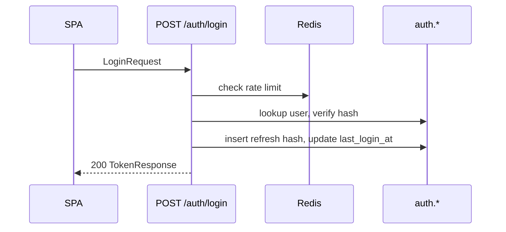
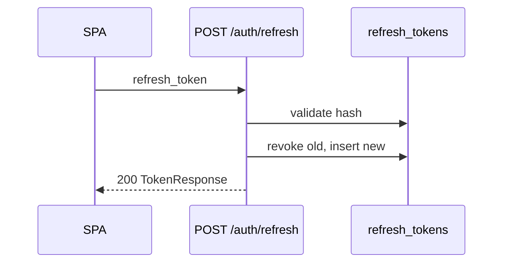
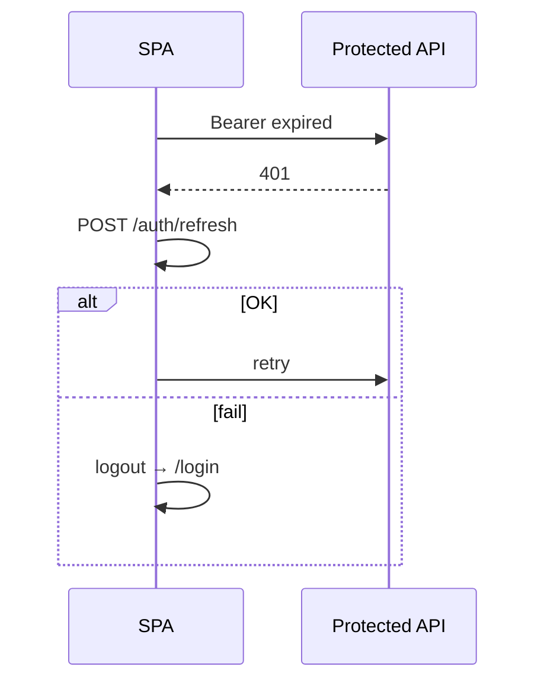

# Authentication — Implementation Specification

| Field | Value |
|-------|--------|
| **Feature ID** | `FEAT-AUTH-001` |
| **Status** | Approved (2026-06-10) |
| **Phase** | Phase 1 (MVP) |
| **Traceability** | FR-PLT-001, NFR-SEC-003, NFR-SEC-004 (partial), NFR-SEC-008, NFR-PER-003, NFR-LOC-001, NFR-ACC-001/002 |
| **Tasks** | TASK-DB-001, TASK-PLT-001, TASK-UI-001 |
| **OpenSpec change** | `authentication-backend` (+ TASK-UI-001 frontend slice) |
| **Canonical API** | [openapi.yaml](../apis/openapi.yaml) |
| **Database** | [database.md](../database.md) — `auth.*` |
| **ADRs** | ADR-001, ADR-002, ADR-003, ADR-005, ADR-006, ADR-012, ADR-013, ADR-014 |

---

## Resolved Decisions

Stakeholder approved the following scope and defaults (2026-06-10):

| # | Decision |
|---|----------|
| **D1 — Feature boundary** | Authentication includes backend auth API, auth schema, login UI, JWT validation dependency (`get_current_user`). **Excludes** TASK-PLT-002 full RBAC policy matrix (separate deliverable). |
| **D2 — Post-login routes** | `super_admin` → `/admin`; `team_admin`, `finance_viewer`, `team_member` → `/dashboard`; `auditor` → `/reports`. |
| **D3 — Logout** | **Client-only:** clear tokens and auth state; no `POST /auth/logout` in Phase 1. Refresh tokens remain valid until expiry (acceptable for MVP). |
| **D4 — Token storage** | Access token in memory; refresh token in `sessionStorage` (cleared on tab close). `localStorage` **not** used in production builds. |
| **D5 — Access token TTL** | Default **30 minutes** (`JWT_ACCESS_TOKEN_EXPIRE_MINUTES=30`). OpenAPI example `expires_in: 3600` is illustrative only. |
| **D6 — Refresh reuse detection** | **Deferred** to Phase 2. Phase 1 rejects revoked/expired refresh tokens only. |
| **D7 — Login audit** | **Not required** for MVP. Optional failure audit deferred with TASK-PLT-003. |
| **D8 — Multi-org login** | Phase 1 is **single-org deployment**. Login accepts email + password; organization inferred from user record. |
| **D9 — Email normalization** | Emails stored and matched **lowercase trimmed** at login and user create. |

---

## 1. Objective

Deliver secure **JWT-based authentication** for the AI Tool Usage Tracker so that:

1. Users with valid credentials receive access and refresh tokens and can call protected APIs.
2. The SPA can log in, maintain a session via refresh, access protected routes, and retrieve the current user profile (`/auth/me`).
3. Invalid, expired, or missing tokens are rejected with standardized errors.
4. Failed login attempts are rate-limited per NFR-SEC-003.
5. User identity, role, and organization are available to downstream modules.

**Success measures:**

- FR-PLT-001 AC-PLT-001-01, AC-PLT-001-02 satisfied for auth endpoints and JWT lifecycle.
- NFR-SEC-003 AC-NFR-SEC-003-01, AC-NFR-SEC-003-02 satisfied.
- Authentication endpoints meet NFR-PER-003 p95 ≤ **300 ms**.
- TASK-PLT-001 and TASK-UI-001 Definition of Done met.

---

## 2. Scope

### 2.1 In Scope

| Layer | Deliverable | Source |
|-------|-------------|--------|
| **Database** | `auth.organizations`, `auth.users`, `auth.refresh_tokens` + Alembic `002_auth` | database.md, TASK-DB-001 |
| **Backend API** | `POST /api/v1/auth/login`, `POST /api/v1/auth/refresh`, `GET /api/v1/auth/me` | OpenAPI, TASK-PLT-001 |
| **Security** | Argon2id password hashing, HS256 JWT, opaque refresh rotation (ADR-014), Redis login rate limit | authentication-backend design |
| **Backend shared** | `get_current_user` dependency, JWT decode/validate | authentication-backend design |
| **Dev tooling** | Dev-only seed: default org + Super Admin (`DEV_SUPER_ADMIN_PASSWORD`) | auth-schema spec |
| **Frontend** | Login page, auth context, token refresh, protected routes, client logout, role-based redirect | TASK-UI-001 |
| **Tests** | Unit + integration tests in §12 | verification.md, testing.md |

### 2.2 Out of Scope

| Item | Source |
|------|--------|
| SSO / SAML / OAuth IdP | FR-P2-002, ADR-005 |
| MFA | ADR-005 |
| Self-service registration | Not in requirements |
| Password reset API | user-management-backend — Phase 2 |
| User CRUD API | user-management-backend |
| Full RBAC policy matrix | TASK-PLT-002 |
| `POST /auth/logout` | Not in OpenAPI (D3) |
| Audit log on login | D7 |
| Populated `team_ids` before TASK-DB-002 | Returns `[]` until admin schema |

### 2.3 Dependencies

```text
foundation (INF-002 /api/v1, INF-004 Alembic)
  → authentication-backend (backend)
  → TASK-UI-001 (frontend — requires INF-006)
  → TASK-PLT-002 (RBAC — separate)
```

---

## 3. User Stories

| ID | Role | Story | Priority |
|----|------|-------|----------|
| **US-AUTH-01** | All | As a user, I want to log in with email and password so that I can access features appropriate to my role. | P0 |
| **US-AUTH-02** | All | As a user, I want my session to refresh automatically so that I am not interrupted while using the app. | P0 |
| **US-AUTH-03** | All | As a user, I want to log out so that my session ends on this browser tab. | P0 |
| **US-AUTH-04** | All | As a user, I want protected pages blocked when I am not authenticated. | P0 |
| **US-AUTH-05** | All | As a user, I want to see my profile and role after login. | P0 |
| **US-AUTH-06** | SA | As a Super Admin, I want failed login attempts throttled. | P0 |
| **US-AUTH-07** | All | As a user with an expired access token, I want refresh or re-login. | P0 |
| **US-AUTH-08** | Dev | As a developer, I want a seeded Super Admin in dev. | P1 |

---

## 4. Acceptance Criteria

### 4.1 Backend — Login

| ID | Given | When | Then |
|----|-------|------|------|
| **AC-AUTH-01** | Active user, valid email/password | `POST /api/v1/auth/login` | `200` `TokenResponse` with `access_token`, `token_type: Bearer`, `expires_in`, `refresh_token` |
| **AC-AUTH-02** | Wrong email or password | `POST /api/v1/auth/login` | `401` Problem Details; generic invalid-credentials message |
| **AC-AUTH-03** | User `active = false` | Login with valid password | `401` |
| **AC-AUTH-04** | Invalid email format or password length | Login | `400`/`422` Problem Details |
| **AC-AUTH-05** | > 5 failed attempts / 15 min (default) | Additional login | `429` Problem Details |

### 4.2 Backend — Refresh

| ID | Given | When | Then |
|----|-------|------|------|
| **AC-AUTH-06** | Valid refresh token | `POST /api/v1/auth/refresh` | `200` new tokens; old row `revoked_at` set |
| **AC-AUTH-07** | Expired/revoked/unknown refresh | Refresh | `401` |

### 4.3 Backend — Current User & JWT

| ID | Given | When | Then |
|----|-------|------|------|
| **AC-AUTH-08** | Valid access JWT | `GET /api/v1/auth/me` | `200` `UserProfile` |
| **AC-AUTH-09** | Missing/invalid/expired JWT | `GET /api/v1/auth/me` | `401` |
| **AC-AUTH-10** | Expired JWT | Protected route via `get_current_user` | `401` |
| **AC-AUTH-11** | Missing `JWT_SECRET_KEY` (non-dev) | API startup | Startup fails |

### 4.4 Frontend

| ID | Given | When | Then |
|----|-------|------|------|
| **AC-AUTH-12** | Valid credentials | Submit login | Tokens stored; redirect per D2 |
| **AC-AUTH-13** | Invalid credentials | Submit | Error from Problem Details `detail` |
| **AC-AUTH-14** | Unauthenticated | Protected route | Redirect `/login?returnUrl=` |
| **AC-AUTH-15** | Expired access, valid refresh | API 401 | Silent refresh + retry; else login |
| **AC-AUTH-16** | Authenticated | Logout | Tokens cleared; redirect login |
| **AC-AUTH-17** | Login page | Keyboard-only | All actions completable (NFR-ACC-002) |

### 4.5 Database

| ID | Given | When | Then |
|----|-------|------|------|
| **AC-AUTH-18** | Empty DB | `002_auth` migration | `auth` schema + 3 tables + constraints |
| **AC-AUTH-19** | Refresh issued | Persist | SHA-256 hash only in DB |
| **AC-AUTH-20** | Empty dev auth tables | Dev seed | One org + `super_admin` |

---

## 5. UI Specifications

### 5.1 Login Page (`/login`)

| Element | Specification |
|---------|---------------|
| **Route** | Public; authenticated users redirect to role default (D2) |
| **Layout** | Centered MUI card; product title |
| **Fields** | Email (required, max 255); Password (required, 8–128, optional show/hide) |
| **Actions** | Primary “Sign in”; disabled while submitting |
| **i18n** | Keys: `auth.login.title`, `auth.login.email`, `auth.login.password`, `auth.login.submit`, `auth.login.error` |
| **Errors** | MUI `Alert` from Problem Details `detail`; 429 shows throttle message |
| **Accessibility** | Labels/ARIA; tab order email → password → submit; WCAG AA contrast |

### 5.2 Auth Context

| Concern | Specification |
|---------|---------------|
| **AuthProvider** | `user`, `accessToken`, `login()`, `logout()`, `refreshSession()` |
| **Token storage** | Access: memory; Refresh: `sessionStorage` (D4) |
| **ProtectedRoute** | Redirect unauthenticated to `/login?returnUrl=` |
| **API client** | Base `/api/v1`; `Authorization: Bearer`; `X-Correlation-ID` (UUID v4) |
| **Refresh** | On 401: single refresh attempt; queue concurrent requests |

### 5.3 Post-Login Redirect (D2)

| Role | Route |
|------|-------|
| `super_admin` | `/admin` |
| `team_admin` | `/dashboard` |
| `finance_viewer` | `/dashboard` |
| `team_member` | `/dashboard` |
| `auditor` | `/reports` |

### 5.4 Logout (D3)

Clear memory access token, remove refresh from `sessionStorage`, invalidate TanStack Query cache, navigate to `/login`.

---

## 6. API Contracts

**Base path:** `/api/v1` · **Errors:** RFC 9457 Problem Details · **Auth:** `bearerAuth`

### 6.1 `POST /auth/login`

- **Auth:** None
- **Request:** `LoginRequest` — `{ email, password }`
- **Success:** `200` → `TokenResponse`
- **Errors:** `400`/`422`, `401`, `429`

### 6.2 `POST /auth/refresh`

- **Auth:** None (body token)
- **Request:** `RefreshRequest` — `{ refresh_token }`
- **Success:** `200` → `TokenResponse`
- **Errors:** `401`

### 6.3 `GET /auth/me`

- **Auth:** Bearer JWT
- **Success:** `200` → `UserProfile` (`id`, `email`, `role`, `organization_id`, `team_ids`)
- **Errors:** `401`

### 6.4 JWT Claims

| Claim | Description |
|-------|-------------|
| `sub` | User UUID |
| `org` | Organization UUID |
| `role` | OpenAPI `Role` enum |
| `exp`, `iat`, `jti` | Standard JWT |

**Algorithm:** HS256 · **TTL default:** 30 min (D5) · **Key:** `JWT_SECRET_KEY` (ADR-013)

---

## 7. Validation Rules

| Field | Rules |
|-------|-------|
| `email` | Required; RFC 5322; max 255; normalized lowercase trim (D9) |
| `password` | Required; length 8–128 |
| `refresh_token` | Required; non-empty |

**Password hash:** Argon2id — time_cost=3, memory_cost=65536 KiB, parallelism=4.

---

## 8. Error Handling

| HTTP | title | When |
|------|-------|------|
| **401** | Invalid Credentials | Login failure (uniform message) |
| **401** | Unauthorized | Invalid/expired JWT or refresh |
| **429** | Too Many Requests | Rate limit exceeded |
| **422** | Validation Error | Request shape failure |

**Rules:** No user enumeration on login; no secrets in logs.

---

## 9. Database Changes

**Migration:** `002_auth`

| Table | Purpose |
|-------|---------|
| `auth.organizations` | Tenant root; retention CHECK ≥ 24 months |
| `auth.users` | Login identity; `password_hash`; `chk_user_role`; `uq_users_org_email` |
| `auth.refresh_tokens` | Hashed opaque refresh; `revoked_at` for rotation |

See [database.md](../database.md) for full column definitions.

---

## 10. Security Requirements

| ID | Requirement |
|----|-------------|
| SEC-AUTH-01 | JWT keys from env/Compose secrets (NFR-SEC-008, ADR-013) |
| SEC-AUTH-02 | Access TTL 15–60 min configurable; default 30 min |
| SEC-AUTH-03 | Opaque refresh + SHA-256 at rest + rotation (ADR-014) |
| SEC-AUTH-04 | Redis rate limit: 5 failures / 15 min → 429 |
| SEC-AUTH-05 | Argon2id password hashing |
| SEC-AUTH-06 | Role in JWT; full route RBAC in TASK-PLT-002 |
| SEC-AUTH-07 | TLS 1.2+ production (NFR-SEC-002) |
| SEC-AUTH-08 | No SSO Phase 1 |
| SEC-AUTH-09 | Login p95 ≤ 300 ms |

### Environment Variables

| Variable | Default |
|----------|---------|
| `JWT_SECRET_KEY` | Required (non-dev) |
| `JWT_ACCESS_TOKEN_EXPIRE_MINUTES` | 30 |
| `JWT_REFRESH_TOKEN_EXPIRE_DAYS` | 7 |
| `LOGIN_RATE_LIMIT_MAX_ATTEMPTS` | 5 |
| `LOGIN_RATE_LIMIT_WINDOW_SECONDS` | 900 |
| `DEV_SUPER_ADMIN_PASSWORD` | Dev seed only |

---

## 11. Sequence Diagrams

### Login (success)



### Refresh with rotation



### Silent refresh on 401



---

## 12. Test Cases

### Backend integration

| Test | Scenario |
|------|----------|
| `test_auth_login.py::test_login_success` | AC-AUTH-01 |
| `test_auth_login.py::test_login_invalid_credentials` | AC-AUTH-02 |
| `test_auth_login.py::test_login_inactive_user` | AC-AUTH-03 |
| `test_auth_refresh.py::test_refresh_success` | AC-AUTH-06 |
| `test_auth_refresh.py::test_refresh_invalid` | AC-AUTH-07 |
| `test_auth_me.py::test_me_success` | AC-AUTH-08 |
| `test_auth_jwt.py::test_expired_token` | AC-AUTH-10 |
| `test_auth_rate_limit.py::test_login_throttled` | AC-AUTH-05 |
| `test_auth_migration.py` | AC-AUTH-18–19 |
| `test_dev_seed.py` | AC-AUTH-20 |

### Frontend

| Test | Scenario |
|------|----------|
| `client.test.ts` | Authorization + correlation headers |
| `LoginPage.test.tsx` | i18n keys |
| `App.test.tsx` | Protected route redirect |

### Contract / performance

| Test | Target |
|------|--------|
| OpenAPI validation `/auth/*` | ADR-012 |
| Login load test p95 | ≤ 300 ms |

---

## 13. Edge Cases

| # | Case | Behavior |
|---|------|----------|
| E1 | Concurrent refresh same token | First wins; second 401 |
| E2 | Revoked refresh reused | 401 (no revoke-all in Phase 1) |
| E3 | User deactivated after JWT issued | JWT valid until expiry; login blocked |
| E4 | Role changed after JWT issued | Stale until refresh/login |
| E5 | Empty `team_ids` | `[]` until TASK-DB-002 |
| E6 | Email case | Normalized lowercase (D9) |
| E7 | Shared NAT IP rate limit | Accept for Phase 1 |
| E8 | Multi-tab logout | `sessionStorage` clear + optional storage event |

---

## 14. Definition of Done

### Backend (TASK-PLT-001 + TASK-DB-001)

- [ ] Migration `002_auth` on empty PostgreSQL
- [ ] All three auth endpoints match OpenAPI
- [ ] Argon2id, JWT, refresh rotation, rate limiting
- [ ] `get_current_user` dependency exported
- [ ] Dev seed script
- [ ] Integration + unit tests pass
- [ ] `openspec validate authentication-backend --strict` passes

### Frontend (TASK-UI-001)

- [ ] Login page (MUI, i18n, a11y)
- [ ] Auth context, protected routes, refresh, logout (D3/D4)
- [ ] Role redirects (D2)
- [ ] Frontend unit tests pass

### Cross-cutting

- [ ] README login examples
- [ ] verification.md Evidence Log + Audit sign-off

---

## Traceability

| Section | FR/NFR/Task | ADR |
|---------|-------------|-----|
| Auth API | FR-PLT-001, TASK-PLT-001 | ADR-005, ADR-012, ADR-014 |
| Rate limit | NFR-SEC-003 | — |
| Login UI | TASK-UI-001 | ADR-006 |
| Secrets | NFR-SEC-008 | ADR-013 |
| Schema | TASK-DB-001 | ADR-003 |
