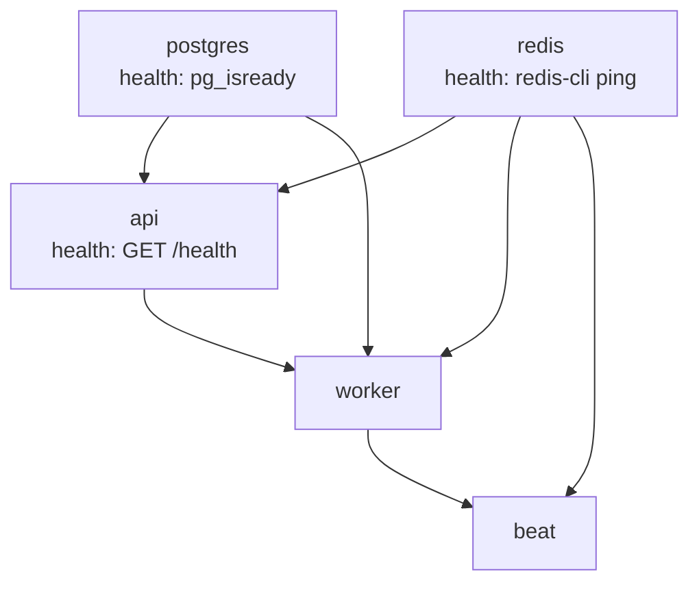

# Local Development Environment

Docker Compose stack for **AI Tool Usage Tracker** — used for **all environments** (development, staging, production). Everything runs in Docker containers with **local persistent volumes** (no AWS S3/EKS).

**Implementation:** repository root `docker-compose.yml`, `backend/`, `.env.example`, `README.md`

**Production hardening:** [deployment.md](./deployment.md) · `docker-compose.prod.yml` (target)

**Related:** [database.md](./database.md#docker-deployment) · [06-deployment-topology.md](../architecture/06-deployment-topology.md) · [NFR-SEC-008](../requirements/NFR.md#nfr-sec-008-secrets-and-configuration-management)

---

## Stack Overview

| Service | Container name | Image / build | Purpose |
|---------|----------------|---------------|---------|
| `postgres` | `ai-tracker-postgres` | `postgres:15-alpine` | PostgreSQL 15 system of record |
| `redis` | `ai-tracker-redis` | `redis:7-alpine` | Cache, Celery broker, result backend |
| `api` | `ai-tracker-api` | `backend/Dockerfile` | FastAPI application |
| `worker` | `ai-tracker-worker` | `backend/Dockerfile` | Celery worker |
| `beat` | `ai-tracker-beat` | `backend/Dockerfile` | Celery Beat scheduler |
| `frontend` | `ai-tracker-frontend` | `frontend/Dockerfile` | nginx — SPA + API reverse proxy (production) |
| `frontend-dev` | `ai-tracker-frontend-dev` | `node` + Vite (profile) | Hot-reload dev server on port 5173 |

**Compose project name:** `ai-tool-tracker`  
**Internal network:** `ai-tracker-network` (Compose key: `ai-tracker`)

### Persistent volumes (local storage)

| Compose key | Docker volume name | Mount point | Purpose |
|-------------|-------------------|-------------|---------|
| `postgres_data` | `ai-tracker-postgres-data` | `/var/lib/postgresql/data` | PostgreSQL data |
| `redis_data` | `ai-tracker-redis-data` | `/data` | Redis AOF |
| `storage_data` | `ai-tracker-storage-data` | `/var/lib/ai-tracker/storage` | Uploads, reports, temp files |
| `backups_data` | `ai-tracker-backups-data` | `/backups` | pg_dump and storage tarballs |

---

## Service Dependencies



| Service | `depends_on` | Notes |
|---------|--------------|-------|
| `api` | `postgres`, `redis` (healthy) | Startup lifespan verifies DB + Redis connectivity |
| `worker` | `postgres`, `redis` (healthy), `api` (healthy) | Ensures broker and DB reachable before worker start |
| `beat` | `redis` (healthy), `worker` (started) | Single Beat instance; no direct Postgres dependency |

---

## Environment Configuration

Configuration is loaded from `.env` (copy from `.env.example`). Secrets MUST NOT be committed (NFR-SEC-008).

### Required variables

| Variable | Example (dev) | Used by |
|----------|-----------------|---------|
| `POSTGRES_USER` | `aitracker` | `postgres` service |
| `POSTGRES_PASSWORD` | dev placeholder | `postgres`, URL construction |
| `POSTGRES_DB` | `aitracker` | `postgres` service |
| `DATABASE_URL` | `postgresql+asyncpg://…@postgres:5432/aitracker` | `api`, `worker`, `beat` |
| `REDIS_URL` | `redis://redis:6379/0` | `api`, `worker` (cache) |
| `CELERY_BROKER_URL` | `redis://redis:6379/1` | Celery broker |
| `CELERY_RESULT_BACKEND` | `redis://redis:6379/2` | Celery results |
| `STORAGE_BACKEND` | `local` | Filesystem adapter (not S3) |
| `LOCAL_STORAGE_ROOT` | `/var/lib/ai-tracker/storage` | Uploads + reports volume |

### Optional port overrides

| Variable | Default | Purpose |
|----------|---------|---------|
| `POSTGRES_PORT` | `5432` | Host port published for Postgres |
| `REDIS_PORT` | `6379` | Host port published for Redis |
| `API_PORT` | `8000` | Host port published for API (dev; hidden in prod override) |
| `APP_PORT` | `4501` | Host port published for frontend nginx |

### Frontend environment (build-time)

| Variable | Example (prod) | Purpose |
|----------|----------------|---------|
| `VITE_API_BASE_URL` | `/aitool/api/v1` | API base path for SPA client |
| `VITE_BASE_PATH` | `/aitool` | React Router basename |

### Forward-looking placeholders (TASK-INF-002+)

`.env.example` also documents `JWT_SECRET_KEY`, `JWT_REFRESH_SECRET_KEY`, and `CREDENTIAL_ENCRYPTION_KEY` with dev placeholders. These are **not consumed** until authentication is implemented.

### URL hostname rules

| Runtime | `DATABASE_URL` host | `REDIS_URL` host |
|---------|---------------------|------------------|
| Inside Compose containers | `postgres` | `redis` |
| On developer host (CLI tools) | `localhost` | `localhost` |

Compose `environment` block overrides `DATABASE_URL`, `REDIS_URL`, and Celery URLs for application containers to enforce service hostnames.

---

## Health Probes

### PostgreSQL

```yaml
healthcheck:
  test: ["CMD-SHELL", "pg_isready -U $POSTGRES_USER -d $POSTGRES_DB"]
  interval: 10s
  timeout: 5s
  retries: 5
  start_period: 10s
```

### Redis

- Command: `redis-server --appendonly yes` (AOF persistence for dev broker durability)
- Healthcheck: `redis-cli ping`

### API (interim — TASK-INF-001)

| Aspect | Value |
|--------|-------|
| Path | `GET /health` (root; **not** `/api/v1/health` until TASK-INF-002) |
| Auth | None |
| Success body | `{"status":"ok","database":"ok","redis":"ok"}` |
| Failure | HTTP 503, `"status":"degraded"`, dependency fields `"error"` |
| Docker healthcheck | Python `urllib` request to `http://127.0.0.1:8000/health` |

On startup, FastAPI lifespan runs the same connectivity check; the API container exits if Postgres or Redis is unreachable.

**Contract alignment (TASK-INF-002):** OpenAPI defines `GET /api/v1/health` with `HealthResponse`. Interim probe matches response shape but uses path `/health` and dependency status value `error` (not `unavailable`).

---

## Backend Layout (minimal scaffold)

```
backend/
  Dockerfile
  requirements.txt
  app/
    main.py           # FastAPI + lifespan + GET /health
    config.py         # Pydantic settings (DATABASE_URL, REDIS_URL, Celery URLs)
    connectivity.py   # Async Postgres + Redis checks
    celery_app.py     # Celery app + sample ping task
```

Bounded-context packages (`auth`, `admin`, …) are **deferred to TASK-INF-002**. Celery queue routing (`ingestion`, `reports`, …) is **deferred to TASK-INF-003**.

---

## Startup Commands

```bash
cp .env.example .env          # set POSTGRES_PASSWORD
docker compose up --build     # foreground
docker compose up --build -d  # detached

docker compose exec postgres pg_isready -U aitracker -d aitracker
curl http://localhost:8000/health
curl http://localhost:4501/aitool/   # production-style frontend (when frontend service running)
```

**Profiles:**

- Default stack includes `frontend` on `${APP_PORT:-4501}` (nginx serving built SPA).
- `docker compose --profile frontend-dev up frontend-dev` — Vite on port `5173` for local UI development.

See repository [README.md](../../README.md) for full command reference.

---

## Security Notes (local dev)

| Topic | Current behavior | Production expectation |
|-------|------------------|------------------------|
| Secrets | `.env` file, gitignored | Host `.env` or Compose `secrets:` |
| Postgres password | Required via `${POSTGRES_PASSWORD:?…}` in Compose | Strong unique password per environment |
| Redis AUTH | Disabled in dev Compose | Enable AUTH or isolated network in production |
| Published ports | Default Docker bind (all interfaces on host) | Restrict to `127.0.0.1` or omit public ports |
| Placeholder secrets in `.env.example` | Allowed for dev templates | Never use in production |

---

## Deferred (not in TASK-INF-001)

| Item | Target task |
|------|-------------|
| `GET /api/v1/health` with OpenAPI router prefix | TASK-INF-002 |
| Modular bounded-context packages | TASK-INF-002 |
| Celery queue routing and Beat schedules | TASK-INF-003 |
| Alembic migrations on startup | TASK-INF-004 |
| Postgres resource limits (NFR-SCL-001 sizing) | OPS / production hardening |
| Daily `pg_dump` backup sidecar | TASK-OPS-003 |
| OpenTelemetry instrumentation | TASK-OPS-001 |

---

## Validation Tests

Repository tests under `tests/infra/` (see [testing.md](./testing.md)):

- `test_docker_compose.py` — Compose structure and wiring
- `test_env_example.py` — Environment template coverage
- `test_connectivity.py` — Unit tests for connectivity module
- `test_compose_integration.py` — Optional smoke test (`pytest -m integration`)

---

## Related Documents

| Document | Purpose |
|----------|---------|
| [deployment.md](./deployment.md) | Production Docker/K8s, CI/CD, secrets, DR |
| [deployment-checklist.md](./deployment-checklist.md) | MVP go-live checklist |
| [testing.md](./testing.md) | Test strategy and CI gates |
