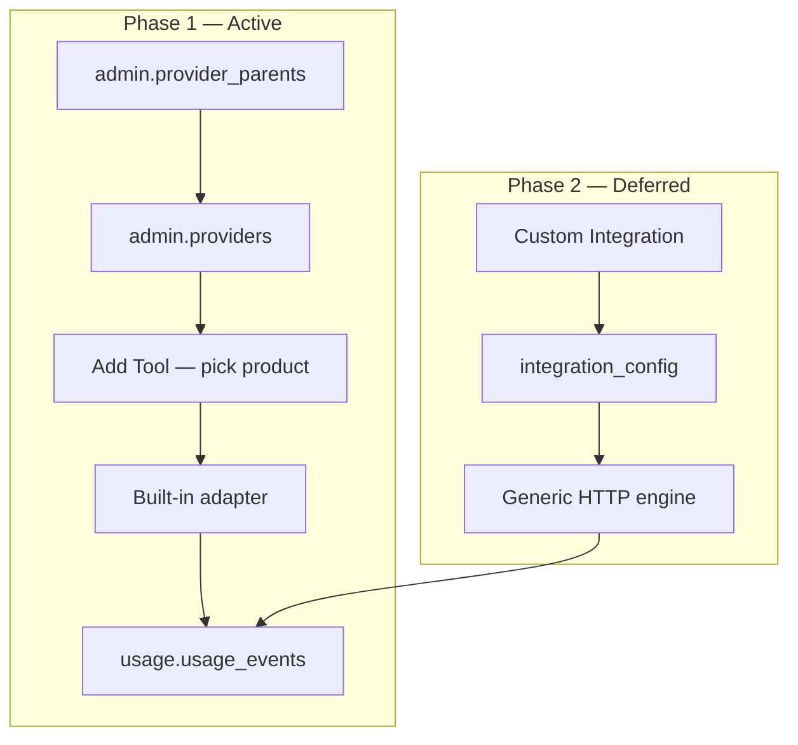

# Provider Catalogue & Integration

**Goal:** Super Admins pick from a **backend-seeded catalogue** of AI tools (with **parent companies**) when adding catalogue tools. Built-in Python adapters handle usage polling for known vendors. **Config-driven HTTP integration** (`integration_config`) remains implemented but **deferred** — used only for **Custom Integration** until Phase 2.

**Related:** [tool-catalogue-redesign](../changes/tool-catalogue-redesign/design.md) · [settings-provider-lookup](../changes/settings-provider-lookup/design.md)

---

## 1. Phases

| Phase | Status | Behaviour |
|-------|--------|-----------|
| **Phase 1 — Built-in catalogue** | **Active** | Eight products seeded in backend; parent companies; dedicated adapters; dropdown from `GET /settings/providers`. |
| **Phase 2 — Config-driven HTTP** | **On hold** | `integration_config` engine + Add Tool polling UI for **Custom Integration** only. Full rollout for all vendors deferred. |



---

## 2. Built-in catalogue (Phase 1)

### 2.1 Parent companies (`admin.provider_parents`)

| slug | label | sort_order |
|------|-------|------------|
| openai | OpenAI | 10 |
| anthropic | Anthropic | 20 |
| google | Google | 30 |
| microsoft | Microsoft | 40 |
| amazon | Amazon | 50 |
| cursor | Cursor | 60 |
| figma | Figma | 70 |

### 2.2 Products (`admin.providers`)

| slug | label | parent | adapter_key | requires_api_endpoint |
|------|-------|--------|-------------|------------------------|
| openai | OpenAI | openai | openai | false |
| anthropic | Anthropic Claude | anthropic | anthropic | false |
| google | Google Gemini | google | google | false |
| azure_openai | Azure OpenAI Platform | microsoft | azure_openai | **true** |
| copilot | Microsoft Copilot | microsoft | copilot | **organization_id** (GitHub org login) |
| bedrock | Amazon Bedrock | amazon | bedrock | **true** |
| cursor | Cursor | cursor | cursor | false |
| figma | Figma | figma | figma | false |
| custom | Custom Integration | — | custom | **true** |

**Retired** (set `active = false` if present): `cohere`, `mistral`, `mabl`, `windsurf`, `github_copilot`.

**Adapter aliases** (legacy tool `vendor` slugs): `claude` → `anthropic`, `gemini` → `google`, `github_copilot` / `github` → `copilot`.

### 2.3 Seed strategy

| Mechanism | When | Idempotent |
|-----------|------|------------|
| Alembic `022_provider_parents_catalog` | Deploy / migrate | Yes (upsert SQL) |
| `sync_builtin_providers()` on app startup | Every boot (incl. production) | Yes |

**Source of truth in code:** `backend/app/settings/builtin_catalog.py` — migration and startup seed both mirror this module.

### 2.4 API — Settings providers

`GET /api/v1/settings/providers` returns extended rows:

| Field | Description |
|-------|-------------|
| `parent_slug` | FK to parent company |
| `parent_label` | Display name for grouping (e.g. Microsoft) |
| `adapter_key` | Collector adapter registry key |
| `requires_api_endpoint` | Tool must set `api_endpoint` when connecting |

---

## 3. Frontend — Add Tool form (Phase 1)

**Route:** `/admin/tools` · **Component:** `ToolsPage.tsx`

### 3.1 Provider dropdown

- Options loaded from **`GET /settings/providers?active=true`** (not hardcoded).
- Grouped by **`parent_label`** using MUI `ListSubheader` (e.g. Microsoft → Azure OpenAI Platform, Microsoft Copilot).
- Fallback: `BUILT_IN_PROVIDERS` in `frontend/src/api/providers.ts` if API unavailable.

### 3.2 Fields by provider type

| Field | Built-in products | Custom Integration |
|-------|-------------------|---------------------|
| Tool name | Yes | Yes |
| Provider | Yes (grouped) | Yes |
| Description | Yes | Yes |
| API Endpoint URL | Only when `requires_api_endpoint` | Required when usage polling enabled |
| Usage polling accordion | **Hidden** | **Shown** (default **off**) |

Built-in tools store `integration_config = {}`. Collector uses **`adapter_key`** from provider row (via tool `vendor` slug).

### 3.4 Built-in catalogue rows

On startup (and when a new organization is created), the backend seeds one **catalogue tool** per built-in provider for each organization:

- Rows have `catalogue_only = true` and `built_in = true`
- Listed on **Tools** page via `GET /tools?catalogue_only=true`
- **Cannot be deleted** (API returns 409; delete button hidden in UI)
- **Add Custom Tool** only creates `vendor = custom` entries (user-deletable)

Built-in rows can still be **edited** (e.g. API endpoint for Azure OpenAI, Copilot, Bedrock).

### 3.5 UX rules

- Usage polling UI is **not** shown for OpenAI, Cursor, Copilot, etc.
- **Custom Integration** exposes Phase 2 config form; polling **disabled by default**.
- Table **Provider** column shows product label from settings lookup.

---

## 4. Backend — collector routing

```
1. Load tool + provider row
2. If integration_config.usage present → generic HTTP engine (Custom / Phase 2)
3. Else resolve adapter_key (or alias) → built-in adapter
4. Persist UsageRecord → usage.usage_events
```

Built-in adapters live under `backend/app/collector/adapters/`. `copilot` and `bedrock` use generic stub until dedicated adapters exist.

---

## 5. Phase 2 — Config-driven integration (deferred)

The following remain **in the codebase** but are **not** the default path for built-in products:

- `admin.tools.integration_config` JSONB column
- `backend/app/integration/*` generic HTTP engine
- `ToolUsagePollingForm` on Add Tool (**Custom Integration only**)
- Validation: `api_endpoint` + `integration_config.usage` required when custom polling enabled

See git history and `openspec/changes/tool-catalogue-redesign` for full HTTP config schema (`auth`, `usage.url`, field maps, etc.).

---

## 6. Acceptance criteria (Phase 1)

- [ ] Migration `022` creates `provider_parents`, extends `providers`, seeds catalogue.
- [ ] Startup calls `sync_builtin_providers()` — safe on every production boot.
- [ ] Tools Add form lists eight built-in products + Custom, grouped by parent.
- [ ] Built-in add/edit does **not** require `integration_config`.
- [ ] Azure OpenAI, Copilot, Bedrock, Custom require `api_endpoint` on save/connect.
- [ ] Built-in catalogue tools auto-seeded per org; listed on Tools page; not deletable
- [ ] Collector polls built-in tools via adapter registry without `integration_config`.
- [ ] Retired slugs inactive in provider list.
