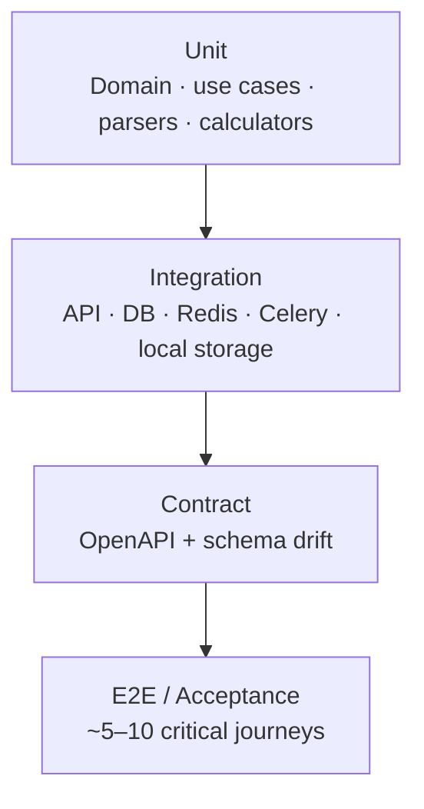
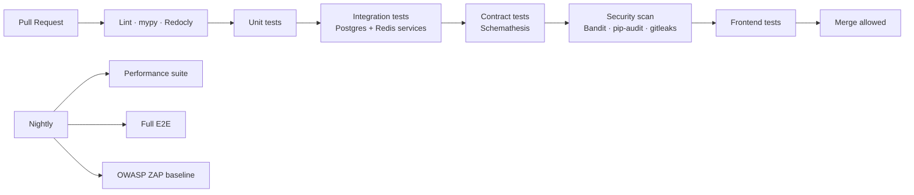

# Testing Specification

Test strategy and requirements for the **AI Tool Usage Tracker** (Phase 1 MVP).

**Sources:** [requirements/](../requirements/) · [NFR.md](../requirements/NFR.md) · [OpenAPI](./apis/openapi.yaml) · [database.md](./database.md) · [local-development.md](./local-development.md) · [deployment.md](./deployment.md) · [.cursor/rules.md](../../.cursor/rules.md)

---

## Overview

### Purpose

Define **what** must be tested, **how** each test layer validates behavior, and **which acceptance criteria** each layer covers. Tests MUST trace to functional requirements (FR-*), non-functional requirements (NFR-*), or task IDs (TASK-*).

### Principles

| Principle | Rule |
|-----------|------|
| Spec-first | Test observable behavior from OpenSpec; do not encode accidental implementation details |
| Layered confidence | Prefer the smallest test layer that credibly validates the requirement |
| Fail the build on drift | Contract, security baseline, and P0 acceptance tests block merge |
| No secrets in tests | Use fixtures and env templates; never commit credentials or production JWTs |
| Tenant isolation | Every persistence and cache test MUST include cross-organization negative cases |
| NFRs are first-class | Performance, security, and accessibility have explicit test plans and evidence |

### Test Pyramid (target mix)



| Layer | Approx. share | Primary tools |
|-------|---------------|---------------|
| Unit | 60–70% | pytest, Vitest, React Testing Library |
| Integration | 20–25% | pytest + Testcontainers/Compose, httpx AsyncClient |
| Contract | Gate in CI | Schemathesis, `@redocly/cli lint` |
| E2E / Acceptance | 5–10 journeys | Playwright |
| Performance | Scheduled + release gate | k6, Locust |
| Security | PR + nightly | Bandit, pip-audit, OWASP ZAP baseline, custom RBAC matrix |

---

## Repository Layout

```
tests/
  infra/                  # TASK-INF-001 — Compose and env validation
  unit/                   # Pure logic (no I/O)
  integration/            # API, repositories, workers
  contract/               # OpenAPI conformance
  e2e/                    # Playwright browser tests
  performance/            # k6 scripts and fixtures
  security/               # RBAC matrix, secret scan helpers
  acceptance/             # FR/NFR acceptance criterion mappings (BDD optional)
  fixtures/               # Shared JSON, CSV vendor exports, seed SQL
backend/
  app/                    # Code under test
  tests/                  # Optional co-located unit tests per module (mirror bounded contexts)
frontend/
  src/
  tests/                  # Component and hook tests (TASK-INF-006+)
pytest.ini                # Root pytest config
```

**Naming:** `test_<behavior>_<task_or_req_id>.py` — e.g. `test_health_connectivity_task_inf_001.py`, `test_rbac_tool_create_ac_plt_001_03.py`.

**Markers (pytest):**

| Marker | Purpose |
|--------|---------|
| `unit` | No external services |
| `integration` | Requires Postgres, Redis, or Compose stack |
| `contract` | Schemathesis / OpenAPI validation |
| `e2e` | Full stack + browser |
| `performance` | Load or latency benchmarks |
| `security` | Auth, RBAC, injection, secret exposure |
| `slow` | > 30s; excluded from default PR job |

---

## 1. Unit Tests

### Scope

| Area | What to test | Location |
|------|--------------|----------|
| Domain entities & value objects | Invariants, pricing rules, token calculations | `tests/unit/domain/` |
| Use cases | Orchestration with mocked ports | `tests/unit/application/` |
| Cost calculator | `flat_token`, `package_with_overage` models (FR-USG-001) | `tests/unit/usage/` |
| Vendor parsers | Fixture-based CSV/JSON per vendor (FR-ING-003) | `tests/unit/ingestion/parsers/` |
| RBAC policy helpers | Role × action matrix (no HTTP) | `tests/unit/platform/rbac/` |
| Settings / config | Required env validation, URL parsing | `tests/unit/platform/` |
| Connectivity module | Postgres/Redis check aggregation (TASK-INF-001) | `tests/infra/test_connectivity.py` |
| Frontend components | Render, interaction, i18n keys | `frontend/tests/` |
| Frontend hooks | TanStack Query with MSW mocks | `frontend/tests/hooks/` |

### Standards

- **Coverage target:** ≥ 80% line coverage on `domain/` and `application/` layers; ≥ 70% overall backend (CI enforced in TASK-INF-005).
- **Isolation:** No real network, DB, or filesystem except parser fixture reads.
- **Fixtures:** Vendor export samples under `tests/fixtures/ingestion/` (OpenAI, Anthropic, Copilot, Cursor formats).
- **Parametrize:** RBAC and pricing edge cases use `@pytest.mark.parametrize` with requirement ID in test name.

### Required unit test suites (by module)

| Module | Minimum tests | Traces to |
|--------|---------------|-----------|
| Auth / JWT helpers | Token expiry, invalid signature, refresh rotation | AC-PLT-001-01, AC-PLT-001-02 |
| RBAC | Each role denied on privileged actions | AC-PLT-001-03, AC-ADM-001-04 |
| Tool pricing | Package allowance, overage, deactivation rules | AC-ADM-001-02, AC-ADM-001-03 |
| Team attribution | Multi-team membership, deactivated team rejection | AC-ADM-002-02, AC-ADM-002-04 |
| Credential encryption | Encrypt/decrypt round-trip; no plaintext in repr | NFR-SEC-005 |
| Idempotency | Duplicate batch key returns same outcome | AC-USG-* (idempotency) |
| Parsers | Valid file → rows; malformed → structured error | FR-ING-003 |
| Aggregates | Sum of events matches aggregate refresh | FR-USG-002 |
| Cache keys | Include `organization_id`; no cross-tenant key collision | NFR-SCL-005, TASK-DSH-001 |

### Commands

```bash
cd backend && pytest tests/unit backend/tests -m unit -v --cov=app --cov-report=term-missing
cd frontend && npm run test -- --run
```

---

## 2. Integration Tests

### Scope

Validate component boundaries with **real** PostgreSQL and Redis (Testcontainers or Docker Compose service containers in CI).

| Area | What to test | Dependencies |
|------|--------------|--------------|
| Repository layer | CRUD, tenant scoping, constraints | Postgres (TASK-DB-007) |
| API endpoints | Happy path, 401/403/422, RFC 7807 errors | FastAPI AsyncClient + Postgres + Redis |
| Alembic migrations | `upgrade head` on clean DB; rollback smoke | Postgres (TASK-INF-004) |
| Celery tasks | Task routing, retry, idempotency, correlation_id | Redis + Postgres (TASK-INF-003) |
| Local storage adapter | Upload, download, path resolution | Temp dir on volume (TASK-ING-001) |
| Cache layer | Cache-aside hit/miss, TTL, invalidation | Redis (TASK-DSH-001) |
| Email worker | Task enqueue; mock SMTP/SES | Celery + mock (TASK-NTF-004) |
| Compose stack | API health, pg_isready, service hostnames | Docker Compose (TASK-INF-001) |

### Environment

| Context | Postgres | Redis | File storage |
|---------|----------|-------|--------------|
| Local developer | Compose or Testcontainers | same | `storage_data` volume mount |
| CI | GitHub Actions service container | service container | tmpfs or volume in job |
| Staging / Production | Compose `postgres` service | Compose `redis` service | `ai-tracker-storage-data` volume |

### Database integration rules

- Use **transaction rollback** or **template database** per test module for isolation.
- Seed data MUST include at least **two organizations** to verify tenant isolation.
- Never assert against production databases.
- Migration tests run `alembic upgrade head` before suite; verify expected schemas exist (`auth`, `admin`, `usage`, …).

### Required integration scenarios

| Scenario | Expected outcome | Requirement |
|----------|------------------|-------------|
| Login + authorized CRUD | 200/201 with correct body | AC-PLT-001-01 |
| Expired JWT on protected route | 401 Problem Details | AC-PLT-001-02 |
| Team Member creates tool | 403 | AC-PLT-001-03 |
| Audit log after credential rotate | Row in `audit` schema | AC-PLT-002-01 |
| Upload → parse → preview → commit | Usage events persisted once | FR-ING-* |
| Duplicate idempotency key | No duplicate events | FR-USG-004 |
| Dashboard widget query | Scoped to org + role | FR-DSH-* |
| Health readiness DB down | 503, `database: error` | AC-NFR-AVL-004-01 |
| Celery ingestion queue | 50 MB file job on `ingestion` queue | ADR-004 |

### Commands

```bash
# Compose integration (optional)
docker compose up -d
pytest tests/integration tests/infra -m integration -v

# CI-style with service containers (see .github/workflows)
pytest tests/integration -v
```

---

## 3. Contract Tests

### Purpose

Ensure the **running API** conforms to `openspec/specifications/apis/openapi.yaml`. Spec changes MUST precede implementation (ADR-012).

### Static validation (every PR)

```bash
npx @redocly/cli lint openspec/specifications/apis/openapi.yaml
```

| Check | Tool | Fail condition |
|-------|------|----------------|
| OpenAPI syntax & style | Redocly | Lint errors |
| Schema consistency | Redocly `$ref` resolution | Broken references |
| Breaking change detection | oasdiff (optional P1) | Undocumented breaking diff vs main |

### Dynamic contract tests (TASK-OPS-004)

| Tool | Role |
|------|------|
| **Schemathesis** | Property-based HTTP tests from OpenAPI; validates status codes, headers, response schemas |
| **Dredd** (alternative) | Example-driven contract verification |

**CI job flow:**

1. Start Compose stack (api + postgres + redis).
2. Run `alembic upgrade head`.
3. Seed contract test fixtures (org, user, JWT for test roles).
4. Execute Schemathesis against `http://api:8000/api/v1` with OpenAPI spec.
5. Fail build on any `5xx` or schema mismatch.

### Contract test coverage matrix

| OpenAPI tag | Min. operations exercised | Auth scenarios |
|-------------|---------------------------|----------------|
| Health | `GET /health` | Unauthenticated |
| Auth | `POST /auth/login`, `POST /auth/refresh`, `GET /auth/me` | Valid + invalid tokens |
| Tools | CRUD subset | super_admin ✓, team_member ✗ |
| Teams | List, create, assign member | super_admin, team_admin scoped |
| Uploads | Upload, preview, commit | team_admin scoped |
| Dashboard | One widget per category | Each read role |
| Reports | Sync + async job create | finance_viewer, auditor |
| Audit | Query | auditor, super_admin |

### Response validation rules

- Success responses MUST match component schemas for the returned status code.
- Error responses MUST be `application/problem+json` per `responses.yaml` (except interim TASK-INF-001 `/health` JSON — removed when TASK-INF-002 completes).
- Pagination responses MUST include `meta` per `PaginationMeta` schema.
- Required headers: `X-Correlation-ID` echoed on authenticated routes (TASK-PLT-005).

### Commands

```bash
schemathesis run openspec/specifications/apis/openapi.yaml \
  --base-url http://localhost:8000/api/v1 \
  --header "Authorization: Bearer ${TEST_JWT}" \
  --checks all
```

---

## 4. E2E Tests

### Purpose

Validate **critical user journeys** across React SPA, API, workers, Postgres, Redis, and object storage in a environment closest to production (TASK-OPS-007).

### Tooling

| Tool | Use |
|------|-----|
| **Playwright** | Browser automation (recommended) |
| Docker Compose | Full stack under test |
| Test mail catcher | MailHog or mock for email steps (optional) |

### MVP release gate journeys (P0)

| ID | Journey | Steps | Requirements |
|----|---------|-------|--------------|
| E2E-001 | Super Admin setup | Login → create tool → create team → assign member | FR-ADM-001, FR-ADM-002 |
| E2E-002 | Usage ingestion | Login as Team Admin → upload vendor file → preview → commit | FR-ING-001 – FR-ING-005 |
| E2E-003 | Dashboard visibility | Login as Finance Viewer → open dashboard → verify widgets load < 3s | FR-DSH-*, NFR-PER-001 |
| E2E-004 | Threshold alert | Configure threshold → ingest usage → verify in-app notification | FR-ADM-004, FR-NTF-* |
| E2E-005 | Report export | Generate cost report → download CSV/PDF | FR-RPT-* |
| E2E-006 | Auditor read-only | Login as Auditor → view audit log → confirm no write actions | FR-PLT-002, AC-PLT-001-03 |
| E2E-007 | Tenant isolation | Two orgs seeded → user A cannot see org B data in UI | NFR-SCL-005 |

### E2E standards

- Run against **Docker Compose** in CI (TASK-OPS-007).
- Use **`data-testid`** attributes on critical UI elements (stable selectors).
- Record **trace on failure** (Playwright trace + screenshot).
- Parallelize by journey, not by step, to reduce flakiness.
- Maximum suite time for PR gate: **15 minutes**; full suite nightly.

### Commands

```bash
docker compose up -d --build
cd frontend && npx playwright test
```

---

## 5. Performance Tests

### Purpose

Verify NFR latency, throughput, and scalability targets at **reference scale** (50 tools, 200 teams, 5,000 users, NFR-SCL-001).

### Tooling

| Tool | Use |
|------|-----|
| **k6** | HTTP load tests, SLA thresholds in script |
| **Locust** (alternative) | Python-based load for custom workflows |
| **pytest-benchmark** | Micro-benchmarks for parsers and cost calculator |

### Performance test catalog

| ID | Target | Load model | Pass criteria | NFR |
|----|--------|------------|---------------|-----|
| PERF-001 | Dashboard TTI | 50 VUs, 5 min | p95 ≤ 3s | NFR-PER-001 |
| PERF-002 | Widget API | 100 RPS read mix | p95 ≤ 2s | NFR-PER-001 |
| PERF-003 | Standard report sync | 10 concurrent reports | p95 ≤ 10s | NFR-PER-002 |
| PERF-004 | Async report ack | Spike 20 requests | p95 ≤ 2s to 202/ job id | NFR-PER-002 |
| PERF-005 | Admin CRUD API | 50 VUs mixed read/write | Read p95 ≤ 500ms, write p95 ≤ 1s | NFR-PER-003 |
| PERF-006 | Auth login | 30 VUs | p95 ≤ 300ms | NFR-PER-003 |
| PERF-007 | Batch ingestion | 1 worker, 10K records/min | ≥ 10K records/min sustained 5 min | NFR-PER-004 |
| PERF-008 | Aggregate lag | Continuous ingest | p95 lag ≤ 5 min | NFR-PER-004 |
| PERF-009 | File parse start | 50 MB upload | Job starts ≤ 30s | NFR-PER-004 |
| PERF-010 | Critical alert email | Threshold breach | p95 delivery ≤ 5 min | NFR-PER-005 |

### Execution policy

| When | Scope |
|------|-------|
| PR | Smoke only (PERF-006, PERF-005 subset, < 2 min) |
| Nightly | PERF-001 – PERF-004 against staging seed data |
| Pre-release | Full catalog on production-like environment |
| Ad-hoc | After query/index changes (TASK-DB-006) |

### Reporting

Each performance run MUST document:

- Environment (CPU, RAM, Docker host disk, Compose stack size)
- Dataset size (orgs, users, events)
- Traffic model (VUs, RPS, duration)
- Metrics (p50, p95, p99, error rate, CPU, PG connections)
- Pass/fail against budget with links to Grafana dashboards (TASK-OPS-002)

### Commands

```bash
k6 run tests/performance/dashboard_load.js
k6 run tests/performance/ingestion_throughput.js
```

---

## 6. Security Tests

### Purpose

Validate NFR-SEC-* controls, tenant isolation, and OWASP baseline before release.

### Static analysis (every PR — TASK-INF-005)

| Tool | Target | Fail on |
|------|--------|---------|
| **Bandit** | Python source | High severity findings |
| **pip-audit** | Dependencies | Known CVEs without waiver |
| **npm audit** | Frontend deps | High/critical (configurable) |
| **gitleaks / trufflehog** | Repository | Secret patterns in committed files |
| **mypy** | Python types | Strict violations |

### Dynamic security tests

| ID | Test | Method | Requirement |
|----|------|--------|-------------|
| SEC-001 | RBAC matrix | Automated: every OpenAPI operation × role | NFR-SEC-004, AC-PLT-001-03 |
| SEC-002 | Tenant isolation | API + DB: org A token cannot read org B resources | NFR-SCL-005 |
| SEC-003 | JWT tampering | Modified signature → 401 | NFR-SEC-003 |
| SEC-004 | SQL injection | Schemathesis + manual payloads on filters | NFR-SEC-006 |
| SEC-005 | Credential exposure | API responses and logs never contain plaintext secrets | NFR-SEC-005 |
| SEC-006 | Security headers | `X-Content-Type-Options`, `X-Frame-Options`, CSP baseline | NFR-SEC-007 |
| SEC-007 | Rate limiting | Auth endpoint brute-force mitigation (if enabled) | NFR-SEC-003 |
| SEC-008 | Secrets in repo | CI scan: no production credentials in source | NFR-SEC-008 |
| SEC-009 | Encryption at rest | Credential ciphertext in DB; not reversible without key | NFR-SEC-001 |
| SEC-010 | OWASP ZAP baseline | Weekly against staging | NFR-SEC-007 |

### RBAC matrix test format

```python
@pytest.mark.security
@pytest.mark.parametrize("role,method,path,expected_status", RBAC_CASES)
async def test_rbac_matrix(role, method, path, expected_status):
    ...
```

`RBAC_CASES` generated from OpenAPI `security` definitions + `components/security.yaml` role semantics.

### Security test environments

- **Never** run destructive scans (full ZAP active scan) against production.
- Staging uses anonymized data only.
- Security tests that create users or credentials MUST use isolated test orgs torn down after suite.

---

## 7. Acceptance Tests

### Purpose

Map **Given/When/Then** acceptance criteria from functional and non-functional requirements to executable tests. Acceptance tests MAY be implemented as:

- **pytest** with Gherkin-style docstrings, or
- **Playwright** for UI-facing AC, or
- **Manual test scripts** with sign-off for P1 items only

Every **P0** acceptance criterion MUST have at least one automated test at unit, integration, contract, or E2E layer.

### Traceability format

| AC ID | Description | Test layer | Test ID / file | Automated |
|-------|-------------|------------|----------------|-----------|
| AC-PLT-001-01 | Valid login issues JWT | Integration | `test_auth_login_ac_plt_001_01.py` | Yes |
| AC-NFR-PER-001-01 | Dashboard p95 ≤ 3s | Performance | `PERF-001` | Yes |
| AC-NFR-SEC-008-01 | No hardcoded secrets | Security | `SEC-008` | Yes |

### P0 acceptance coverage by module

| Module | Key AC IDs | Primary layer |
|--------|------------|---------------|
| Platform (FR-PLT) | AC-PLT-001-01 – 04, AC-PLT-002-01 | Integration + SEC-001 |
| Administration (FR-ADM) | AC-ADM-001-01 – 04, AC-ADM-002-01 – 04 | Integration + E2E-001 |
| Ingestion (FR-ING) | Parser + commit ACs | Unit (parsers) + E2E-002 |
| Usage (FR-USG) | Idempotency, aggregates | Unit + Integration |
| Dashboards (FR-DSH) | Widget scoping | Integration + E2E-003 |
| Notifications (FR-NTF) | Threshold → alert | Integration + E2E-004 |
| Reporting (FR-RPT) | Report types, async | Integration + E2E-005 |
| NFR Performance | AC-NFR-PER-* | Performance catalog |
| NFR Security | AC-NFR-SEC-* | Security catalog |
| NFR Availability | AC-NFR-AVL-004-01 | Integration (health) |
| NFR Accessibility | AC-NFR-ACC-* | axe + manual (TASK-OPS-005) |

### Manual acceptance (allowed for P1 only)

| AC ID | Manual procedure | Sign-off |
|-------|------------------|----------|
| AC-NFR-BKP-005-01 | Execute DR runbook restore drill | Ops lead |
| AC-NFR-ACC-004-01 | Screen reader walkthrough | QA + accessibility |

Manual results MUST be recorded in test evidence folder with date, environment, and tester.

### MVP release gate (TASK-OPS-007)

All of the following MUST pass before Phase 1 MVP release:

- [ ] P0 acceptance criteria automated coverage ≥ 95%
- [ ] Contract test suite green
- [ ] E2E-001 through E2E-005 green on Compose
- [ ] PERF-001, PERF-003, PERF-007 smoke green on staging
- [ ] SEC-001, SEC-002, SEC-005, SEC-008 green
- [ ] Zero critical/high Bandit and pip-audit findings
- [ ] `@redocly/cli lint` clean

---

## CI Pipeline Integration (TASK-INF-005)



| Job | Trigger | Timeout | Blocks merge |
|-----|---------|---------|--------------|
| `lint` | PR | 5 min | Yes |
| `test-unit` | PR | 10 min | Yes |
| `test-integration` | PR | 20 min | Yes |
| `test-contract` | PR (after core API) | 15 min | Yes |
| `security-static` | PR | 10 min | Yes |
| `test-frontend` | PR | 10 min | Yes |
| `test-e2e` | Nightly + pre-release | 30 min | Pre-release only |
| `test-performance` | Nightly + pre-release | 60 min | Pre-release only |

---

## Test Data and Fixtures

### Reference scale seed (performance & acceptance)

| Entity | Count | Notes |
|--------|-------|-------|
| Organizations | 2 | Tenant isolation tests |
| Tools | 50 | Mixed pricing models |
| Teams | 200 | Nested under orgs |
| Users | 5,000 | Role distribution per project.md |
| Usage events | 1M+ | For report and aggregate tests |

Seed scripts: `tests/fixtures/seed/reference_scale.sql` (TASK-DB-* + ops).

### Vendor export fixtures

| Vendor | File | Purpose |
|--------|------|---------|
| OpenAI | `openai_usage_export.csv` | Parser unit tests |
| Anthropic | `anthropic_usage.json` | Parser unit tests |
| GitHub Copilot | `copilot_usage.csv` | Parser unit tests |
| Cursor | `cursor_usage.csv` | Parser unit tests |
| Invalid | `malformed.csv` | Error path tests |

---

## Current Implementation Status

| Layer | Status | Location |
|-------|--------|----------|
| Unit (infra) | Implemented | `tests/infra/test_connectivity.py` |
| Integration (Compose) | Partial | `tests/infra/test_compose_integration.py` (optional marker) |
| Compose validation | Implemented | `tests/infra/test_docker_compose.py`, `test_env_example.py` |
| Unit (domain) | Not started | Pending TASK-INF-002+ |
| Contract | Not started | TASK-OPS-004 |
| E2E | Not started | TASK-OPS-007 |
| Performance | Not started | Pre-release |
| Security (RBAC matrix) | Not started | TASK-PLT-002 |
| Acceptance mapping | Not started | Populate as modules ship |

---

## Related Tasks

| Task | Testing deliverable |
|------|---------------------|
| TASK-INF-001 | Compose + env infra tests ✓ |
| TASK-INF-005 | CI pipeline jobs |
| TASK-PLT-002 | RBAC matrix integration tests |
| TASK-OPS-004 | Contract test job |
| TASK-OPS-005 | Accessibility acceptance evidence |
| TASK-OPS-007 | E2E MVP smoke test |
| Per-module tasks | FR acceptance criteria tests in DoD |

---

## Document History

| Date | Change |
|------|--------|
| 2026-06-10 | Initial testing specification for Phase 1 MVP |
