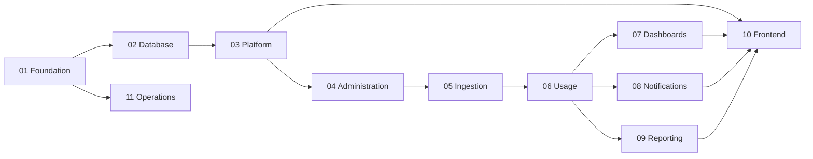

# Implementation Tasks

Task breakdown for **AI Tool Usage Tracker** Phase 1 (MVP), derived from functional requirements, NFRs, architecture, OpenAPI, and database specifications.

## Task Files

| File | Epic | Task IDs |
|------|------|----------|
| [TASK-SUMMARY.md](./TASK-SUMMARY.md) | All 63 tasks — quick reference table |
| [01-foundation.md](./01-foundation.md) | Infrastructure & project setup | TASK-INF-001 – 006 |
| [02-database.md](./02-database.md) | Database migrations & data layer | TASK-DB-001 – 007 |
| [03-platform.md](./03-platform.md) | Auth, RBAC, audit, retention | TASK-PLT-001 – 007 |
| [04-administration.md](./04-administration.md) | Tools, teams, credentials, thresholds | TASK-ADM-001 – 004 |
| [05-ingestion.md](./05-ingestion.md) | File upload & vendor parsing | TASK-ING-001 – 006 |
| [06-usage.md](./06-usage.md) | Usage tracking & aggregation | TASK-USG-001 – 004 |
| [07-dashboards.md](./07-dashboards.md) | Dashboard APIs & caching | TASK-DSH-001 – 006 |
| [08-notifications.md](./08-notifications.md) | Alerts & notifications | TASK-NTF-001 – 004 |
| [09-reporting.md](./09-reporting.md) | Reports & exports | TASK-RPT-001 – 004 |
| [11-operations.md](./11-operations.md) | Observability, backups, quality | TASK-OPS-001 – 007 |
| [10-frontend.md](./10-frontend.md) | React SPA | TASK-UI-001 – 008 |

## Complexity Legend

| Level | Estimate | Typical scope |
|-------|----------|---------------|
| **S** | 0.5–2 days | Single endpoint, config, or small component |
| **M** | 3–5 days | Module slice with tests |
| **L** | 1–2 weeks | Multi-component feature with async workers |
| **XL** | 2+ weeks | Full vertical slice or cross-cutting system |

## Recommended Implementation Order

## Traceability

| Spec | Location |
|------|----------|
| Functional requirements | [requirements/](../requirements/) |
| NFRs | [requirements/NFR.md](../requirements/NFR.md) |
| OpenAPI | [specifications/apis/](../specifications/apis/) |
| Database | [specifications/database.md](../specifications/database.md) |
| Local development | [specifications/local-development.md](../specifications/local-development.md) |
| Testing | [specifications/testing.md](../specifications/testing.md) |
| Deployment | [specifications/deployment.md](../specifications/deployment.md) |
| Architecture | [architecture/](../architecture/) |
| ADRs | [decisions/](../decisions/) |

## Definition of Done (Global)

Unless a task specifies otherwise, **Done** means:

- Code merged with unit/integration tests for happy path and primary error cases
- OpenAPI spec updated if endpoints changed
- RBAC enforced server-side
- No secrets in logs or committed files
- Lint and CI pass
